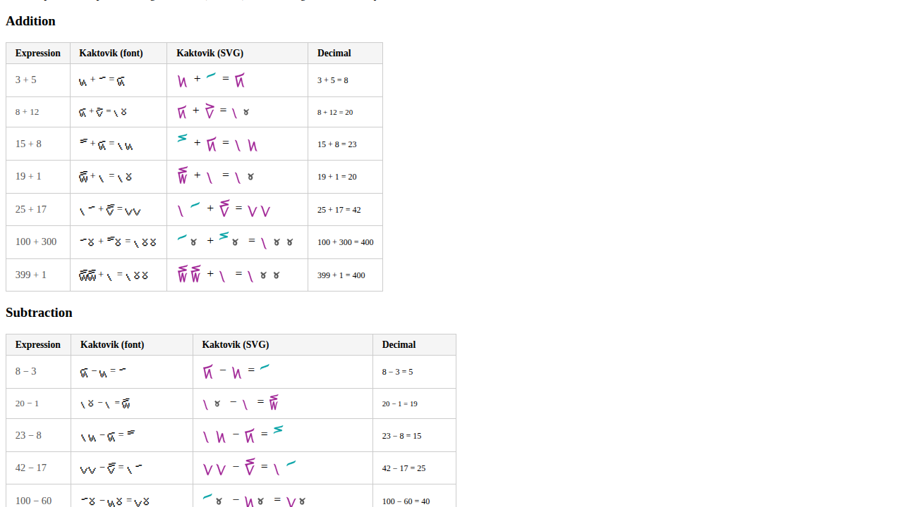
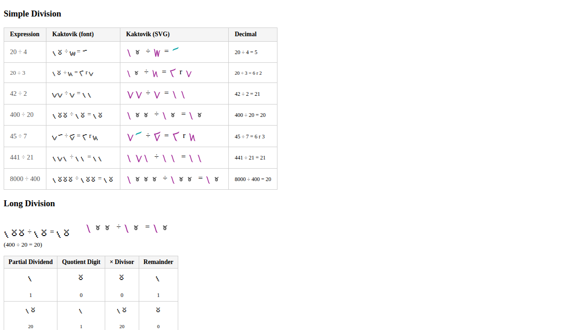
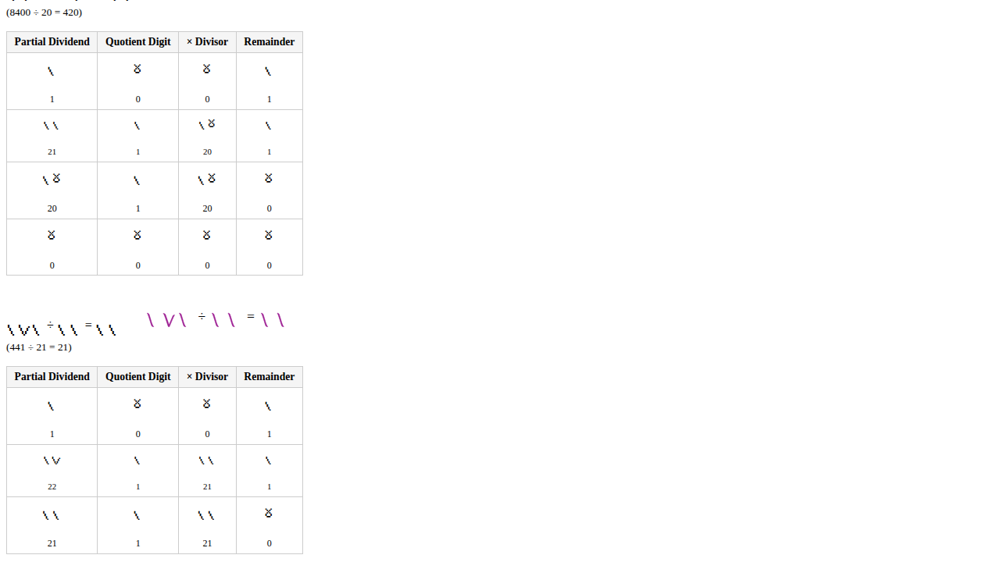
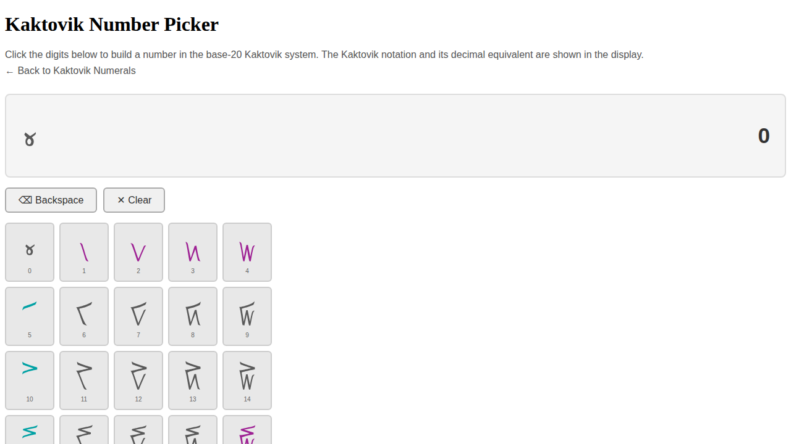
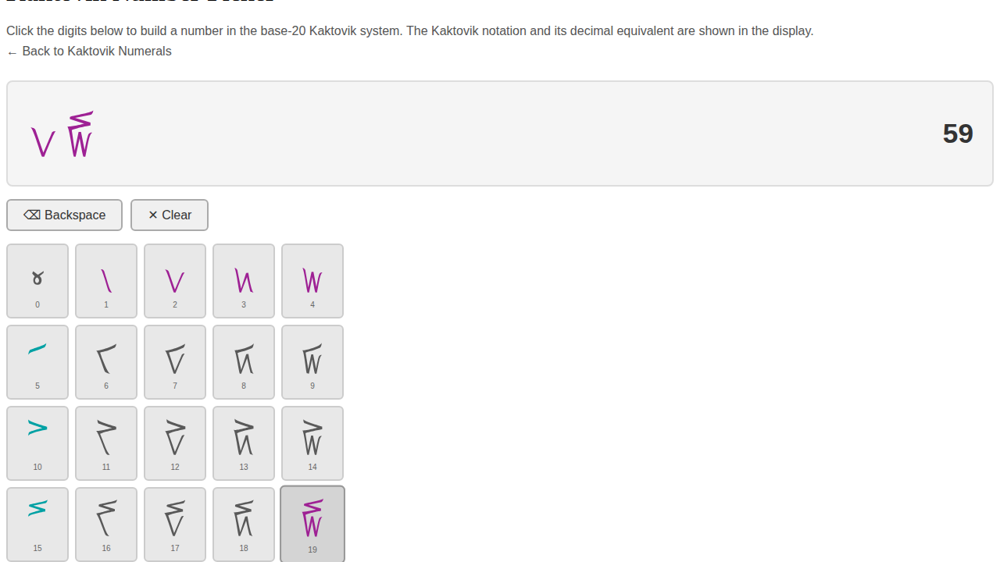

<!-- Kaktovik Numerals Equations -->

In a previous post about [Kaktovik Numerals](kaktovik-numerals)/[KN SVG](kaktovik-numerals-svg) I started a site to show the numbers in this system.

I used [GitHub Copilot](github-copilot) to build the calculations:

> Addition, Subtraction, Simple Division, Long Division

---

**New**: `src/js/kaktovik.js`

Pure arithmetic module with full input validation:
- `numberToKaktovik(n)` / `kaktovikToNumber(s)` — decimal ↔ Kaktovik (U+1D2C0–U+1D2D3)
- `add(a, b)`, `subtract(a, b)` — validated non-negative integer ops
- `divide(a, b)` → `{ quotient, remainder }`
- `longDivide(a, b)` → `{ quotient, remainder, steps[] }` — step-by-step base-20 workings per digit

```js
longDivide(8400, 20)
// { quotient: 420, remainder: 0, steps: [
//   { partialDividend: 1,  quotientDigit: 0, product: 0,  remainder: 1 },
//   { partialDividend: 21, quotientDigit: 1, product: 20, remainder: 1 },
//   { partialDividend: 20, quotientDigit: 1, product: 20, remainder: 0 },
//   { partialDividend: 0,  quotientDigit: 0, product: 0,  remainder: 0 }
// ]}
```

**Updated**: `src/index.html`

- **Arithmetic calculator**: Four panels (addition, subtraction, simple division, long division). Each shows decimal inputs, the result as Kaktovik glyphs (via existing Unifont-Upper font), and a decimal reference. Long division additionally renders the per-step table. All four panels are **auto-run on page load** so results are immediately visible.
- **Examples section**: A new section below the calculator with pre-computed examples for each operation:
  - Addition, Subtraction, Simple Division: a table of 7 examples each, with columns for the expression, the Kaktovik font rendering, a **colored SVG rendering**, and the decimal equivalent.
  - Long Division: 4 worked examples (400÷20, 8400÷20, 441÷21, 399÷19), each with the full step-by-step base-20 breakdown table and a **colored SVG expression header**.
- **Colored SVG rendering**: Each digit is rendered from the existing per-digit SVG files with a two-tone color scheme matching the reference visual — **teal** (`#00a1a4`) for pure multiples of 5 (digits 5, 10, 15) and **purple** (`#9e2194`) for all unit-bearing digits — using async `fetchSVGText` / `numberToColoredSVG` / `renderSVGCells` helpers.

<!--  -->


<!--  -->


<!--  -->


## Updated: `src/css/styles.css`
Styles for `.kaktovik` (large glyph display), `.arithmetic` flex layout, `.operation-group` cards, `.long-division` step table, `.examples-table` / `.ldiv-example` for the Examples section, and `.svg-kak` / `.svg-expr` / `.svg-op` / `.ldiv-header` / `.ldiv-svg` for the colored SVG column.

---

I then asked

> Use the following image alongside the existing code base to build an interactive number picker using the SVGs and match the colours

Adds a new `picker.html` page that lets users build arbitrary base-20 numbers by clicking Kaktovik digit buttons, displaying the result in both Kaktovik SVG notation and decimal.

**New files**

- **`src/picker.html`** — Picker page: 4×5 digit grid, Kaktovik display, decimal readout, Backspace/Clear controls; fully accessible (`aria-live`, `role="group"`, `aria-label`)
- **`src/js/picker.js`** — Fetches all 20 SVG digit files in parallel, builds clean inline SVGs with per-digit colouring, handles base-20 digit accumulation and leading-zero suppression

**Modified files**

- **`src/css/styles.css`** — Grid layout, rounded cells with hover/active states, display area and control button styles
- **`src/index.html`** — Link to the picker from the main page

**Colour mapping (matches reference)**

| Digits | Colour |
|--------|--------|
| 0 | `#595959` |
| 1–4 | `#9e2194` purple |
| 5, 10, 15 | `#00a1a4` cyan |
| 6–9, 11–14, 16–18 | `#595959` |
| 19 (= 15+4, max digit) | `#9e2194` purple |

**Screenshots**

Initial state — full digit grid with correct colouring:
<!--  -->


After selecting digits 2 and 19 → decimal 59:
<!--  -->


---

I still need to review this but it's got me started for sure.

## 🌍 Site

- https://alex-hedley.github.io/kaktovik-numerals/

## </> Code

- https://github.com/Alex-Hedley/kaktovik-numerals

## 🔗 Links

- https://github.com/alex-hedley/kaktovik-numerals/issues/1
  - https://github.com/alex-hedley/kaktovik-numerals/pull/2
  - https://github.com/alex-hedley/kaktovik-numerals/tasks/f2cf528e-fc6d-4e16-9671-bd7caa781774?author=AlexHedley

- https://github.com/alex-hedley/kaktovik-numerals/issues/3
  - https://github.com/alex-hedley/kaktovik-numerals/tasks/49513b60-7102-4b9e-9c47-449a13cfb3ce?author=AlexHedley
  - https://github.com/alex-hedley/kaktovik-numerals/pull/4
