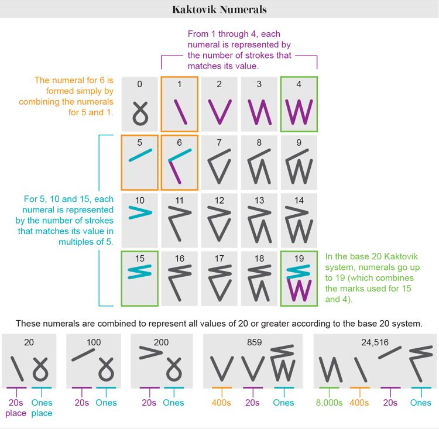
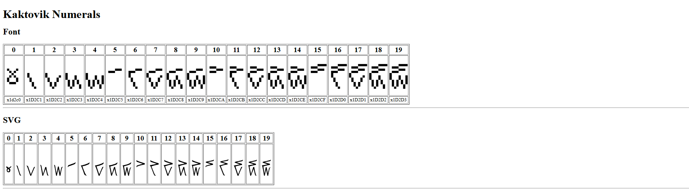

<!-- Kaktovik Numerals -->

I stumbled upon the following article [A Number System Invented by Inuit Schoolchildren Will Make Its Silicon Valley Debut](https://www.scientificamerican.com/article/a-number-system-invented-by-inuit-schoolchildren-will-make-its-silicon-valley-debut1/) which I found fascinating so my first thought was to build it into a website.

> The Kaktovik numerals or Kaktovik Iñupiaq numerals[1] are a base-20 system of numerical digits created by Alaskan Iñupiat. They are visually iconic, with shapes that indicate the number being represented.

I went looking for a font and some SVGs and displayed them on the page, my initial attempt:

## 🌍 Site

- https://alex-hedley.github.io/kaktovik-numerals/

## </> Code

- https://github.com/Alex-Hedley/kaktovik-numerals

## 🔗 Links

- [A Number System Invented by Inuit Schoolchildren Will Make Its Silicon Valley Debut](https://www.scientificamerican.com/article/a-number-system-invented-by-inuit-schoolchildren-will-make-its-silicon-valley-debut/)
- [Unicode® 15.0.0](https://unicode.org/versions/Unicode15.0.0/)
- [Unicode request for Kaktovik numerals](21058-kaktovik-numerals.pdf)
  - [Site](http://www.unicode.org/L2/L2021/21058-kaktovik-numerals.pdf)
- [Kaktovik Numerals - Unicode v15](U1D2C0.pdf)
- [Kaktovik numerals](https://en.wikipedia.org/wiki/Kaktovik_numerals)
- [Help:Multilingual support - Kaktovik numerals](https://en.wikipedia.org/wiki/Help:Multilingual_support#Kaktovik_numerals)
- [GNU Unifont](https://en.wikipedia.org/wiki/GNU_Unifont)
  - [unifont](http://unifoundry.com/unifont/)

### Fonts

- [GNU Unifont Glyphs](http://unifoundry.com/unifont/)

Unifont 15.0

- 13 September 2022 (Unifont 15.0.01)
  - Unicode Plane 1
    - Paul Hardy added new glyphs in these ranges:
      - U+1D2C0..U+1D2DF Kaktovik Numerals*

*New in Unicode 15.0.0.

- http://unifoundry.com/pub/unifont/unifont-15.0.01/unifont-15.0.01.bmp
- http://unifoundry.com/pub/unifont/unifont-15.0.01/unifont_plane1-15.0.01.bmp

Font Downloads

The standard font build — with and without the ConScript Unicode Registry (CSUR) / Under-CSUR Private Use Area (PUA) glyphs. Download in your favorite format:

- OpenType:
  - The Standard Unifont OpenType Download: unifont-15.0.01.otf (5 Mbytes)
    - http://unifoundry.com/pub/unifont/unifont-15.0.01/font-builds/unifont-15.0.01.otf
  - Glyphs above the Unicode Basic Multilingual Plane: unifont_upper-15.0.01.otf (1 Mbyte)
    - http://unifoundry.com/pub/unifont/unifont-15.0.01/font-builds/unifont_upper-15.0.01.otf
- TrueType:
  - The Standard Unifont TTF Download: unifont-15.0.01.ttf (12 Mbytes)
    - http://unifoundry.com/pub/unifont/unifont-15.0.01/font-builds/unifont-15.0.01.ttf
  - Glyphs above the Unicode Basic Multilingual Plane: unifont_upper-15.0.01.ttf (2 Mbytes)
    - http://unifoundry.com/pub/unifont/unifont-15.0.01/font-builds/unifont_upper-15.0.01.ttf

- GS Unicode 2.0 (Plane 1)
  - https://fontstruct.com/fontstructions/show/2016169/gs-unicode-2-0-plane-1
