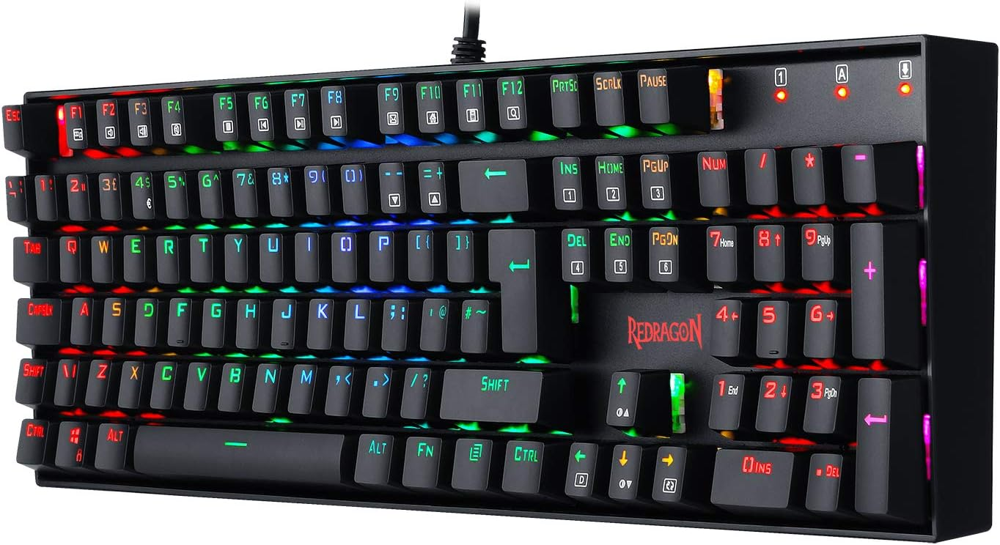
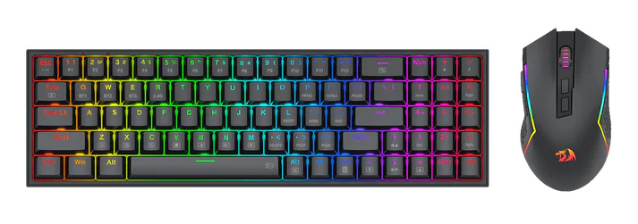
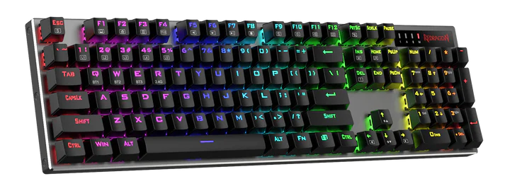

<!-- # Keyboards -->

<!--  -->

A few years back when I was watching a stream from [@praeclarum](https://x.com/praeclarum) on his [Twitch](https://twitch.tv/FrankKrueger) channel I heard the dulcet tones of a mechanical keyboard. I think it was a Redragon which is probably why I purchased my own.

I chose the following due to it having a numpad, which I couldn't live without.

**Redragon K551 Mechanical Gaming Keyboard, Wired, 104 Keys for PC Computer Gamer UK QWERTY (RGB Backlit with Red Switches)**  
🔗 https://www.amazon.co.uk/dp/B07CMLBFPY  
🔗 https://www.redragonzone.com/products/redragon-k551-mitr-104-key-led-backlit-mechanical-keyboard-with-blue-switches  
💷 £56.99  
Ordered on 19 November 2020  

I was wired which saves from having to charge it but swapping between desktop and laptop and having to unplug it became a little annoying, first world problems! I decided to buy a new one, this time it was wireless and though might as well get a mouse too. I found the following:

**K628 75% Mechanical Gaming Keyboard M693 Gaming Mouse Tri-Modes Combo**  
🔗 https://redragonshop.com/products/redragon-bs136-tri-mode-gaming-keyboard-and-mouse-combo  
💷 £58.80 GBP (£48 ~~£60~~)  
February 25, 2025  

I'd not used a 75% keyboard before and very much a trend I probably rushed into the decision. It did have a numpad but my muscle memory just couldn't get used to it. It didn't take long for me to buy another. This time, another wireless but very similar to the original. The only problem is it isn't a UK layout. Luckily I've just swapped some of the keys from my original. Let's see how long this one will last.

**DHARMA PRO K556 PRO Aluminum Keyboard**  
🔗 https://redragonshop.com/products/dharma-k556-pro-aluminum-keyboard  
💷 £57.60 GBP (£49)  
June 4, 2025  

