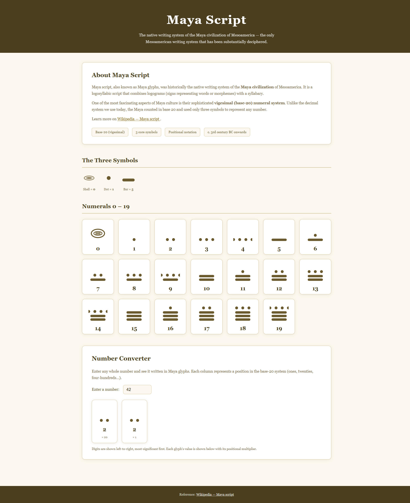

<!-- # Maya -->

I'd first come across Maya in Nov 2023 and added it as a discussion on [Cistercian Numerals/](cistercian-numerals) [#1](https://github.com/alex-hedley/cistercian-numerals/discussions/1) to work on later. As with most of these [projects](https://alexhedley.com/projects/) I forgot about it. It wasn't until I was looking back through them all and though I know something that can help.

> The native writing system of the Maya civilization of Mesoamerica — the only Mesoamerican writing system that has been substantially deciphered.

[GitHub Copilot](github-copilot) to the rescue :)

## Site

- 🌍 https://alexhedley.com/maya/

## </> Code

- 🔗 https://github.com/AlexHedley/maya
- https://github.com/AlexHedley/maya/issues/1
  - https://github.com/AlexHedley/maya/pull/2
  - https://github.com/AlexHedley/maya/tasks/d25d6bd9-457b-4ebe-941a-4465632370fb?author=AlexHedley

## 🔗Links

- https://en.wikipedia.org/wiki/Maya_script
