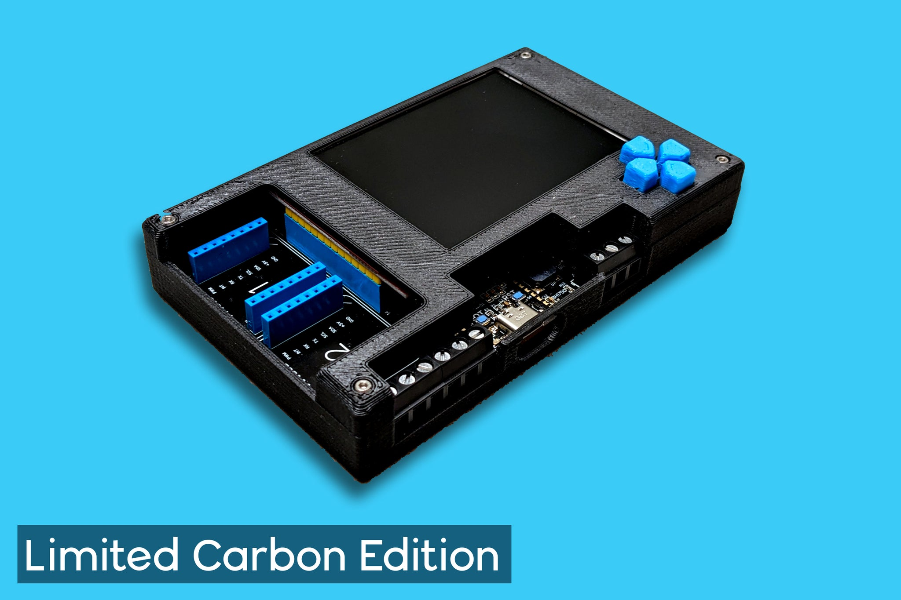

<!-- # Meadow Project Lab -->

Meadow Project Lab v3 - .NET IoT prototyping platform by Wilderness Labs

Having helped in [Hacktoberfest 2023](hacktoberfest-2023.md) and then having watched a Twitch stream I finally purchased a board late in November so it's taken about a month to arrive. I'm thinking of using it for a POC for my [poker](tags/poker/) setup, so I can use the screen and draw on the chip numbers via some .NET code, and inform the game about the current bets. We'll see how that goes, plus I can play about with all the other options available.

## Product

Project Lab v3 - RRP £200.00

- https://store.wildernesslabs.co/collections/iot-kits/products/project-lab-board

About

Cut your time to production in half. Project Lab is created by Wilderness Labs, runs entirely on .NET, and makes hardware less hard to create. With Project Lab, every software developer is an IoT developer. Design your hardware using Project Lab&#39;s open-source design. Connect to Thousands of Plug &amp; Play Peripherals Project Lab includes two microBUS and three Grove/Qwiic/StemmaQT Connectors. No breadboard, no complicated wiring, and no tedious soldering. Enjoy rapid prototyping and exploring thousands of plug &amp; play peripherals. Two mikroBUS connectors unlock thousands of official MikroElektronika click boards and tons of 3rd party boards that are mikroBUS compatible. Three Grove/Qwiic/StemmaQT connectors provide access to a massive ecosystem of pluggable peripherals from SeeedStudio, Adafruit, and SparkFun. Accelerometer and Gyroscope Project Lab includes the small, lower power, and optimized for wearables, BMI270 Inertial Measurement Unit (IMU). The 6-axis sensor combines a 16-bit tri-axial gyroscope and a 16-bit tri-axial accelerometer featuring Bosch’s automotive-proven gyroscope technology. While you may not want to wear Project Lab, the lab is perfect to start your wearable design. Environmental sensing with Artificial Intelligence The BME688 is the first gas sensor with Artificial Intelligence (AI) and integrated high-linearity and high-accuracy pressure, humidity, and temperature sensors. Use Project Lab to start building your mobile &amp; connected applications where size, low power consumption, and environmental awareness are critical requirements. The Standard for Light Sensors The Rohm BH1760 Digital Ambient Light sensor is the go-to for engineers. It&#39;s low power, used in a wide variety of applications, and it can accurately measure from 1 to 65535 lux. TFT LCD with 65k colors The ILI9341 is a 2.8” 320x240 IPS full view TFT LCD with 65k colors. Project Lab&#39;s onboard ILI9341 allows you to directly display information from your peripherals or create a complete navigation system using the directional push buttons. RS-485, I/O, and Power Terminals Through easy-to-use screw terminals, Project Lab enables RS-485 communication directly with industrial sensors, a 5v and 3v3 power connection with the ground, and additional digital and analog I/O. Onboard Audio Project Lab includes an onboard CMT-7525-80-SMT Magnetic Buzzer Transducer when you need more than visuals. Meadow F7v2 Core Compute Module is now onboard For Project Lab v3 we included the Meadow F7 Core Compute Module right on board to get your projects/ideas even closer to production. Explore thousands of plug-and-play peripherals and build endless solutions with Project Lab. Designs, documents, and other resources can be found on GitHub.

<table>
    <tr>
        <th>Onboard Peripherals</th>
        <th>Connectivity</th>
    </tr>
    <tr>
        <td><strong>ILI9341</strong> - SPI 320x240 color display</li></td>
        <td><strong>MikroBUS</strong> - Two sets of MikroBUS pin headers</td>
    </tr>
    <tr>
        <td><strong>BMI270</strong> - I2C motion and acceleration sensor</td>
        <td><strong>Qwiic</strong> - Stemma QT I2C connector</td>
    </tr>
    <tr>
        <td><strong>BH1750</strong> - I2C light sensor</td>
        <td><strong>Grove</strong> - Analog header</td>
    </tr>
    <tr>
        <td><strong>BME688</strong> - I2C atmospheric sensor</td>
        <td><strong>Grove</strong> - GPIO/serial header</td>
    </tr>
    <tr>
        <td><strong>Push Button</strong> - 4 momentary buttons</td>
        <td><strong>RS-485</strong> - Serial</td>
    </tr>
    <tr>
        <td><strong>Magnetic Audio Transducer</strong> - High quality piezo speaker</td>
        <td><strong>Ports</strong> - 3.3V, 5V, ground, one analog and two GPIO ports</td>
    </tr>
</table>

### Price

Be careful about import fees as it comes from the US.

|                |             |
| -------------- | ----------- |
| Project Lab v3 | £202.00     |
| Discount       | -£40.27     |
| Shipping       | £16.00      |
| Import fees    | £49.48      |
| **Total**      | **£227.21** |

## Docs

- https://developer.wildernesslabs.co/Meadow/Getting_Started/

## Code

- https://github.com/WildernessLabs/Meadow.ProjectLab
- https://github.com/WildernessLabs/Meadow.ProjectLab.Samples
- https://github.com/wildernesslabs

## Links

- https://www.wildernesslabs.co/
- https://store.wildernesslabs.co/collections/iot-kits/products/project-lab-board
- https://developer.wildernesslabs.co/Meadow/Getting_Started/
- https://github.com/WildernessLabs/Meadow.ProjectLab
- https://github.com/WildernessLabs/Meadow.ProjectLab.Samples
- https://github.com/wildernesslabs
- https://www.youtube.com/WildernessLabs
- https://www.twitch.tv/wildernesslabs
