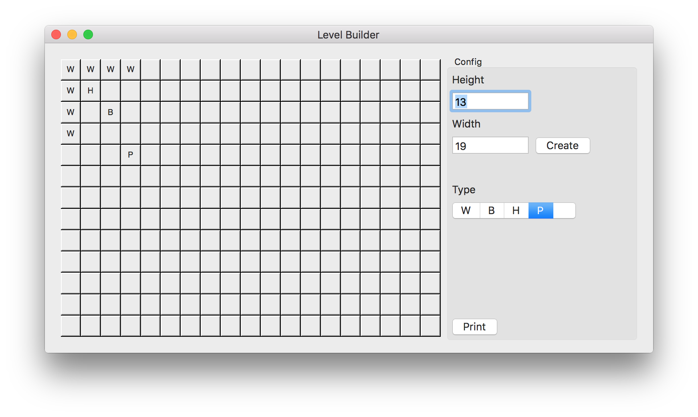

I've been working a little more on my Movem port, and there are over 50 levels, so I thought I'd make a level editor, one to speed up creating the levels, one because it's flipped using the code from boxxle and two because I could then create my own levels.

True I still need to create a sokoban solver to make sure

I used one to create a solution for another iOS game once: https://www.youtube.com/watch?v=9IodB2OrpuE

I used the following as a starting block for my level builder:

Code

http://www.knowstack.com/minesweeper-game-for-mac-os-written-in-cocoa-objective-c/

 [Original Link](https://alexhedley.wordpress.com/2016/03/19/movem-level-editor/)
