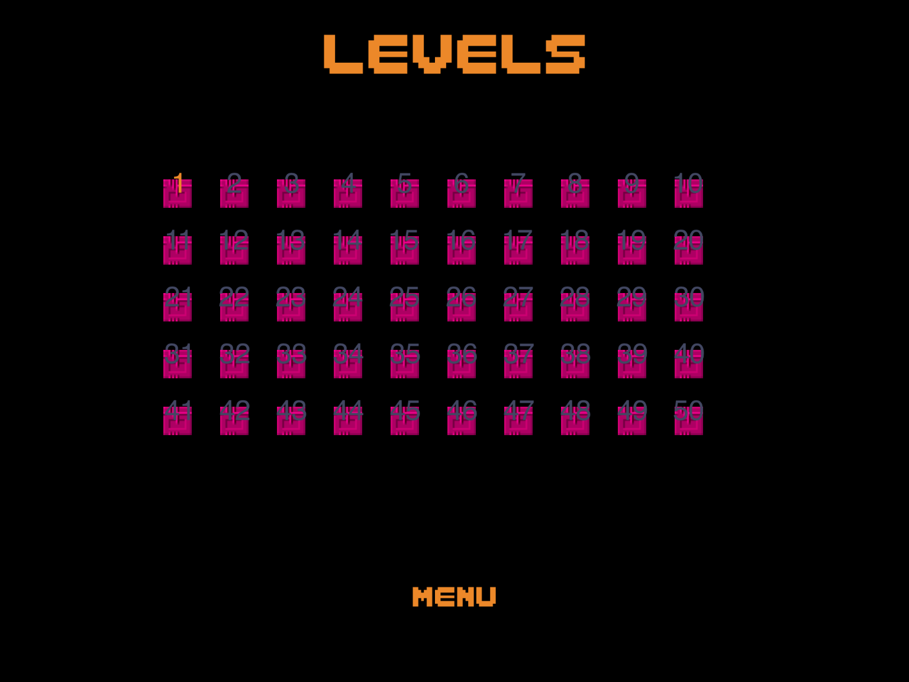
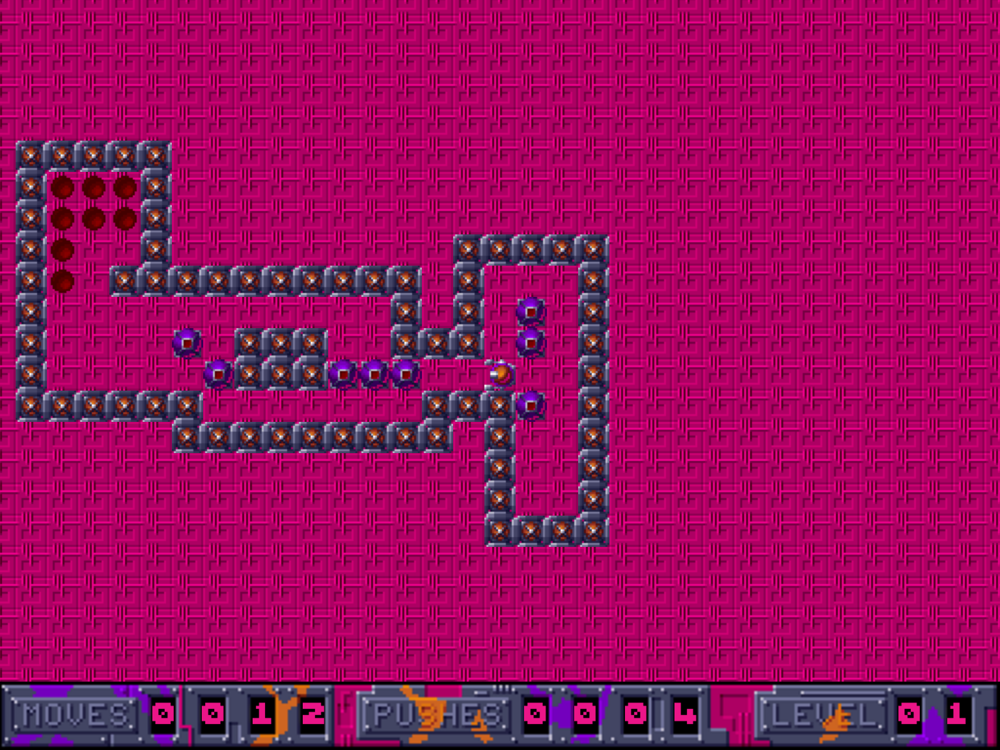

I've made some progress on my movem game

[gallery ids="496,495,493,497,500" type="rectangular"]

<!--  -->

Main Menu

Level select parsed from the plist

HUD updating with Moves, Pushes and Level

 [Original Link](https://alexhedley.wordpress.com/2016/03/28/movem-progress/)
