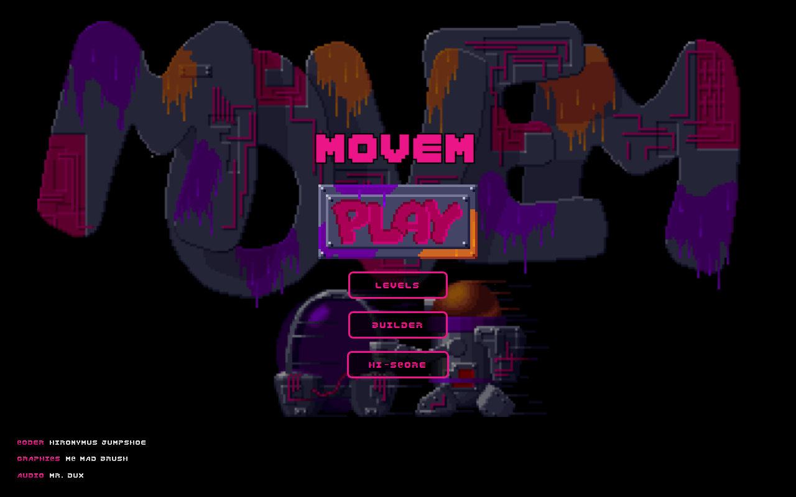
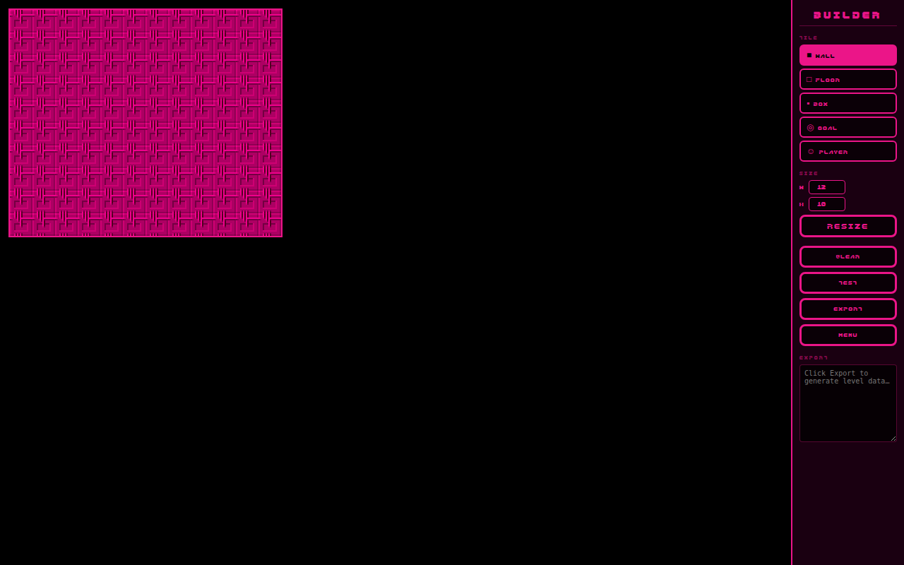
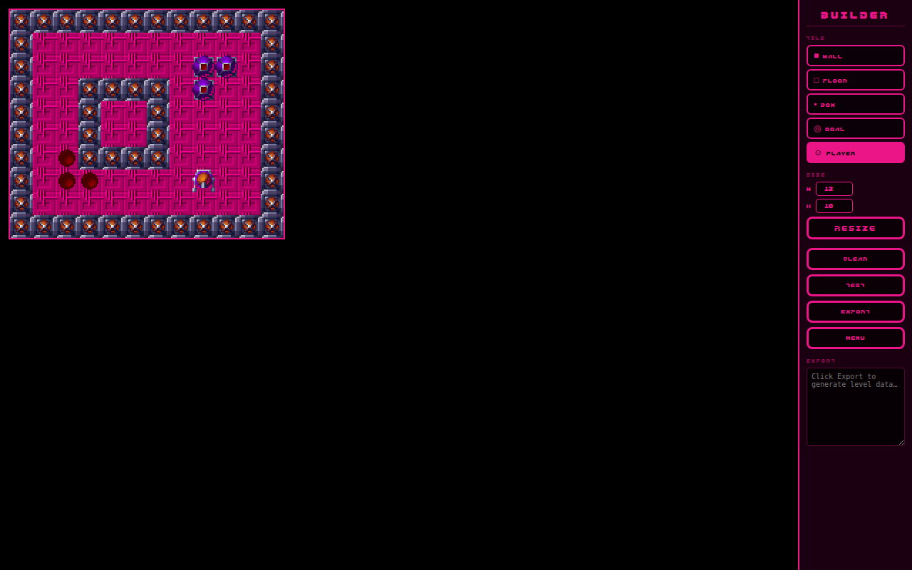
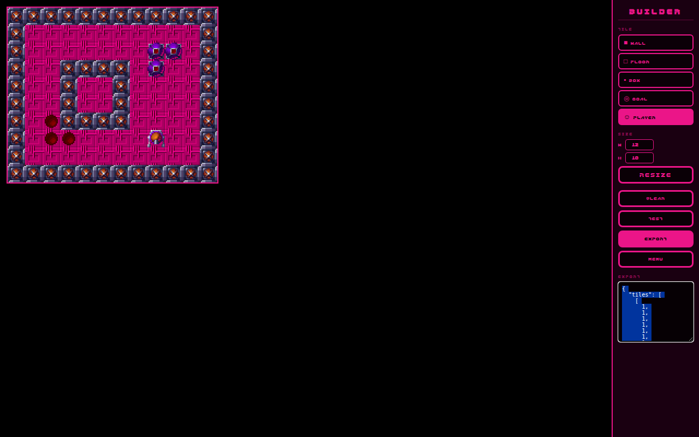
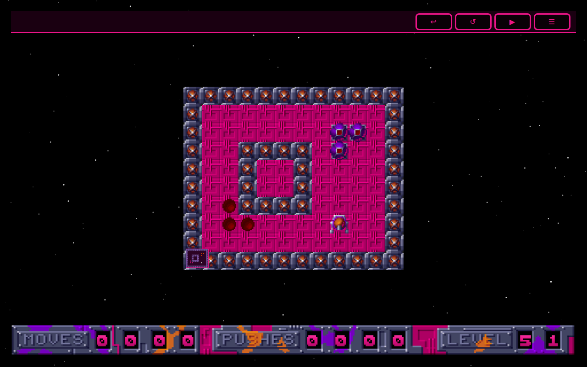

<!-- # Movem Web - Level Builder -->

What's a 🏷️[movem](tags/movem/) game without a Level Builder? I never knew the original Amiga game had one until I was looking for some assets for it.

I set [GitHub Copilot](github-copilot) off to do it's thing.

Think it would look better if the level centered in the screen, will have to work out how to handle a larger height and width.

I also asked for a way to allow you to test your level manually.

This is where the solver will come in handy, run that and make sure it's possible or don't allow the level to be saved.

I'd built a stand alone [level editor](movem-level-editor) on macOS and then a web version a few years back, but thought it would be better to integrate this into a single app.

- 🌍 https://alexhedley.com/movem-level-editor/
- https://github.com/AlexHedley/movem-level-editor

## 🌍 Site

- https://alexhedley.com/movem-web/

## Project

- https://github.com/AlexHedley/movem-web
- https://github.com/AlexHedley/movem-level-editor
- 🔒 https://github.com/AlexHedley/Movem-Apple
- 🔒 https://github.com/AlexHedley/Movem-LevelMaker-macOS

## 🔗 Links

- https://www.lemonamiga.com/game/movem
