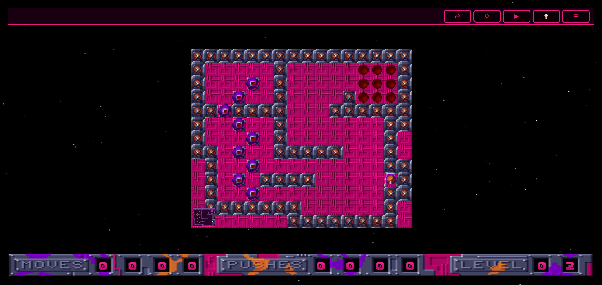

I thought it would be nice to create a 🏷️[movem](tags/movem/) solver to help if you get stuck on any level. It also would help for testing new levels.

Click on the light bulb 💡 and it will begin solving the level for you.
I will need to add in some speed controls and maybe a pause button.

- [solver.js](https://github.com/AlexHedley/movem-web/blob/main/src/js/solver.js)

Not all levels have a solution written up yet and I the current few were done by copilot I think without using the `solver.js` because of the way it was trying to run it.

- [solutions.js](https://github.com/AlexHedley/movem-web/blob/main/src/js/solutions.js)

I need to spend some more time polishing this but it's working ok for now.

## 🌍 Site

- https://alexhedley.com/movem-web/

## Project

- https://github.com/AlexHedley/movem-web
- 🔒 https://github.com/AlexHedley/Movem-Apple

## 🔗 Links

- https://www.lemonamiga.com/game/movem
