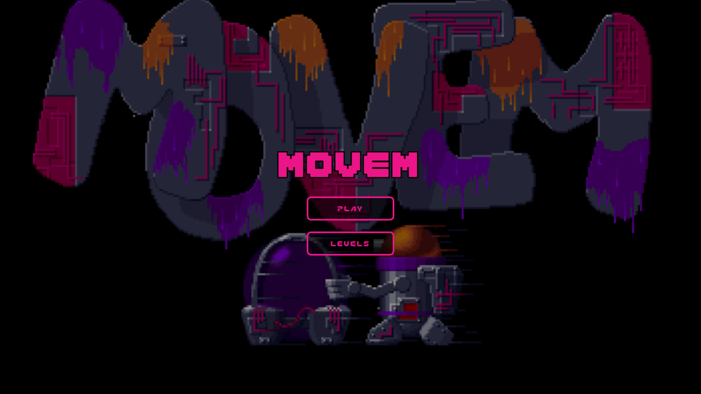
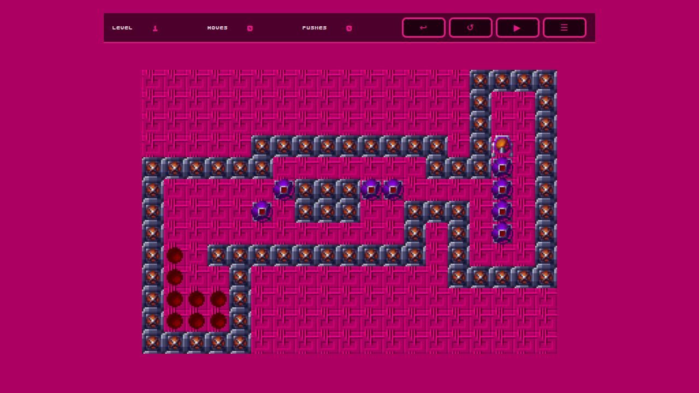
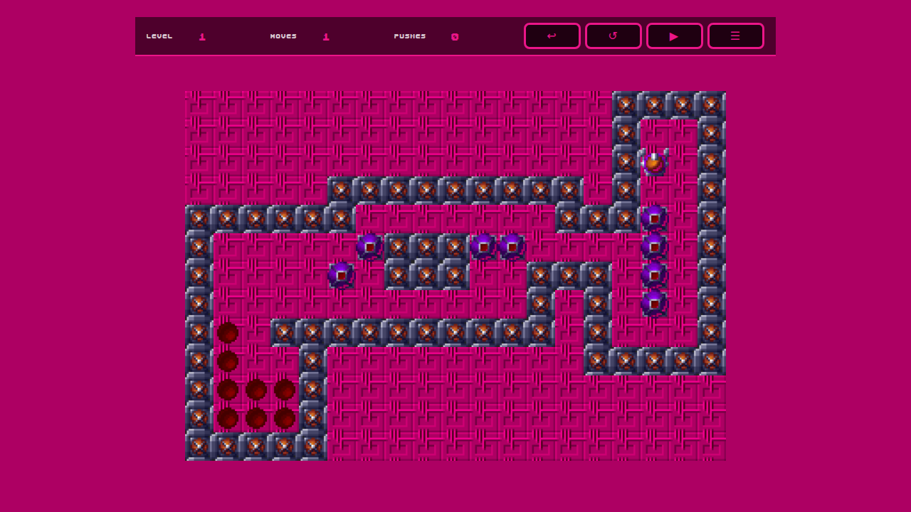
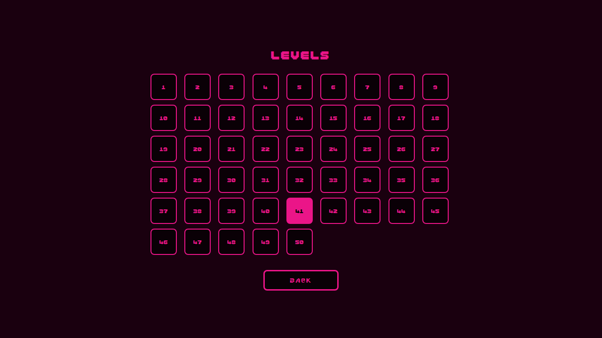
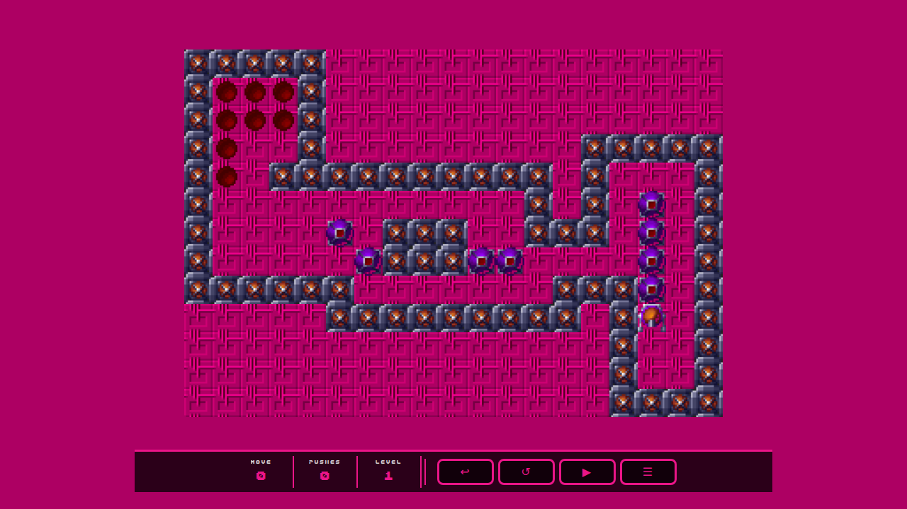
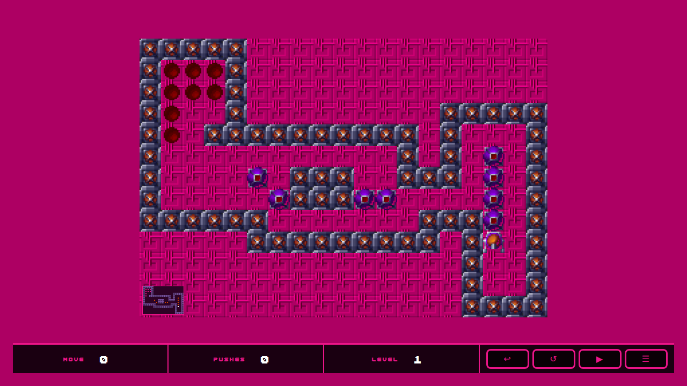
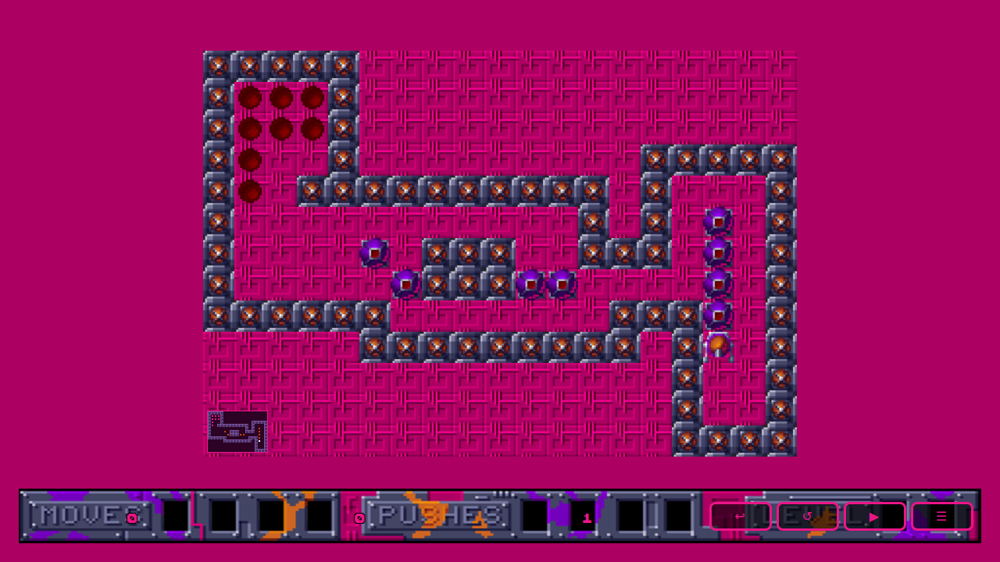
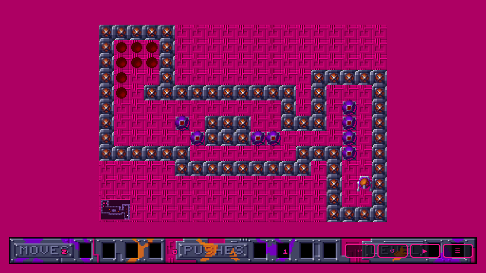
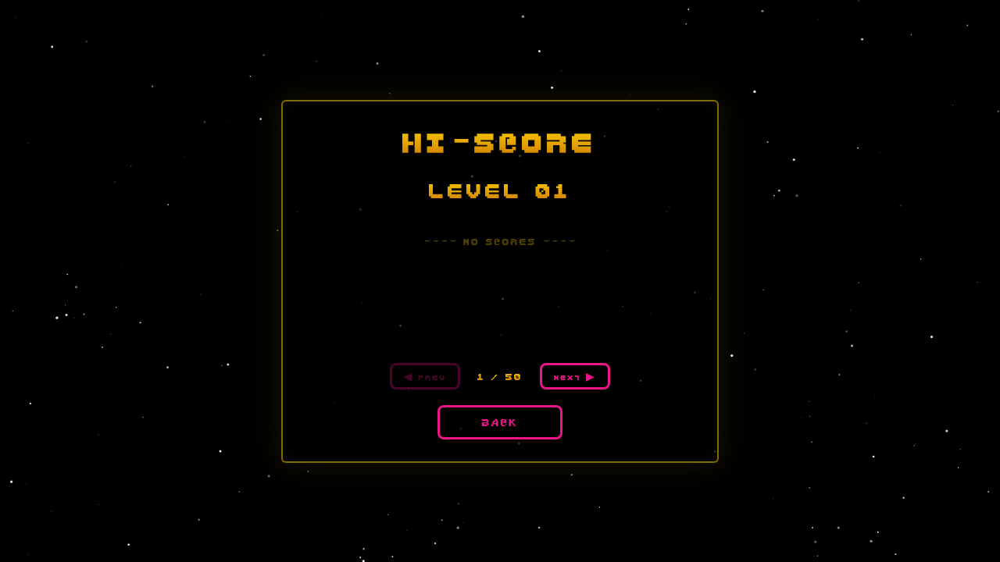

<!-- # Movem Web -->

I've built a couple of 🏷️[movem](tags/movem/) games over the years, all at various levels of completion.

Using [GitHub Copilot](github-copilot) I got it to build a vanilla website using just HTML/CSS/JS.

Using my existing Swift project I used the following simple prompt:

> Build a web version of sokoban using the movem assets

```
The web Sokoban is fully working. Here's a summary of what's in web/:

index.html – main menu, game screen (canvas + HUD), level select, and win screen
css/style.css – Movem font, brand pink (#eb1588 / #ad0063) colour scheme
js/levels.js – all 50 levels extracted from LevelData.swift
js/game.js – full Sokoban engine (movement, box pushing, undo, win detection)
assets/ – all original PNG sprites (Wall, Block, Block_store, Holder, Man_Up/Down/Left/Right, Background) plus Movem.ttf
Controls: Arrow keys / WASD, on-screen d-pad (mobile), swipe gestures.
```

Screenshots:

Main Menu



Game Screen – Level 1




Level Select (all 50 levels)



My implementation on Apple used a flipped co-ords so I needed to flip this:



I then asked for a mini map to be added.



I asked for the HUD to be updated to match the one used in the game and also add the info on Moves/Pushes and Level.





A few more prompts to add other functionality and more screens, a nice stary background and some `localStorage` to remember your progress.



## 🌍 Site

- https://alexhedley.com/movem-web/

## Project

- https://github.com/AlexHedley/movem-web
- 🔒 https://github.com/AlexHedley/Movem-Apple

## 🔗 Links

- https://www.lemonamiga.com/game/movem
