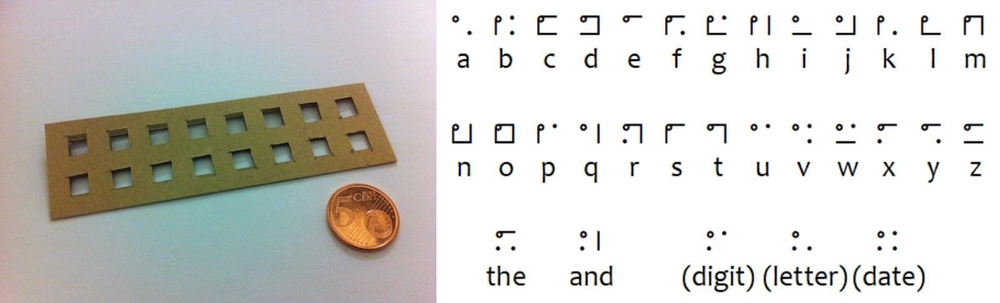
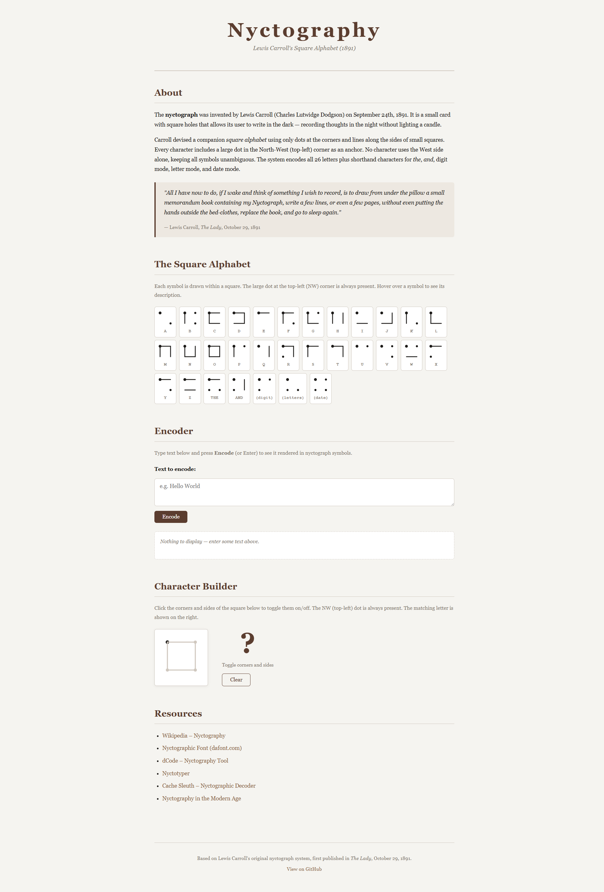

<!-- Nyctography -->

To continue my journey of numerals and alphabets like [Kaktovik Numerals](kaktovik-numerals) and [Cistercian Numerals](cistercian-numerals) I kept a note of others to work on later, I've finally gotten round to producing a site for this too.

> Nyctography is a form of substitution cipher writing created by Lewis Carroll (Charles Lutwidge Dodgson) in 1891.

Back to my tool of the month [GitHub Copilot](github-copilot) assigning it to the following issue [#1](https://github.com/AlexHedley/nyctography/issues/1).

It produced a very clean site with 3 main parts:

- The Square Alphabet
- Encoder
- Character Builder

## Site

- 🌍 https://alexhedley.com/nyctography/

## </> Code

- 🔗 https://github.com/AlexHedley/nyctography

- https://github.com/AlexHedley/nyctography/issues/1
  - https://github.com/AlexHedley/nyctography/pull/2
  - https://github.com/AlexHedley/nyctography/tasks/385a0a7f-fbd9-49cd-afc6-ae6c48f43d98?author=AlexHedley

## 🔗Links

- [Wikipedia – Nyctography](https://en.wikipedia.org/wiki/Nyctography)
- [Nyctographic Font (dafont.com)](https://www.dafont.com/nyctographic.font)
- [dCode – Nyctography Tool](https://www.dcode.fr/nyctography-lewis-carroll)
- [Nyctotyper](https://nyctotyper.netlify.app)
- [Nyctography in the Modern Age](https://www.cedricchase.com/blog/nyctography-in-the-modern-age)
