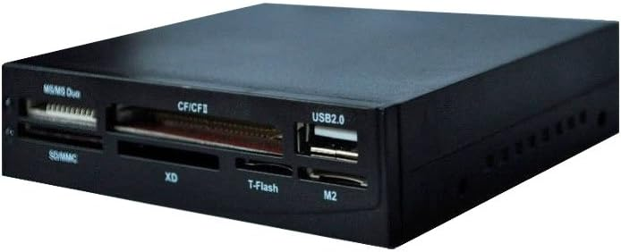
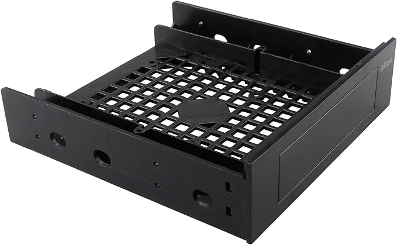

<!-- # PC Updates -->

Having a friend build a PC for me a number of years ago I've tweaked a few parts myself since the initial setup.

I've been looking to do more [3D Printing](3dprinter) and there are two ways I can send the models to the machine. One is via a cable connected to the printer directly, or the other is through an SD card.

I found an old external SD reader but was having issues getting it to work so I've bought an internal reader instead.

This was a really easy install, just pop the front of the remaining slot and then plug the device into a spare port.

The major oversight I had was this is much smaller than the fitting.

Back to the shops to by an adapter:

Hopefully this fits as expected, we shall see when it arrives.

## Products

DYNAMODE DYNA-USB-ALL-INT USB 2.0 6-Slot 3.5-Inch Internal All-in-One Card Reader - Black

£7.99

- https://www.amazon.co.uk/DYNAMODE-DYNA-USB-ALL-INT-6-Slot-3-5-Inch-Internal/dp/B000E9X7WU

Akasa 3.5" Device/SSD/HDD Adapter | 5.25" to 3.5" Bay Adapter | 2.5/3.5 Inch Hard Drive Enclosure | SSD Mounting Bracket | for 5.25 inch PC Front Bay | AK-HDA-05

£10.50

- https://www.amazon.co.uk/gp/product/B005ZWGEU8/
- https://akasa.co.uk/update.php?tpl=product/product.detail.tpl&model=AK-HDA-05
