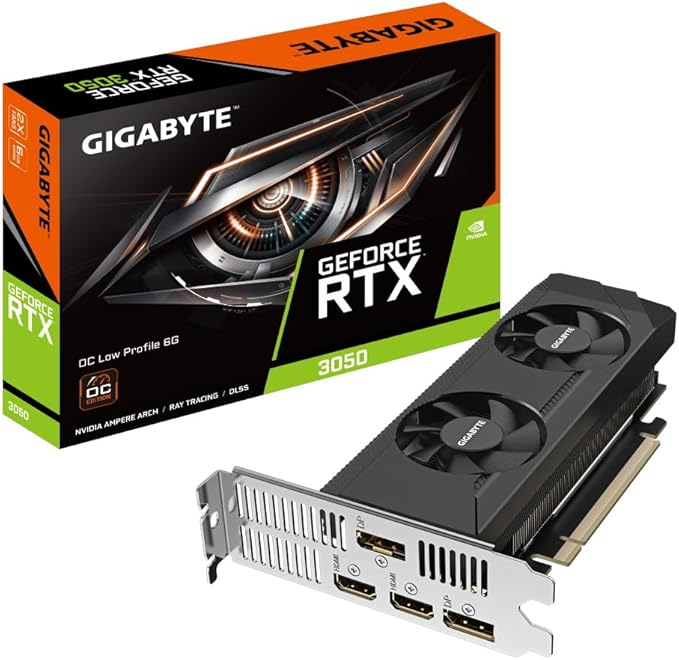

<!-- # PC Upgrade -->

Having built the [PC](pc) back in 2019 I thought it was time for an upgrade. And excuse to catch up with a mate and re-build the PC.

## Products

| Date | Description | Price | Image | Link |
| ---- | ----------- | ----- | ----- | ---- |
| 4 January 2025 | Corsair Vengeance LPX 64GB (2x32GB) DDR4 3600MHz C18 - Black | £109.97 |  | https://www.amazon.co.uk/dp/B07YV9VYYY |
|  | AMD Ryzen™ 9 5900X Desktop Processor | £205.00 |  | https://www.amazon.co.uk/dp/B08164VTWH |
|  | Gigabyte NVIDIA GeForce RTX 3050 OC Low Profile 6G Graphics Card - 6GB GDDR6, 96-bit, PCI-E 4.0, 1477MHz Core Clock, 2x DP 1.4, 2 x HDMI 2.1, GV-N3050OC-6GL | £166.97 |  | https://www.amazon.co.uk/dp/B0CV4CPQ7S |
|  | Samsung 970 EVO Plus 2 TB PCIe NVMe M.2 Internal Solid State Drive (SSD) (MZ-V7S2T0) | £149.00 |  | https://www.amazon.co.uk/dp/B07MLJD32L |
