<!-- # PC -->

For the first time "I" built a pc from scratch, when I say "I" I mean a dear friend did it for me :p.
I got a parts list together and got ordering.

I was surprised at how easy it was to do, just plug and play for the most part.

## Products

| Date | Description | Price | Image | Link |
| ---- | ----------- | ----- | ----- | ---- |
| 12 January 2019 | Corsair CC-9011075-WW Carbide Series 100R Windowed Mid-Tower ATX Computer Case - Black | £47.99 |  | https://www.amazon.co.uk/dp/B00RORBQNW |
|  | Corsair CP-9020101-UK CX450M 450 W 80+ Bronze Certified ATX Power Supply Unit | £53.98 | 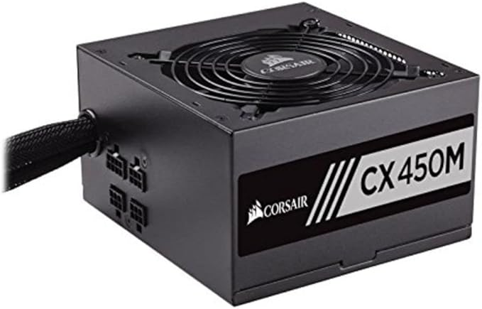 | https://www.amazon.co.uk/dp/B01C3FFOHS |
|  | Crucial MX500 CT250MX500SSD1(Z) 250 GB Internal SSD (3D NAND, SATA, 2.5 Inch) | £46.49 | 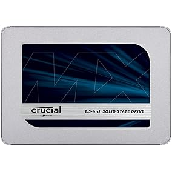 | https://www.amazon.co.uk/dp/B0764WCXCV |
|  | GIGABYTE B450 AORUS M AM4/B450/DDR4/S-ATA 600/Micro ATX Socket - Black | £88.33 | 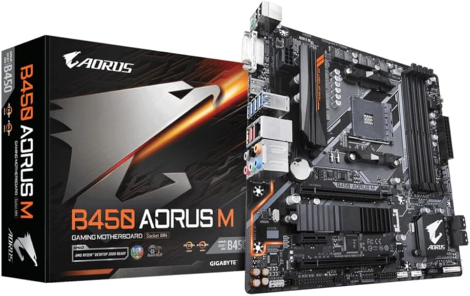 | https://www.amazon.co.uk/dp/B07G36DF29 |
|  | Seagate Barracuda 7200 Desktop 1 TB Hard Drive | £38.98 |  | https://www.amazon.co.uk/dp/B01LNJBA2I |
|  | Asus DVD Rewriter (Internal) Drive with M-Disc Support [Retail Boxed: bundled with SATA Power and Data Cables; Cyberlink Power2Go 8, Cyberlink PowerBackup 2.5 included] | £19.49 |  | https://www.amazon.co.uk/dp/B079YQZZHY |
|  | Corsair CMK16GX4M2B3200C16 Vengeance LPX 16 GB (2 x 8 GB) DDR4 3200 MHz C16 XMP 2.0 High Performance Desktop Memory Kit, Black | £123.59 |  | https://www.amazon.co.uk/dp/B0143UM4TC |
|  | AMD YD2400C5FBBOX Ryzen 5 2400G CPU with Wraith Stealth Cooler and RX Vega Graphics - Black | £141.47 |  | https://www.amazon.co.uk/dp/B079D8FD28 |

Added some more items later.

| Date | Description | Price | Image | Link |
| ---- | ----------- | ----- | ----- | ---- |
| 26 September 2021 | TP-Link N300 Universal Wi-Fi Range Extender, Broadband/Wi-Fi Extender, Wi-Fi Booster, Plug and Play, WPS, UK Plug (TL-WA854RE) | £11.39 |  | https://www.amazon.co.uk/dp/B07PKX1ZD1 |
| 20 July 2021 | HDMI to VGA, Benfei Gold-Plated HDMI to VGA 0.9M Cable (Male to Male) for Computer, Desktop, Laptop, PC, Monitor, Projector, HDTV, Chromebook, Raspberry Pi, Roku, Xbox and More - Black | £8.95 |  | https://www.amazon.co.uk/dp/B07ZF8WFZN |
| 27 June 2020 | 2 in 1 Headphone Stand&Headphone Hanger,Klearlook (Dual-Purposed) (360 Degree Rotatable) Spring-loaded Clamp&Height Adjustable Earphone Clip Under Desk/On Desk Headset Holder Mount Headset Display | £9.99 | 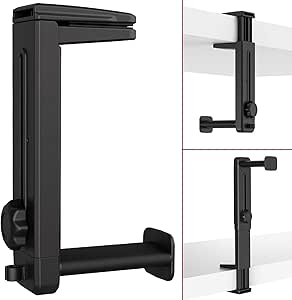 | https://www.amazon.co.uk/dp/B07R8GBKPN |
| 11 June 2020 | StarTech.com 1 m White Cat5e Snagless RJ45 UTP Patch Cable - 1m Patch Cord - Ethernet Patch Cable - RJ45 Male to Male Cat 5e Cable (45PAT1MWH) | £0.80 | 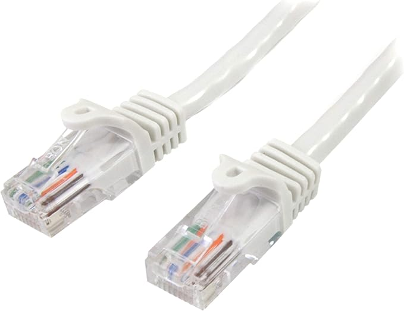 | https://www.amazon.co.uk/dp/B00UFQK3MY |
|  | TP-Link TL-SF1005D 5-Port 10/100 Mbps Desktop Ethernet Switch | £6.47 | 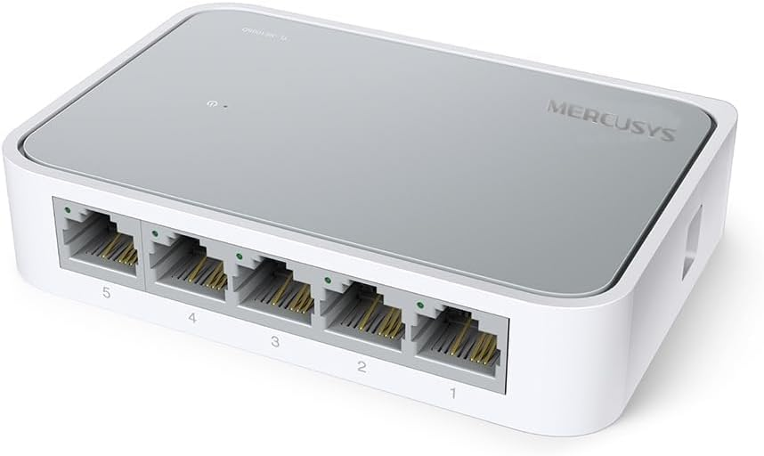  | https://www.amazon.co.uk/dp/B0766D8HZ3 |
| 22 April 2020 | Acer K222HQLbid 21.5 Inch FHD Monitor, Black (TN Panel, 5ms, HDMI, DVI) | £79.99 | 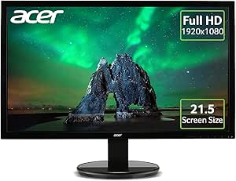 | https://www.amazon.co.uk/dp/B00LX2JC4O |
|  | AmazonBasics High-Speed  4K, Ultra HD, HDMI 2.0 Cable - 0.9m / 3 Feet (Latest Standard) Supports Ethernet, 3D, Audio Return | £4.99 |  | https://www.amazon.co.uk/dp/B014I8SIJY |
| 18 April 2020 | BONTEC Double Arm Stand Desk Mount Ergonomic for 13"-27" TV LCD Monitor Computer PC Screen Bracket Dual Tilt +90°/-90° Swivel 180° Rotate 360° VESA Dimensions: 75x75-100x100 | £28.99 | 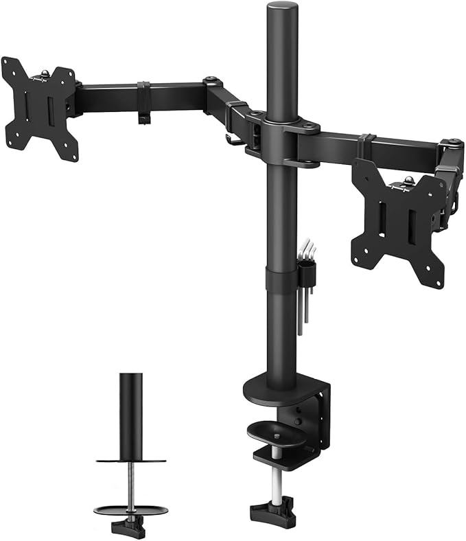 | https://www.amazon.co.uk/dp/B01MR397OH |
| 3 November 2019 | Replacement Cable/Wire for Beats by Dr Dre/Monster Headphone with Inline Mic Microphone & Audio Remote Control Talk for Studio Solo HD Wireless Pro Mixr iPhone Auxiliary Lead Cord Red/Black | £8.99 |  | https://www.amazon.co.uk/dp/B07PH1M3TQ |
| 3 October 2019 | Microsoft Office 365 Home up to 6 users 1 year PC/Mac download | £56.97 |  |  |
| 26 January 2019 | StarTech.com 3 ft Black USB 2.0 Extension Cable A to A - M/F - 3 ft USB A to A Extension Cable - 3ft USB 2.0 Extension cord | £3.04 | 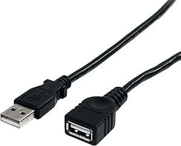 | https://www.amazon.co.uk/dp/B003YKX6VI |
| 26 January 2019 | Logitech Z200 Multimedia Speakers/PC Speakers - Midnight Black | £19.98 | 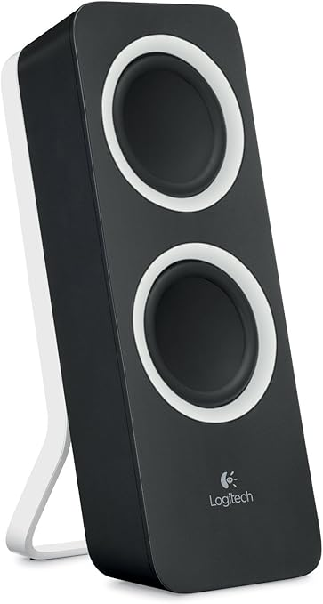 | https://www.amazon.co.uk/dp/B00FSF2OSS |
| 19 January 2019 | TP-Link TL-PA4010KIT Nano Powerline Adapter Starter Kit, No Configuration Required, UK Plug | £24.99 | 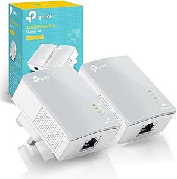 |  |
| 19 January 2019 | Acer K222HQLbd 21.5 Inch FHD Monitor, Black (TN Panel, 5 ms, DVI) | £75.43 | 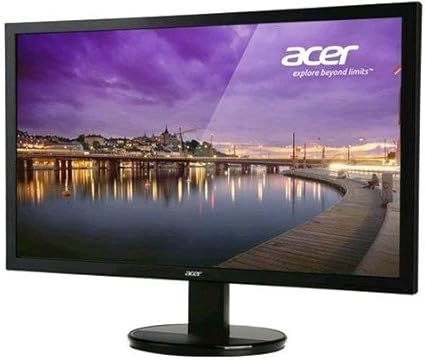 | https://www.amazon.co.uk/dp/B00HVYBU70 |
