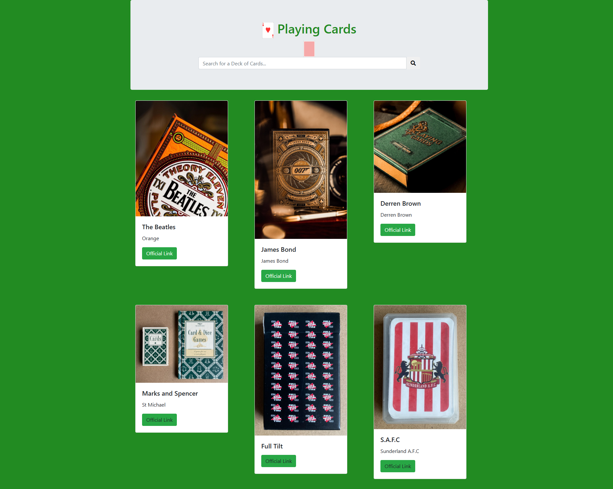

I've always loved playing cards, maybe linked to magic. I have fond memories of playing cribbage with my dad, and my first pack I remember treasuring was Aladin, the box was made of thin plastic, which I broke and fixed with sellotape. It's probably also where my love of X-Men's Gambit evolved from. That and probaly the awesome coat and cool staff.

- https://alexhedley.com/playingcards/
  - https://github.com/AlexHedley/playingcards/

<!--  -->
