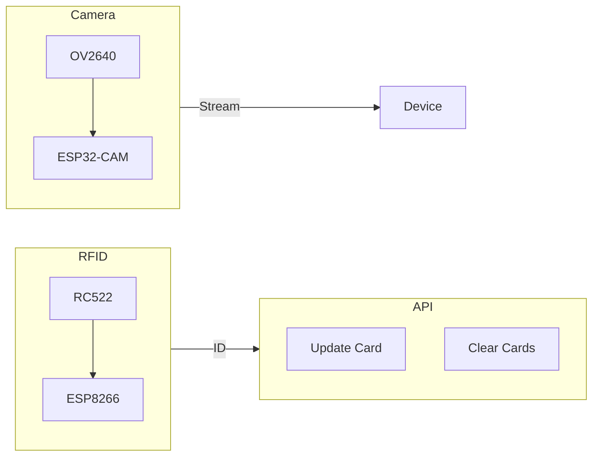

<!-- # Poker - API -->

<?# Markdown ?>
<?!^ "./../includes/posts/poker.md" /?>
<?#/ Markdown ?>

The main idea behind the API is to have an RFID sticker on a playing card, that gets scanned by an RC522 RFID Reader that then calls an endpoint via an ESP8266 (This could also have been an ESP32). A simple first solution is to pass the id and the player number. This then finds the corresponding playing card and copies it to given location. The reason for this is OBS is configured to show these cards in a scene. In the future I might be saving all this information to a local db to track everything to be able to replay the scenarios, but for now this will do.

Alongisde the API there is also an OV2640 camera connected to an ESP32-CAM which sends a stream to a given IP address. This can then be embedded in an OBS scene or shown via a webbrowser or `img` control.

## Source

- [Source](https://github.com/AlexHedley/poker-recording/tree/main/src/Poker)
  - [Poker](https://github.com/AlexHedley/poker-recording/tree/main/src/Poker)
  - [Poker.API](https://github.com/AlexHedley/poker-recording/tree/main/src/Poker/Poker.API)
