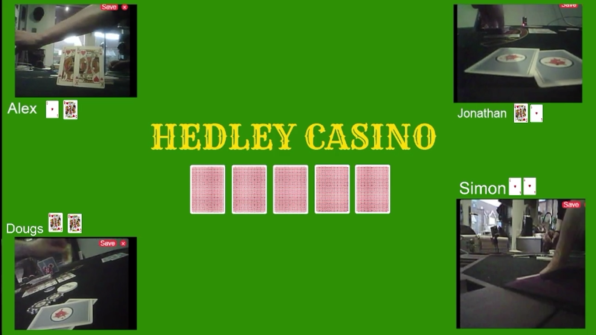

<!-- # Poker - App -->

<?# Markdown ?>
<?!^ "./../includes/posts/poker.md" /?>
<?#/ Markdown ?>

Aside to the API the ultimate goal would be to have a website that I can use to track the game information and visualise it, alongside the OBS scene. I've made a start on replicating the scene but as a webpage.

I'm looking to create custom components for the player setup and the board, but as a POC I'm getting the information reading from the local text files for name and stats, as well as the current cards each player has, alongside the board.

If I choose to add a db in the future I could keep track of the movements and then have a replay button to simulate the game, but let's get the current functionality working first.

What's useful is the camera has a stream endpoint so it's much easier to display the current feed. This saves parsing the dom for it in the previous display.

## Source

- [Poker](https://github.com/AlexHedley/poker-recording/tree/main/src/Poker)
  - [App (branch)](https://github.com/AlexHedley/poker-recording/tree/app/src/Poker) WIP
