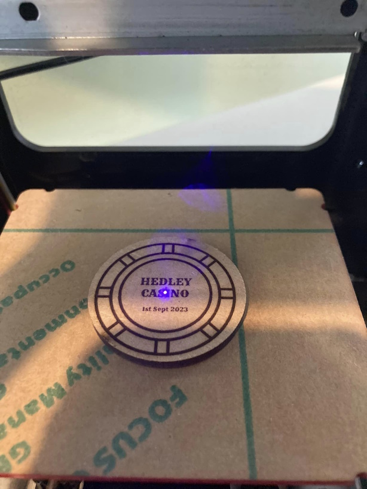
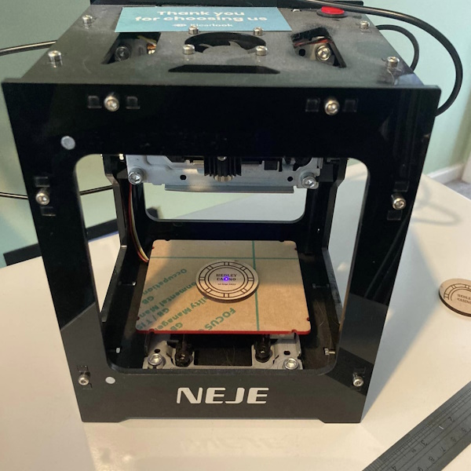

<!-- # Poker - Chip -->

<?# Markdown ?>
<?!^ "./../includes/posts/poker.md" /?>
<?#/ Markdown ?>

Thought as a little momento I'd create a poker chip for each of the players. Gave me an excuse to use the laser engraver again. I found the surround The Noun Project from Anton Gajdosik, the just reused the Rye font from the OBS scene to add some text. A few trial and error prints and got it looking decent. It kept moving about the board so a bit of greentac fixed the problem.

Managed to pick one up on ebay for ~£45 in 2021, just before they went up in price.

## Links

Poker Chip - Anton Gajdosik

https://thenounproject.com/icon/poker-chip-170742/

Poker Chip by Anton Gajdosik from <a href="https://thenounproject.com/browse/icons/term/poker-chip/" target="_blank" title="Poker Chip Icons">Noun Project</a> (CC BY 3.0)
