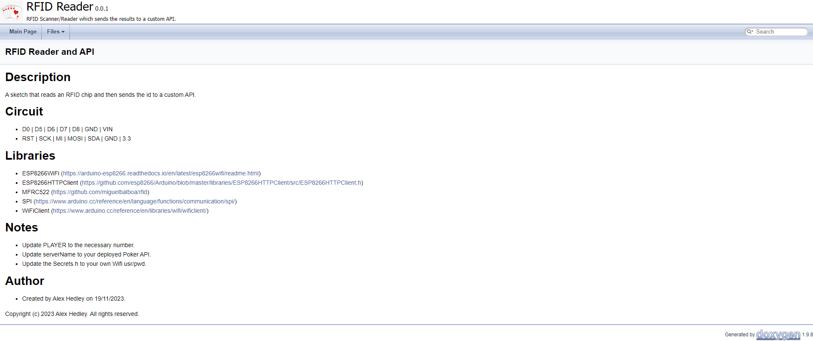

<!-- # Poker - Docs -->

<?# Markdown ?>
<?!^ "./../includes/posts/poker.md" /?>
<?#/ Markdown ?>

As with everything I do, I add documentation. The first thing I like to do is generate the API documentation for any code I've written. With the Arduino code (C++) I'm using [Doxygen](https://www.doxygen.nl/)

Download the required version you need:

- https://www.doxygen.nl/download.html

Run the following terminal command to check it installed correctly.

`doxygen -v`

> 1.9.8

I also the install location to my `PATH`.

Generate a config file with:

`doxygen -g`

Update the necessary settings.

```bash
PROJECT_NAME           = "..."
PROJECT_NUMBER         = "0.0.1"
PROJECT_BRIEF          = "..."
PROJECT_LOGO           = "icon.png"
EXTENSION_MAPPING      = ino=C++
EXTRACT_ALL            = YES
INPUT                  = "<filename>.ino"
FILE_PATTERNS          = ...
                         *.ino
GENERATE_LATEX         = NO
```

I also added docs/comments to my `.ino` file. If you are familiar to javadoc this should be fine.

- [ESP8266.ino](https://github.com/AlexHedley/poker-recording/blob/app/src/RFIDReader/ESP8266/ESP8266.ino)

Generate the header file to update and add a _favicon_.

`doxygen -w html headerFile`

> error: option "-w html" does not have enough arguments

Ran this instead and just deleted the `footerFile` `styleSheetFile`.

`doxygen -w html headerFile footerFile styleSheetFile`

> `doxygen -w html headerFile footerFile styleSheetFile [configFile]`

Updated the `headerFile` with:

`<link rel="icon" href="$relpath^favicon.ico" type="image/x-icon" />`

Update the config file with

```bash
HTML_HEADER            = headerFile
HTML_EXTRA_FILES       += favicon.ico
```

Not sure I like these files in the root, may need to move them, everything can be relative paths.

Finally I updated some parts of the code so it didn't output my secrets.

```cpp
#ifndef DOXYGEN_SHOULD_SKIP_THIS

<SECRETS>

#endif /* DOXYGEN_SHOULD_SKIP_THIS */
```

Updated the config:

```bash
PREDEFINED             = DOXYGEN_SHOULD_SKIP_THIS
```

I tried adding it to the `EXCLUDE` but it still pulled in the macros and displayed the variables.

```bash
EXCLUDE                = "secrets.h"
```

Finally run

`doxygen`

A number of things will output in the terminal and hopefully it should end with:

```bash
finished...
```

You should then have a folder called "html" with the full output, including your `icon.png` and `favicon.ico`.

Open the `index.html` to view the generated webpage.



You may wish to add that folder to your `.gitignore`.

Now to get GitHub to build and deploy the docs.

I used [doxygen-action](https://github.com/mattnotmitt/doxygen-action) from @mattnotmitt.

- [build-docs.yml](https://github.com/AlexHedley/poker-recording/blob/app/.github/workflows/build-docs.yml)

## Links

- https://www.doxygen.nl/
  - https://www.doxygen.nl/manual/index.html
- https://www.woolseyworkshop.com/2020/03/20/documenting-arduino-sketches-with-doxygen/
- https://stackoverflow.com/questions/18215463/how-to-set-a-favicon-for-doxygen-output
- https://the78mole.de/doxygen-tips-and-tricks/
- https://github.com/mattnotmitt/doxygen-action
  - https://github.com/marketplace/actions/doxygen-action
