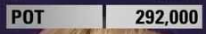

<!-- # Poker - HUD -->

<?# Markdown ?>
<?!^ "./../includes/posts/poker.md" /?>
<?#/ Markdown ?>

I'm back to working on the [Poker Web App](poker-app), as you saw from the original post the UI is lacking somewhat.

I've taken some inspiration from live shows and started working on implementing the styles in the app. I've found a number of variations I can work through, so here's the first attempt.

This led me to creating a shared `Microsoft.NET.Sdk.Razor` project called **Poker.Components**. (I should have done this with the original [components](https://alexhedley.github.io/poker-recording/components)).

I've made a start on the first **Board**:

**Players**:

And **Pot**:

<?# Info ?>
Thanks for the card images [@danielpaz6](https://github.com/danielpaz6) in [Texas holdem Rank Card Evaluator](https://github.com/danielpaz6/Poker-Hand-Evaluator)
<?#/ Info ?>

With this shared Library it means I can try it out in both my _Blazor WASM_ app (that I have deployed on GitHub Pages), and my _Blazor Server_ app which I'll be using as the main app.

See the current progress at

- https://alexhedley.com/poker-recording/hud

One very helpful tool I used to layout the _Players_ was [Layoutit!](https://grid.layoutit.com/), which is a _CSS Grid Generator_.

I copied the initial output to [codepen](https://codepen.io/) before moving to my Blazor app.

- https://codepen.io/AlexHedley/pen/KKLWXpO

Track it via

- Issue (40): https://github.com/AlexHedley/poker-recording/issues/40
- MR (39): https://github.com/AlexHedley/poker-recording/pull/39
