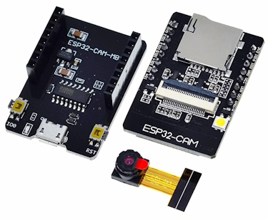
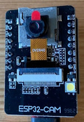
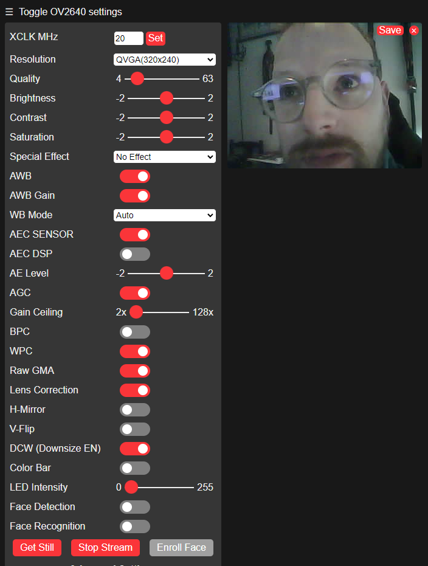
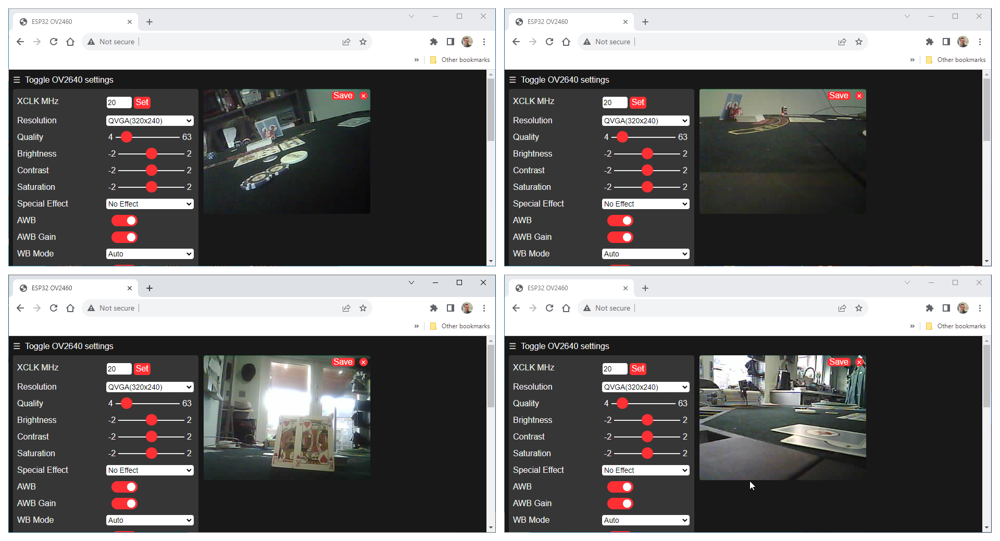
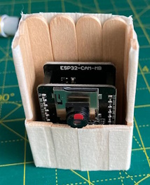
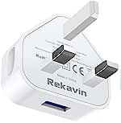
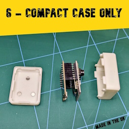

Watching the poker on [WPT](https://www.worldpokertour.com/) I thought wouldn't it be cool if I could have the same setup at my home games? Where would I even begin?

So I need a camera to point at the players hole cards (multiple by the number of players), one camera over the table to see the flop, turn and river. Then would I need any more?

So how to I get the camera feeds to my computer?

I could use WebCams, and connect them via a cable - issue with that is my computer isn't in the same room as where I want to play. Is there a wireless one? But won't these be very expensive.

logitech C270 HD Webcam RRP £34.99


Found them on eBay for ~£15.

Is there an Arduino alternative, yes! You can use a combination of ESP32-CAM, ESP32-CAM-MB, OV2640.



~£11 on Amazon but then I also need a micro USB cable and USB plug. (Multiply by the number of devices.)

## Arduino

Install the board

- https://raw.githubusercontent.com/espressif/arduino-esp32/gh-pages/package_esp32_index.json

Change it in the app to

- AI Thinker ESP-32 CAM

Examples | ESP32 | Camera | CameraWebServer

- [GitHub](https://github.com/espressif/arduino-esp32/tree/master/libraries/ESP32/examples/Camera/CameraWebServer)

Update the SSID and password - put this in a conf file?

- https://github.com/espressif/arduino-esp32/blob/e1f14331f173a00a9062f616bc9a62c358b9076f/libraries/ESP32/examples/Camera/CameraWebServer/CameraWebServer.ino#L38-L39

```c
#include "Secrets.h"
const char* ssid = SECRET_SSID;
const char* password = SECRET_PASSWORD;
```

`touch "Secrets.h"`

```c
#define SECRET_SSID "foo"
#define SECRET_PASS "bar"
```

Update the CAMERA to `#define CAMERA_MODEL_AI_THINKER // Has PSRAM`

- https://github.com/espressif/arduino-esp32/blob/e1f14331f173a00a9062f616bc9a62c358b9076f/libraries/ESP32/examples/Camera/CameraWebServer/CameraWebServer.ino#L24C2-L24C2

Upload

Reset (RST)




Check the output for the IP Address, then navigate to it in a browser.

Click on "Start Stream"



Click "Stop Stream".

I then used [FancyZones](https://learn.microsoft.com/en-us/windows/powertoys/fancyzones) in [PowerToys](https://learn.microsoft.com/en-us/windows/powertoys/) to show all the screens together.



As this part is working I can move onto trying it in a piece of screen recording software.

Download/Install/Start [OBS](https://obsproject.com/) and in the Scene click **+** and navigate to **Browser**,


Update the URL to the one above.


Then in the Browser Options bar click on "Interact", this will open up a new window, hopefully load the same as the above browser did, then scroll down and click "Start Stream", once you see a video feed you can re-position this in your Scene.


Once the video feeds are on the scene I tried to make a quick mockup of the screen - any designers about and want to help...please :p.


I looked for an ole time font and found one called [Rye](https://fonts.google.com/specimen/Rye) (from Google Fonts).

- [Preview - Hedley Casino](https://fonts.google.com/specimen/Rye?preview.text=HEDLEY%20CASINO&preview.text_type=custom)

The card backs are taken from the excellent SVG web lib from [CardMeister](https://cardmeister.github.io/)

Then I found a set of individual [cards](https://www.improvemagic.com/all-playing-cards-names-with-pictures/) on [Improve Magic](https://www.improvemagic.com/)

These should come in handy later...

I created an image with a green background which I cut out 4 transparent windows to fit the camera items, a few text widgets for the names.

TODO: Pot Total, Individual Total, % Outs etc.

See a 📼 video of it in action:

<iframe width="560" height="315" src="https://www.youtube.com/embed/wJCgOoJmJX0" title="YouTube video player" frameborder="0" allow="accelerometer; autoplay; clipboard-write; encrypted-media; gyroscope; picture-in-picture; web-share" allowfullscreen></iframe>

I need some wood to build a crane to hang a camera over the table to show the rest of the action.

## Live Stream

I may live stream them on my [Twitch](https://www.twitch.tv/) [@alexhedley8](https://www.twitch.tv/alexhedley8) one day.

## Case Attempt

Found some lollipop sticks and some masking tape and got to work making a temporary case...



I then bought one instead.

> Note to self: configure your 3d Printer and print one yourself!

## Hardware

| Item   | Price  |
| ------ | ------ |
| Camera | £10.99 |
| Cable  | £2.66  |
| Plug   | £2.49  |
| Case   | £6.20  |
|        | ------ |
| Total  | £22.34 |

**Camera**

XTVTX ESP-32-CAM WiFi Bluetooth Board ESP-32-CAM-MB Micro USB to Serial Port with OV2640 2MP Camera Module Dual Mode compatible with Arduino

- https://www.amazon.co.uk/dp/B093GSCBWJ

£10.99


**Mirco USB Cable**

- https://www.amazon.co.uk/dp/B07WNX1B8C

£7.99 / 3 = £2.66


**USB Plug**

- https://www.amazon.co.uk/dp/B09X2Z6V5W

£9.99 / 4 = £2.49



**Magnetic Case**

- https://www.ebay.co.uk/itm/275204804237

£5.90 + (£2.70 P&P)



### Alternatives

- [Logitech - C270 HD Webcam](https://www.logitech.com/en-gb/products/webcams/c270-hd-webcam.960-001063.html) RRP £34.99
  - [Amazon](https://www.amazon.co.uk/Logitech-Widescreen-Noise-Reducing-Automatic-Correction/dp/B01BGBJ8Y0/) £17.99

## Links

- [Arduino](https://www.arduino.cc/)
- [OBS](https://obsproject.com/)

### Tutorials

**Random Nerd Tutorials**

- [Installing the ESP32 Board in Arduino IDE (Windows, Mac OS X, Linux)](https://randomnerdtutorials.com/installing-the-esp32-board-in-arduino-ide-windows-instructions/)
- [Upload Code to ESP32-CAM AI-Thinker using ESP32-CAM-MB USB Programmer (easiest way)](https://randomnerdtutorials.com/upload-code-esp32-cam-mb-usb/)
- [ESP32-CAM Video Streaming and Face Recognition with Arduino IDE](https://randomnerdtutorials.com/esp32-cam-video-streaming-face-recognition-arduino-ide/)
- [Change ESP32-CAM OV2640 Camera Settings: Brightness, Resolution, Quality, Contrast, and More](https://randomnerdtutorials.com/esp32-cam-ov2640-camera-settings/)

**ArduCAM**

- [ArduCAM Mini Cameras Tutorial](https://www.arducam.com/knowledge-base/mini-tutorial/)
