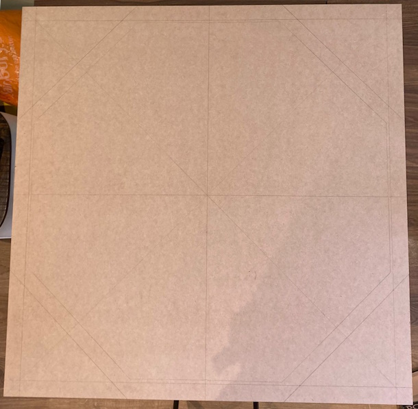
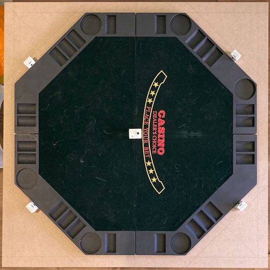
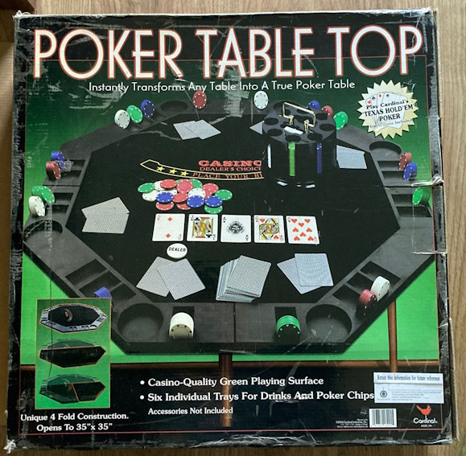
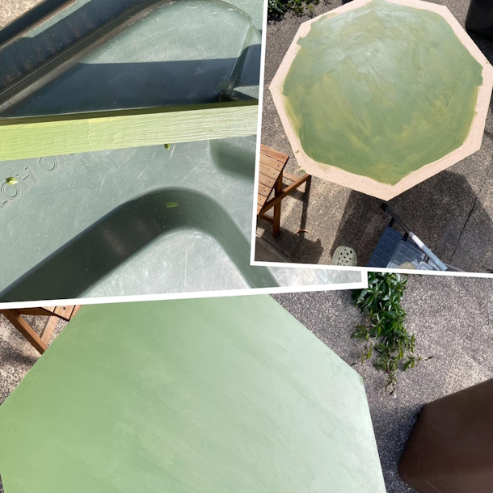
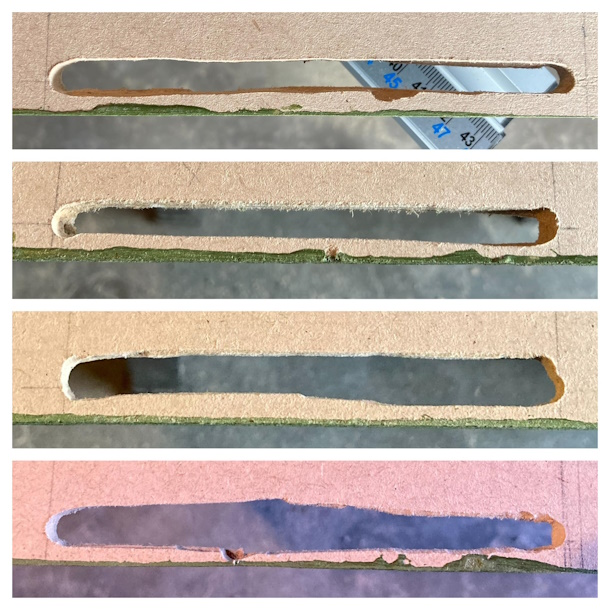
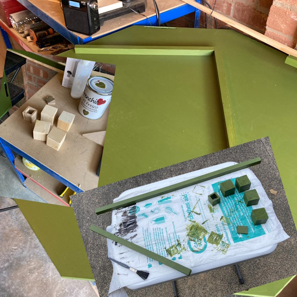
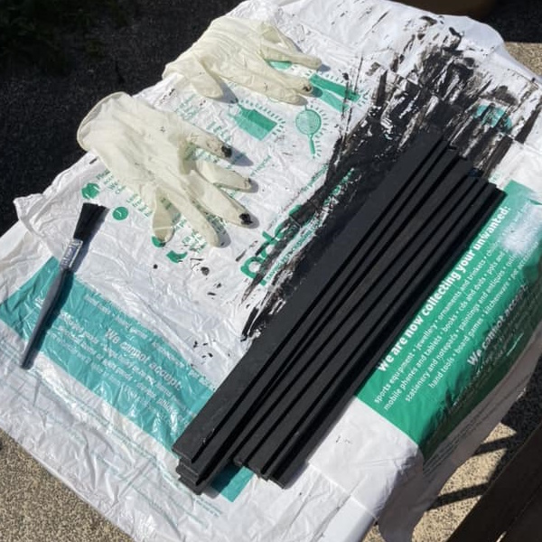
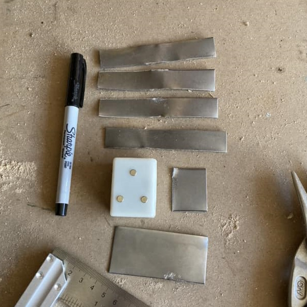

<!-- # Poker Table Top -->

<?# Markdown ?>
<?!^ "./../includes/posts/poker.md" /?>
<?#/ Markdown ?>

I have a Cardinal Poker Table top that folds in 4 and opens to 35".

It's a little shy of that but close enough.

I bought a piece of 6mm MDF cut to 38" square.

Drew corner to corner to get the center, then measured in 1.5" from each edge to draw a square.

Next I measured 8.75" from the center each way, and joined the dots to draw a hexagon.

I placed the folded out table in the center and drew around it.

I've placed the 4 cameras around the table, in a rough position.

I cut the excess corners and did a rough sanding.

Next was painting it with Constance Moss (Al Fresco) from Frenchic paint to give it a baize feel. This came out really well.

I needed to cut out some holes for the cables of the cameras, for this I used a Dremel Router, practiced on some off cuts first then just took the plunge (:p), with varying outcomes, but it's all trial and error. Filled in some of the miss cuts with wood filler and repainted.

I've got some edging which I cut at 22.5° and painted in Blackjack (Al Fresco) from Frenchic paint, I thought it was rather apt. I'll be fun to try and glue all this round and make it hold. I've got a couple of rope clamps and another jig I can use. I think I'll wait until I've done the bottom before attempting this.

I'm adding strips of metal on the edging so the cameras connect here. Had some tin snips but I've bent the metal and now need to re-flatten it.

I need a way to holding the camera for the board, so I cut a piece at 30", which gives a good angle over the cards. I need some way to hold this to the board, but I want to be able to dismantle this. I've glued some off cuts of the mdf together and I'll see how that works. Cut another piece to glue a piece of metal on, as the camera has magnets so it can easily be removed.

## Links

- [Frenchic paint - Constance Moss (Al Fresco)](https://frenchicpaint.co.uk/collections/paint-al-fresco/products/constance-moss-al-fresco)
- [Frenchic paint - Blackjack (Al Fresco)](https://frenchicpaint.co.uk/collections/paint-al-fresco/products/blackjack-al-fresco)
- [DREMEL® Plunge Router Attachment (335)](https://www.dremel.com/gb/en/p/dremel-plunge-router-attachment-26150335ja)
- [DREMEL® Multipurpose Router Bit Set (660)](https://www.dremel.com/gb/en/p/dremel-multipurpose-router-bit-set-26150660ja)
