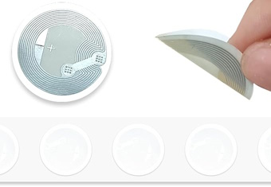
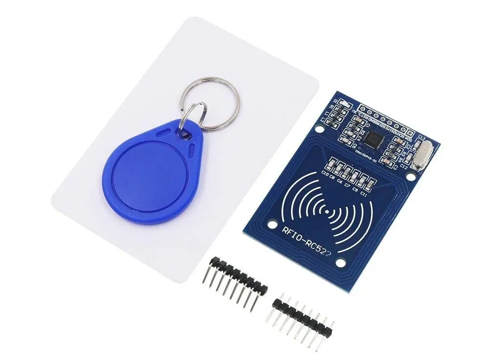
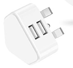
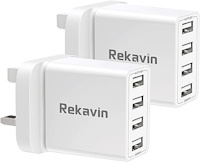
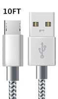

<!-- # Poker - Tracking cards -->

<?# Markdown ?>
<?!^ "./../includes/posts/poker.md" /?>
<?#/ Markdown ?>

This is Part 2 of the Poker series, see [Recording Poker Games](/posts/recording-poker-games) for the initial setup.

What would be the best way to track the cards being played?

I could train a machine learning model or use an existing one? See [Playing-Cards-Computer-Vision](https://github.com/awrd2019/Playing-Cards-Computer-Vision) from [@awrd2019](https://github.com/awrd2019/). Not sure how much work this would be and how accurate the results are.

The next idea was RFID Playing cards, I got a link for [Luna NFC/RFID Cards by Andras Barthazi](https://www.saturnmagic.co.uk/saturn-magic-shop/luna-nfcrfid-cards-by-andras-barthazi.html) and thought £21.99 for a pack isn't bad, but I'd miss read:

- Blank face (6 cards): £21.99
- Poker face (52 + 2 cards): £104.99
- Blank face (54 cards): £104.99

Checking other sites I found one a little cheaper in [RFID PLAYING CARD DECK, ISO15693](https://illuminati-magic.com/products/rfid-deck-iso15693) £93.00 GBP.

So why don't I just buy some NFC / RFID stickers and put them on an existing pack of playing cards?
It might make them harder to shuffle and easier to see a marked card but for an inital POC it'll be cheaper.

> 50pcs NFC Tags, BetterJonny NFC Cards, NFC Stickers Ntag 215 NFC Tag NFC Coin Cards Compatible with TagMo & Amiibo, NFC Enabled Mobile Phones and Devices, Round, White

- https://www.amazon.co.uk/gp/product/B0C786FJ82/

Only £8.99 for 50, that's much better, albeit I need 52 and I'll have to stick them all on and program them all, but that's the fun part!



Next I need a reader/writer, which I'm sure I saw in the [ADVENTURE KIT 2](https://inventr.io/product/adventure-kit-2-pre-order/) $197.00 I'd bought.

> 1x RFID reader and Keychain
>
> Create your own unique ID card and be able to read the data from it. Allowing just those with access keys in.



There's a video and board layout on the course:

- https://inventr.io/lessons/nfc-badges/
- https://inventr.io/lessons/rfid-reader-badge/

Next problem is I'll need a board to connect to them, so that then adds more wires, there doesn't seem to be a nice compact way like with the camera.

I also need to test what the pickup area is, will I only need one per pocket? Will The Board only need one too? Once I've tested I'll feed back with the results.

I can then create a local API that I can post the cards too, which in turn will update the screen.


Having access to what cards are available I can also calculate rudimentary pot odds. Add them to the screen too.

The actual pot will be harder - mic with voice recognition? Weigh the table? RFID on each chip? Let's solve one problem at a time.

All this hardware setup it starting to get messy, my thoughts here are to create my own custom table, I can then hide all the parts in custom fitting areas. If the wood is thin enough the devices should be able to pick up the cards. Plus then I have an excuse to do some woodwork :).

## Scanning

Add https://github.com/miguelbalboa/rfid/releases


https://circuitdigest.com/microcontroller-projects/interfacing-rfid-reader-module-with-arduino


```bash
18:28:27.715 -> Firmware Version: 0xFF = (unknown)
18:28:27.715 -> WARNING: Communication failure, is the MFRC522 properly connected?
18:28:27.761 -> Scan PICC to see UID, SAK, type, and data blocks...
18:29:01.755 -> Firmware Version: 0x92 = v2.0
18:30:42.657 -> Bad read (was card removed too quickly?)
```

---

## Hardware

| Item          | Price  |
| ------------- | ------ |
| RFID Reader   | £.     |
| Board         | £.     |
| RFID Stickers | £8.99  |
| Cable         | £2.66  |
| Plug          | £2.25  |
|               | ------ |
| **Total**     | **£.** |

**RFID Stickers**

> 50pcs NFC Tags, BetterJonny NFC Cards, NFC Stickers Ntag 215 NFC Tag NFC Coin Cards Compatible with TagMo & Amiibo, NFC Enabled Mobile Phones and Devices, Round, White
>
> £8.99

- https://www.amazon.co.uk/gp/product/B0C786FJ82/

**Plug**

> 4-Pack USB Plug for iPhone 14 13 12 11 XS Max XS XR X 8 7 6 6S Plus 5 Plus SE Samsung Galaxy, LG, Android, Cell Phone, 2.1A/5V Dual Port Power Adapter Wall Charging UK Mains Charger
>
> £8.99

- https://www.amazon.co.uk/gp/product/B0BPB6HB3V/



> 2 Pack USB Plug Charger,Rekavin 4 Port Multi USB Plug Adapter UK 25W/5A Wall Charger Mains with Smart IC Fast Charging for iPhone 11 pro Max XS XR X SE2020 10 8 7 6 ipad,Samsung S10 S9 S8 S7,Huawei
>
> 12.78

- https://www.amazon.co.uk/dp/B08M8ZY9J4



**Mirco USB Cable**

- https://www.amazon.co.uk/dp/B07WNX1B8C

£7.99 / 3 = £2.66



**RFID Reader**

- TBC

**Board**

- TBC
