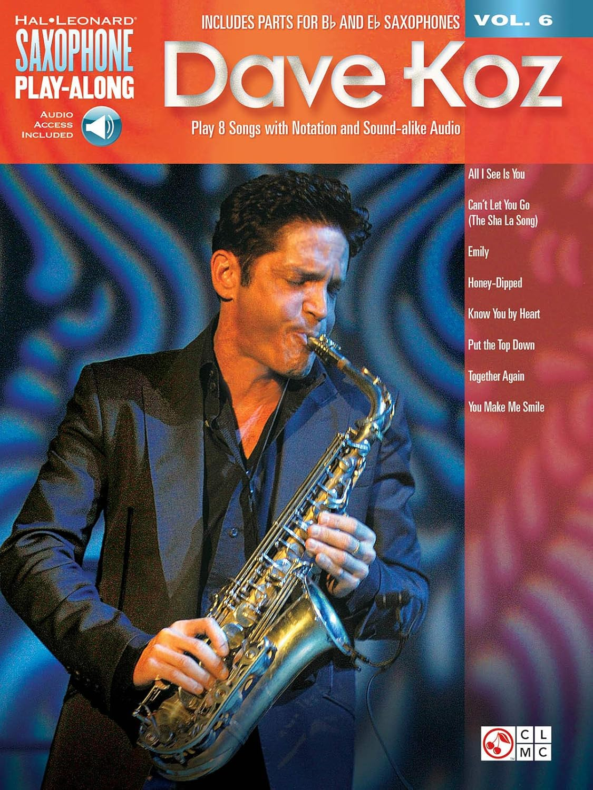
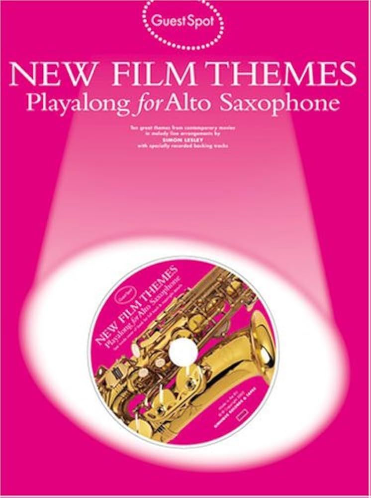

<!-- 🎷 Saxophone - Books 3 -->

My uncle introduced my twin and I to Dave Koz many years ago, he's always been a favourite of mine. Not sure how difficult they'll be but be fun to give them a go.

Dave Koz: Saxophone Play-Along Volume 6 (Hal Leonard Saxophone Play-Along, 6) Paperback – 1 Oct. 2015  
https://www.amazon.co.uk/dp/1480337994  
£14.59  
RRP: £18.99 -23% 

Best of Dave Koz Paperback – 11 Jan. 2006  
https://www.amazon.co.uk/dp/1575608464  
£16.79  

Found **Gladiator** in a book so bought it just for that song. There are others I might try.

New film Themes Play along For alto Saxophone With CD  
£10.10 (from eBay)

