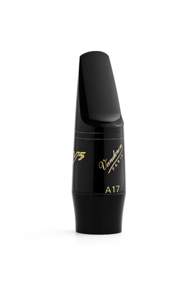
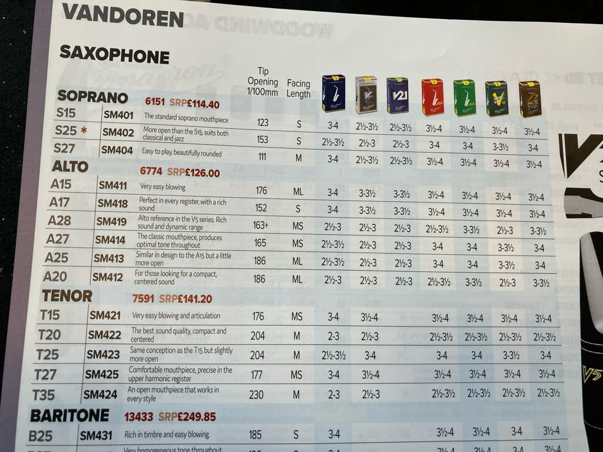

<!-- 🎷 Saxophone - Mouthpiece -->

As the mouthpiece that came with the [saxophone](saxophone) is just a bog standard one I was advised to upgrade. Back to the shops I go!

I found a great video on YouTube - [Upgrading Your First Alto Saxophone Mouthpiece](https://www.youtube.com/watch?v=AOybZxKAOyc) although that just confused me even more, too much choice. I popped into [JG Windows](https://jgwindows.com/) for some advice and based on the description I went for the A17 V5 Alto Saxophone Mouthpiece, I guess back to the Vandoren reeds?

> Perfect in every register, with a rich sound

## Alternatives

| | | |
|-|-|-|
| Vandoren V5 A17 Alto Saxophone Mouthpiece | [Link](https://www.justflutes.com/shop/product/vandoren-v5-classical-ebonite-alto-saxophone-mouthpiece/13147?q=vandoren%20a17%20alto%20mouthpiece) | A17: £109.15 |
| Vandoren V5, A17 | [Link](https://thesaxshack.co.uk/shop/mouthpieces-ligatures/new-mouthpieces/vandoren-mouthpiece-alto-sax-v5-a17/) | £120.00 |
| Vandoren V5 Alto Saxophone Mouthpiece, A17 | [Link](https://www.gear4music.com/Woodwind-Brass-Strings/Vandoren-V5-Alto-Saxophone-Mouthpiece-A17/TGX) | £124.00 |

## 📼 Videos

Upgrading Your First Alto Saxophone Mouthpiece

<?# YouTube AOybZxKAOyc /?>

<!-- <iframe width="560" height="315" src="https://www.youtube.com/embed/AOybZxKAOyc" title="Upgrading Your First Alto Saxophone Mouthpiece" frameborder="0" allow="accelerometer; autoplay; clipboard-write; encrypted-media; gyroscope; picture-in-picture; web-share" allowfullscreen></iframe> -->

## 🔗 Links

- https://vandoren.fr/en/vandoren-mouthpieces/a17-v5-alto-saxophone-mouthpiece/
- https://www.youtube.com/watch?v=AOybZxKAOyc
- https://www.justflutes.com/shop/product/vandoren-v5-classical-ebonite-alto-saxophone-mouthpiece/13147?q=vandoren%20a17%20alto%20mouthpiece
- https://thesaxshack.co.uk/shop/mouthpieces-ligatures/new-mouthpieces/vandoren-mouthpiece-alto-sax-v5-a17/
- https://www.gear4music.com/Woodwind-Brass-Strings/Vandoren-V5-Alto-Saxophone-Mouthpiece-A17/TGX