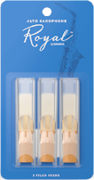
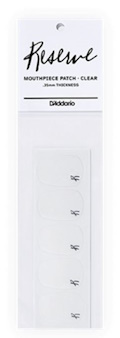
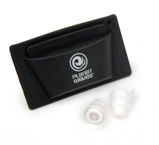

<!-- 🎷 Saxophone - Peripherals -->

It's been about a month and I'm really enjoying learning to play. Let's stock up on some peripherals.

Got some 2 and 2.5 reeds to try out. Mouthpiece patches as I'd knicked one of the teachers, a care kit and some earplugs, although I should probably give them to the neighbour. I was also told that [D'Addario](https://www.daddario.com/) have a points scheme so whenever you buy their products, add the code to your account.

- Royal by D'Addario Alto Sax Reeds, Strength 2, 3-pack
- Royal by D'Addario Alto Sax Reeds, Strength 2.5, 3-pack
- Rico Reserve Mouthpiece Patch - Clear - .35mm
- Stagg Care Kit-Saxphone (SCK-SX)
- D'Addario Pacato Earplugs

")

## 🔗 Links

- https://jgwindows.com/rico-royal-alto-sax-reeds-strength-2-0-3-pack.html
- https://jgwindows.com/rico-royal-alto-sax-reeds-strength-2-5-3-pack.html
- https://jgwindows.com/reserve-mouthpiece-patch-clear-0-35.html
- https://jgwindows.com/stagg-care-kit-saxphone-sck-sx.html
- https://jgwindows.com/planet-waves-pair-pacato-ear-plugs.html