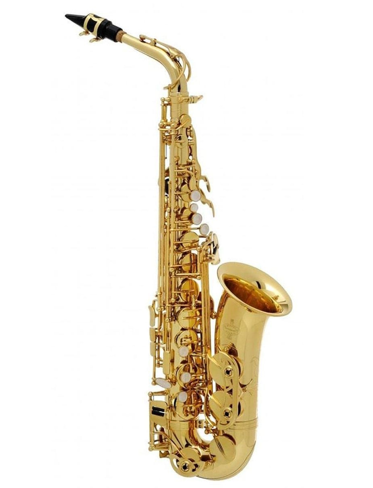
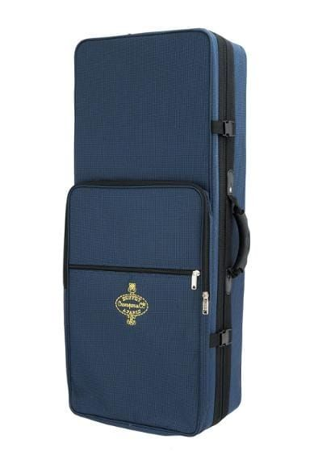

<!-- 🎷 Saxophone -->

Today I had my first lesson 🎷.

On the Saturday before I went into town and bought a Sax, a book and some reeds from [JG Windows](https://jgwindows.com/).

I'd had an intro lesson the week before and got advice on what to buy. And so the journey begins...

## Products

.")

## Instrument

Buffet 100-series Alto Saxophone Outfit

> The Buffet 100 Series Alto Sax has a range of features that you would expect on a top end instrument. Superb for beginners and students, this instrument is a delightful instrument to learn with as wel a great addition to any reed players as a 2nd instrument which is both reliable and afforadble.
>
> The saxophone's consistent intonation as well as easy blowing and response makes this instrument a top class tool for learning music. A wonderful centered tone gives all students a flavour of professional saxophone sounds. This instrument has been made using many professional techniques that are implemented in saxophones of much more value.
>
> The ribbed manufacture of the body concentrates airflow, creating a freer blowing instrument. The premium pads and metal resonators create a full bodied tone and good intonation. This combined with blue steel springs creates an easy action which is ideal for kids and beginners to learn on.
>
> This instrument is finished off with a lacquer, hand engraving on the bell and mother of pearl key buttons.

## Links

- https://jgwindows.com/buffet-100-series-alto-saxophone.html
- https://jgwindows.com/vandoren-alto-sax-reeds-2-traditional-3-pack.html
- https://jgwindows.com/abracadabra-saxophone-pupil-s-book.html

## Site

- https://github.com/alexhedley/saxophone
