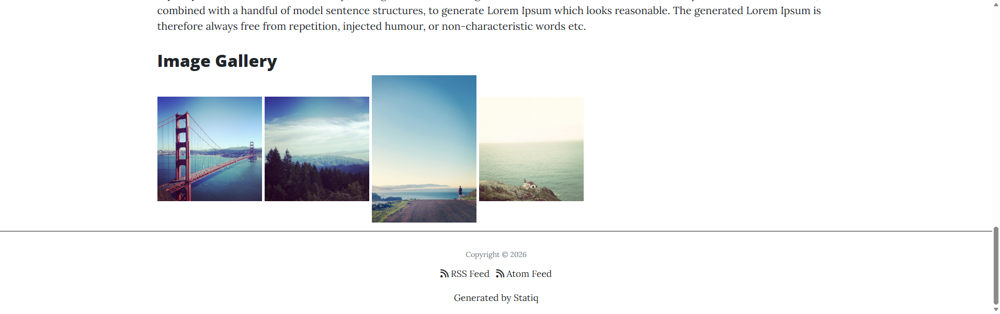
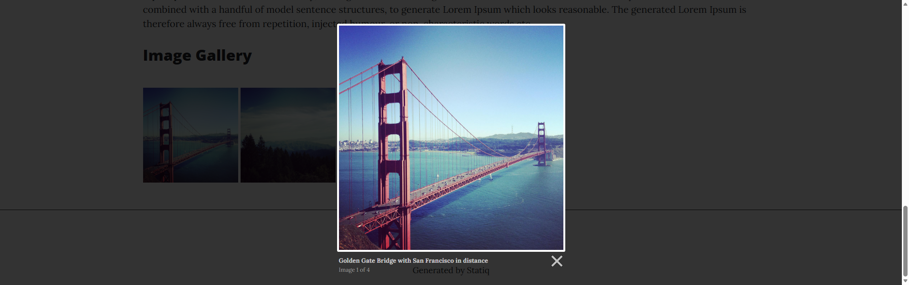

<?! Raw ?><?# Raw ?>

<!-- # Statiq - Plugins -->

It's been  a little while since I've added any new features to my [Static.Plugins](statiq-plugins) library, the last was a [Reading Time](statiq-plugins-reading-time) option to see how long an article might take to get through.

One I've been after for a while is a way to show a number of images in a gallery but without having to resort to swapping to a razor page or adding html in markdown.

You have probably come across [Lightbox JS](https://lokeshdhakar.com/projects/lightbox/), [Lightbox2](https://lokeshdhakar.com/projects/lightbox2/), [Lightbox3](https://lokeshdhakar.com/projects/lightbox3/) from [Lokesh Dhakar](https://lokeshdhakar.com/).

Before the changes to [GitHub Copilot](github-copilot) I thought I'd put it to some use working on my outstanding ideas/[issues](https://github.com/AlexHedley/statiq.plugins/issues): 

- https://github.com/AlexHedley/statiq.plugins/issues/10
- https://github.com/AlexHedley/statiq.plugins/pull/11

Add the `ImageGalleryConfigurator` to your bootstrapper:

```cs
return await Bootstrapper
  .Factory
  .CreateWeb(args)
  .AddConfigurator<Bootstrapper>(new ImageGalleryConfigurator())
  .RunAsync();
```

Include the Lightbox2 CSS and JS in your layout (e.g. via CDN):

```html
<link rel="stylesheet" href="https://cdnjs.cloudflare.com/ajax/libs/lightbox2/2.11.4/css/lightbox.min.css" crossorigin="anonymous" referrerpolicy="no-referrer" />
<script src="https://cdnjs.cloudflare.com/ajax/libs/lightbox2/2.11.4/js/lightbox.min.js" crossorigin="anonymous" referrerpolicy="no-referrer"></script>
```

Then use the `shortcode` in any Markdown file and check you are using the correct pre-processor (`<?!`) so it won't add any stray `<p>` tags in the outputted html.

```markdown
<?! ImageGallery Name=my-gallery ?>
/images/photo1.jpg|Caption for photo 1|Image Alt
/images/photo2.jpg|Caption for photo 2
/images/photo3.jpg
<?!/ ImageGallery ?>
```

You can see it in action in the Sample site with the repo.





## Code


[](https://www.nuget.org/packages/Statiq.Plugins/)
[](https://www.nuget.org/packages/Statiq.Plugins/)

`dotnet add package Statiq.Plugins --version #.#.#`

<?# Info ?>
Update the `version` number (`#.#.#`) to the latest release.
<?#/ Info ?>

- https://github.com/alexhedley/statiq.plugins
  - https://github.com/AlexHedley/statiq.plugins/pkgs/nuget/Statiq.Plugins
- https://www.nuget.org/packages/Statiq.Plugins/

<?#/ Raw ?><?!/ Raw ?>
