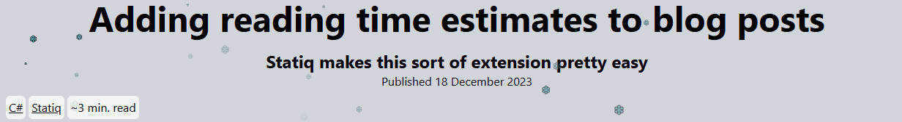

<!-- # Statiq - Plugins -->

I've been keeping a list of Statiq Community extensions and uses on the main Discussions list:

- Plugins: https://github.com/orgs/statiqdev/discussions/223
- Themes: https://github.com/orgs/statiqdev/discussions/227

I was reviewing some blog posts and found a few from _Jeremy Davis_, see [Statiq](https://blog.jermdavis.dev/tags/statiq/) 🏷 tag.

To make this easier to add into my own blog I decided to make a new project: [Statiq.Plugins](https://github.com/alexhedley/statiq.plugins) and port the features there.

> **Adding reading time estimates to blog posts from @ Jeremy Davis**
> - https://blog.jermdavis.dev/posts/2023/reading-time-estimates-statiq

In your `appsettings.json` add a new property `ReadingSpeed` and set it to your desired value:

`"ReadingSpeed": 200`

You can then override the `input/_header.cshtml` of your theme and place the calculated time after the tags.

```html
<span>~@Model.GetString("ReadingTime") minutes</span>
```

_Example_

You can see an example on my test site: https://alexhedley.com/statiqweb-example/posts/1


or



In the future I'm looking to add more functionality. I've raised a number of [Issues](https://github.com/AlexHedley/statiq.plugins/issues) to track them. If you have any ideas please add your own.

## Code


[](https://www.nuget.org/packages/Statiq.Plugins/)
[](https://www.nuget.org/packages/Statiq.Plugins/)

`dotnet add package Statiq.Plugins --version #.#.#`

<?# Info ?>
Update the `version` number (`#.#.#`) to the latest release.
<?#/ Info ?>

- https://github.com/alexhedley/statiq.plugins
  - https://github.com/AlexHedley/statiq.plugins/pkgs/nuget/Statiq.Plugins
- https://www.nuget.org/packages/Statiq.Plugins/
