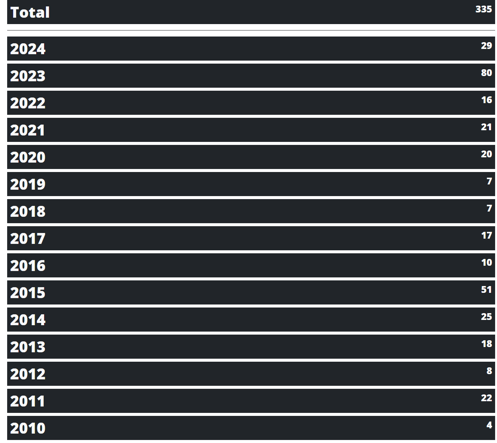

<!-- # Statiq - Stats -->

Previously I'd added a count of posts [commit](https://github.com/AlexHedley/blog/commit/ce65090ba756000610f09653603efc6e3e5e7da6) to the [Posts](https://alexhedley.com/blog/posts/) page. Adding some styling to the `src/input/scss/_overrides.scss` to position it on the right hand side and make it a little smaller, I think it looks quite nice.

Who doesn't want a Total count too?! I made a new **Stats** page just to show the combined total and total for each year.

I might add a graph at some point.

335 posts isn't bad!



## Code

Create a new page `src\input\stats.cshtml`. Update the `Order` you want.

```
Title: Stats
IsPage: true
ShowInNavbar: true
Order: 400
---

<h1 class="bg-dark text-light p-2">Total <span class="postCount">@(Outputs.FromPipeline(nameof(Content))
                                                                        .Flatten()
                                                                        .FilterSources($"posts/*")
                                                                        .Count())</span></h1>

<hr />

@* Years Count *@
@foreach(IGrouping<int, IDocument> group in Outputs
                                            .FromPipeline(nameof(Content))
                                            .Flatten()
                                            .FilterSources($"posts/*")
                                            .GroupBy(x => x.GetDateTime(WebKeys.Published).Year)
                                            .OrderByDescending(x => x.Key))
{
    <h1 class="bg-dark text-light p-2">@group.Key <span class="postCount">@group.Count()</span></h1>
}
```

I originally got the syntax wrong, I put a bracket in the wrong place and couldn't see the wood for the trees. Thankfully I got some help from _@girlpunk_ on Statiq's GitHub Discussions: [D#230](https://github.com/orgs/statiqdev/discussions/230).
