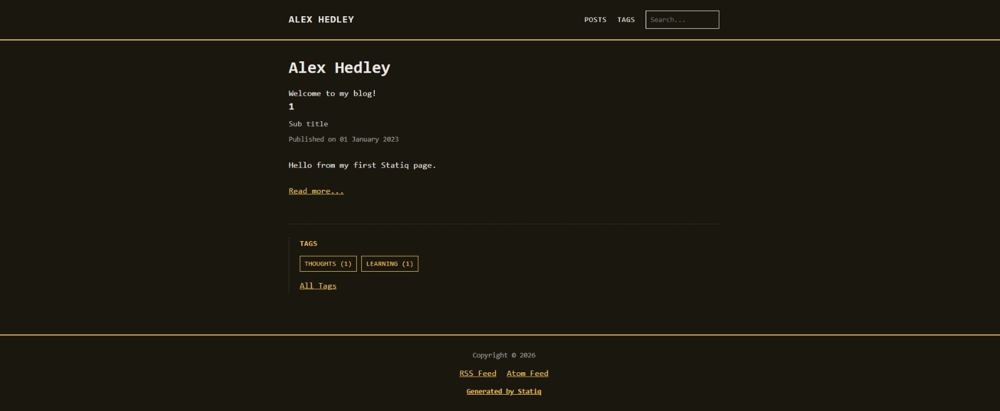
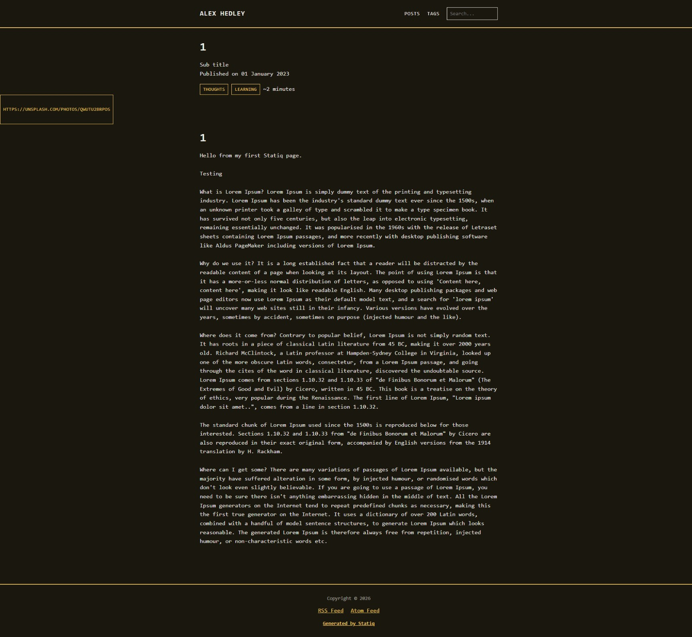

Ever since coming across the [terminal-css](https://panr.github.io/terminal-css/) theme I've needed a use for it, once of which could be this blog, which uses [Statiq](https://www.statiq.dev/) so I'd need to create a [theme](https://www.statiq.dev/guide/themes/) for it.

Using the [Clean Blog](https://github.com/statiqdev/CleanBlog) theme as template I could get started, trusty [GitHub Copilot](github-copilot) to the rescue:

> Creating a new Statiq theme using CleanBlog and terminal-css styling

- https://github.com/AlexHedley/statiq-theme-terminal-css/pull/1
- https://github.com/AlexHedley/statiq-theme-terminal-css/tasks/92cc75a4-dd0f-430f-879a-e8ae0979540c?author=AlexHedley

Use it in my [statiqweb-example](https://github.com/AlexHedley/statiqweb-example) repo and you get:

Posts

Post

The image header needs a little work.

<!-- ## Site

- 🌍 https://www.alexhedley.com/... -->

## </> Code

- https://github.com/AlexHedley/statiq-theme-terminal-css

## 🔗Links

- https://panr.github.io/terminal-css/
- https://github.com/panr/terminal-css

- Themes: https://github.com/orgs/statiqdev/discussions/227
- https://github.com/AlexHedley/statiqweb-example
