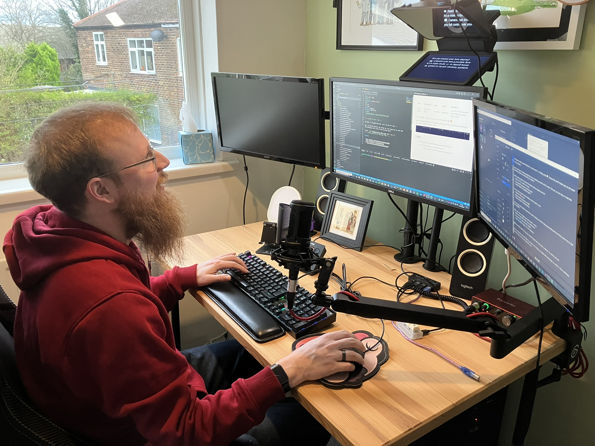
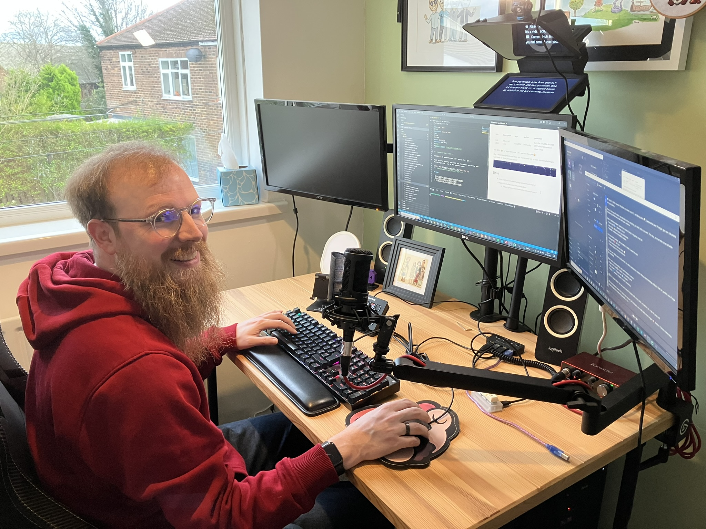
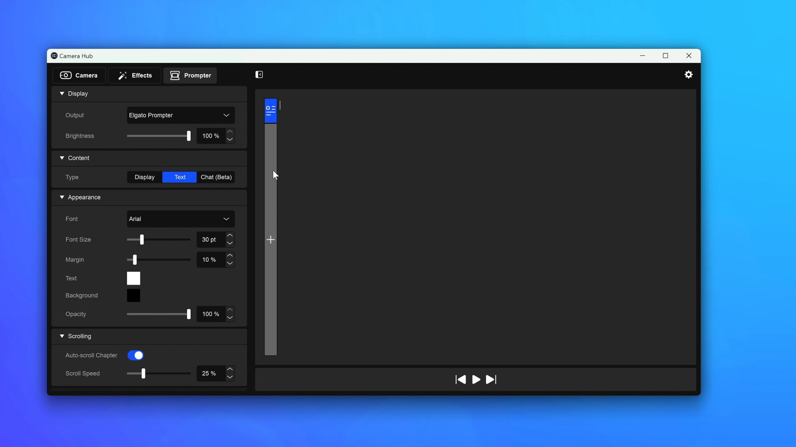
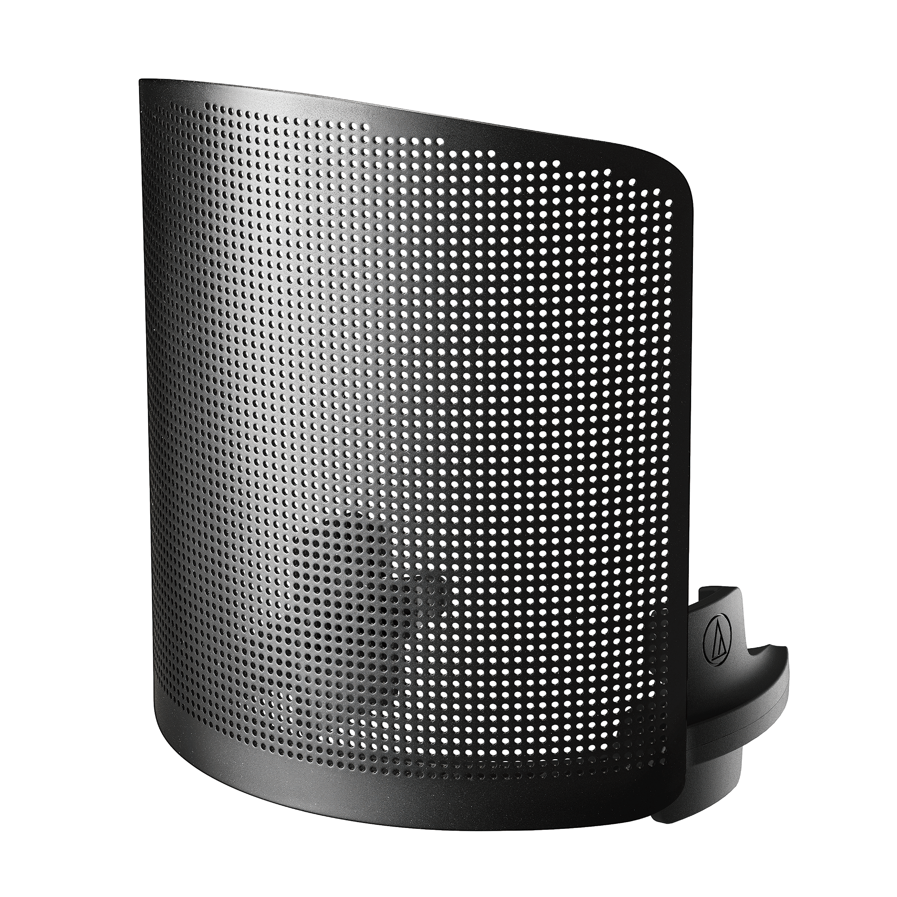

<!-- Streaming Equipment 2 -->

I treated myself to some more [Streaming Equipment](streaming-equipment), this time an Elgato Teleprompter.

After setting it all up I thought I'd take a couple of action shots!

Just need to write up some scripts to use for my next course(s).

There was a deal on their site to get a bundle of all the extra equipment I needed, just need to get the Key Light Mini to connect to my wifi and I'll be able to control that with my Stream Deck ([Twitch post](twitch)).

There's a great app called Camera Hub ([Downloads](https://www.elgato.com/uk/en/s/downloads)) that lets you add your own content and then control the speed of which it shows on the screen. I might have to get the [Stream Deck Pedal](https://www.elgato.com/uk/en/p/stream-deck-pedal) next.

Finally I received a gift for my Birthday of a _Microphone Pop Filter_ for my **Audio Technica AT2020** microphone.

**Microphone Pop Filter - AT8175**  
🔗 https://www.audio-technica.com/en-gb/at8175  
💷 £19.99  

## 🔗 Links

- https://www.elgato.com/uk/en/p/prompter
- https://www.elgato.com/uk/en/p/key-light-mini
- https://www.elgato.com/uk/en/p/cold-shoe
- https://www.elgato.com/uk/en/p/master-mount-l
- https://www.audio-technica.com/en-gb/at8175