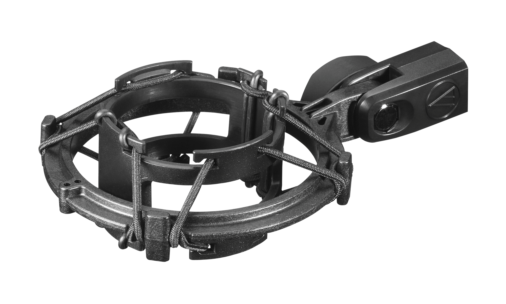
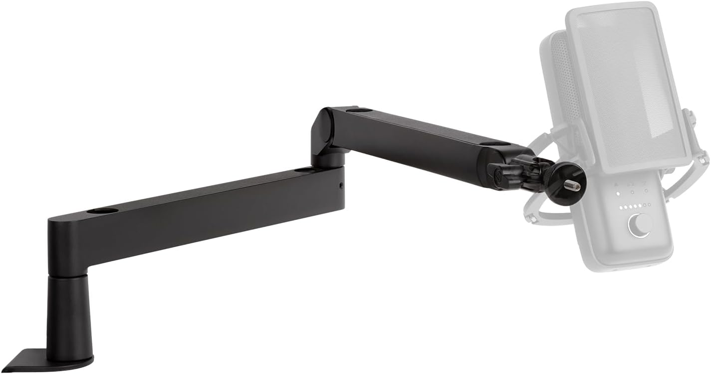
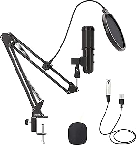

<!-- Streaming Equipment -->

I've upgraded my Microphone equipment for use with my [AT2020](https://www.audio-technica.com/en-gb/at2020).

I've bought the Microphone Shock Mount
[AT8458a](https://www.audio-technica.com/en-gb/microphones/wired/accessories/mounts-clips/at8458a). The clip on my existing one wasn't holding it very safely, I kept knocking it out and was possibly going to damage it.

- [AT8458a](https://www.audio-technica.com/en-gb/microphones/wired/accessories/mounts-clips/at8458a) **£25.00** (+ £3.99 P&P)

Next was a new mic arm, my original was ok but having looked at others I like the fact this one pivots horizontally and vertically and can hide the wires.

 **£69.98**

> A studio-grade boom arm for your premium microphone, Wave Mic Arm offers extra reach, full adjustability, integrated cable channels and compatibility with standard mic mounts.

- [Wave Mic Arm](https://www.elgato.com/uk/en/p/wave-mic-arm) RRP **£89.99**

---

Original:

Koolertron USB Condenser Microphone, BM-900 Condenser Microphone Kit with Adjustable Microphone Suspension Scissor Arm, Shock Mount and Double-layer Pop Filter for Studio Recording and Broadcasting

- [Purchase](https://www.amazon.co.uk/gp/product/B07QV7TS93/) _Amazon_ **£34.99**

Previous post: [Twitch](twitch).
