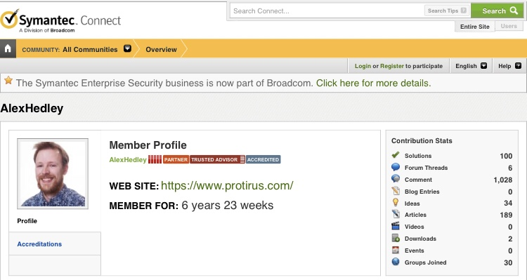

After 6 years and 23 weeks I've hit 100 solutions from 1,028 comments.

Not sure if that's a good ratio in comparison to others but it is a milestone I thought I'd document.

You can find my profile here:

[https://www.symantec.com/connect/user/alexhedley](https://www.symantec.com/connect/user/alexhedley)

I've made a lot of Articles over the years, mostly for Symantec Workflow / ServiceDesk / SMP.

Let's see when I hit 200!

 [Original Link](https://alexhedley.wordpress.com/2019/12/23/symantec-connect-100-solutions/)
