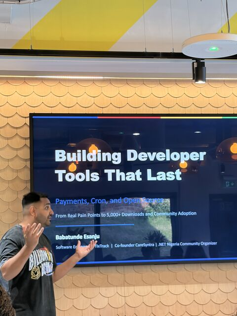
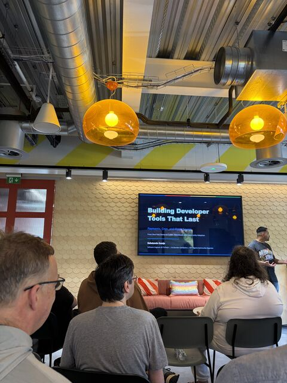
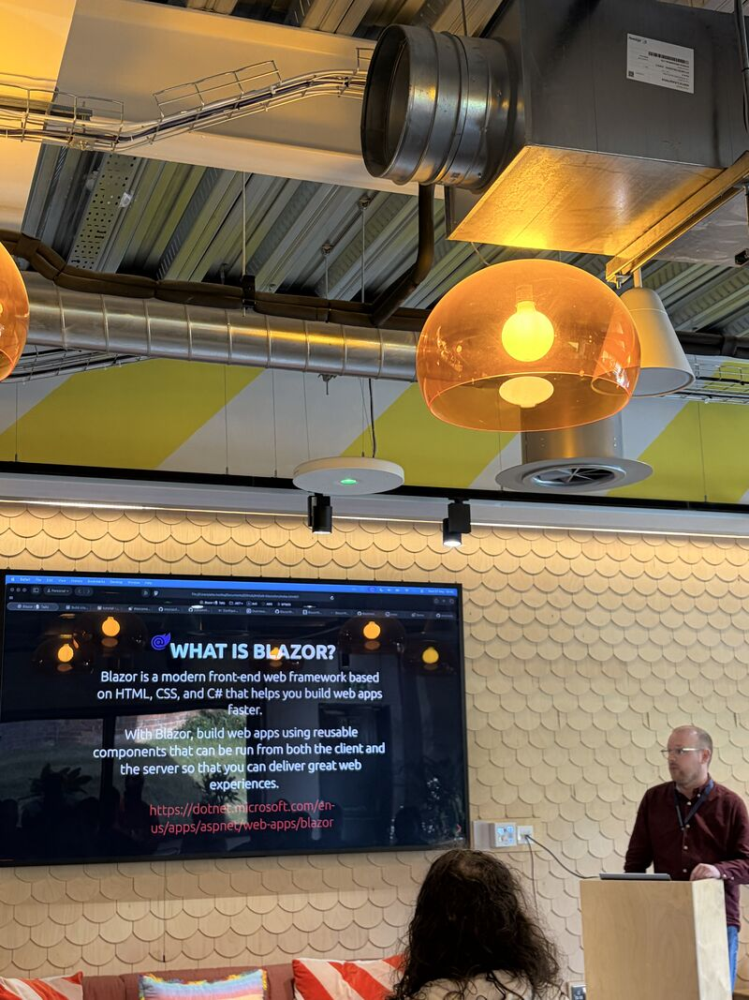
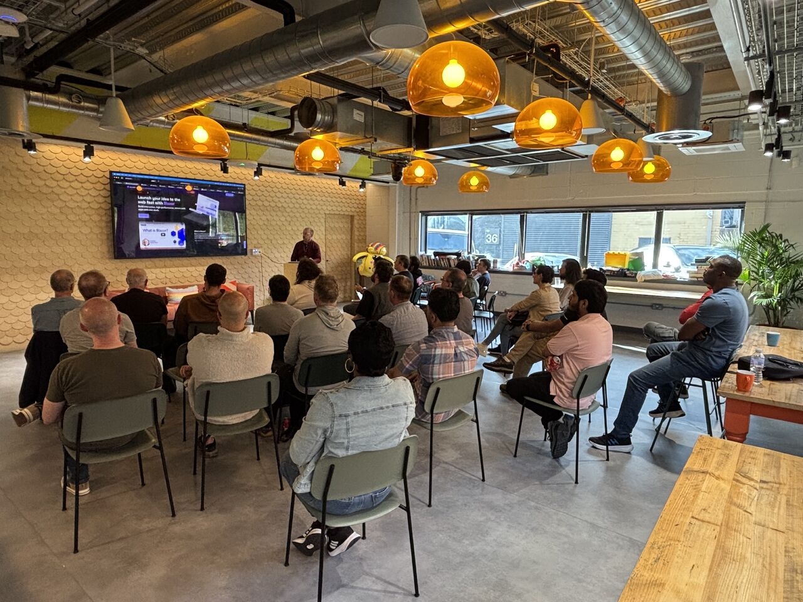
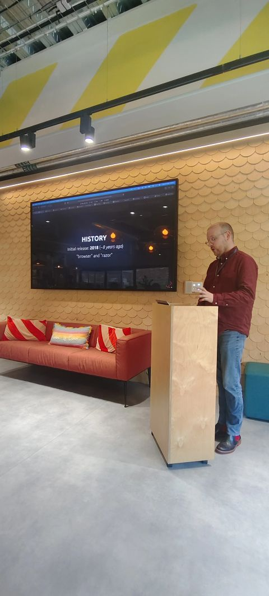
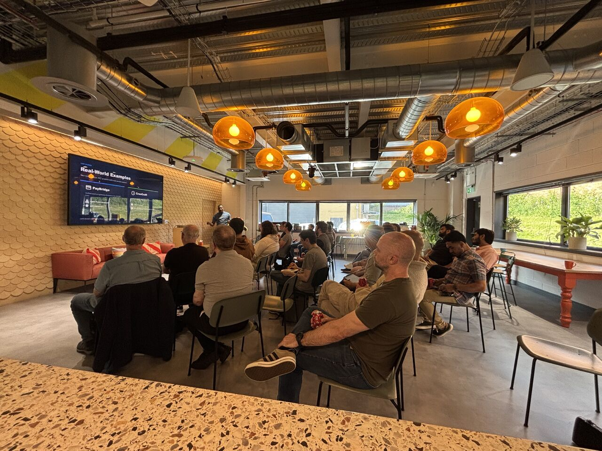
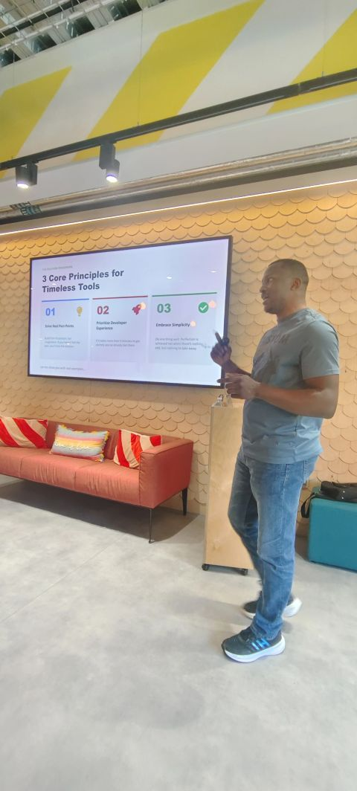
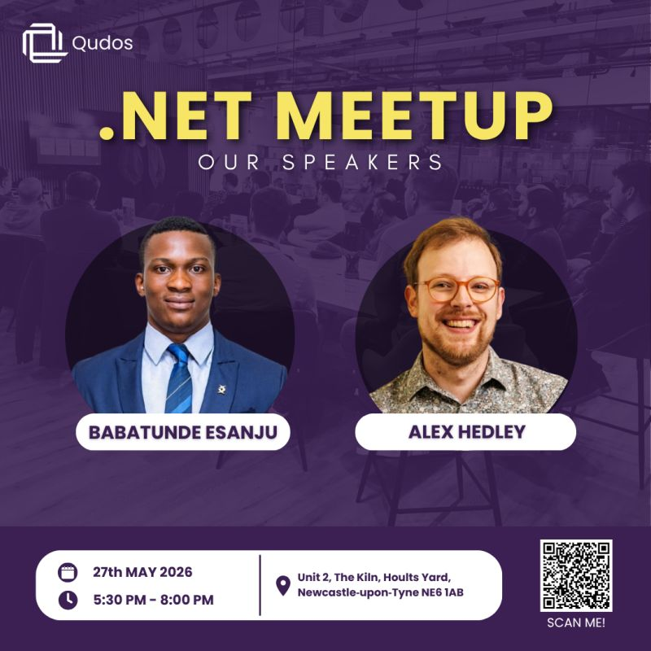

<!-- # An Intro To Blazor (Talk) -->

<!--  -->

May’s North East .NET Meetup - hosted by Opencast

The lovely folks over at Opencast have kindly offered to host the North East .NET Meetup as part of their Open Spaces initiative.

We will now be based at Unit 2, The Kiln, Hoults Yard, Newcastle‑upon‑Tyne NE6 1AB - plenty of free parking on site (input your reg at reception) and a short walk from the nearest Metro

We have a fairly relaxed agenda, but will follow:

5:30 - Doors Open  
5:45 - Pizza arrival  
6:00 - Introduction / Housekeeping  
6:10 - Talks begin  
8:00 - Closing  

Who should attend:

Beginners and experienced .NET developers, architects, cloud engineers, and anyone curious about building smarter, AI-enhanced applications with Microsoft technologies.

Speaker 1: Babatunde Esanju

Title: Building Developer Tools in the Open: Lessons from PayBridge & CronCraft

Description:

Building a developer tool is one thing; building one that others actually adopt, contribute to, and integrate into their own production systems is something else entirely. In this talk, Babatunde will take you behind the scenes of two open-source projects: PayBridge.SDK, a unified .NET payment gateway abstraction adopted by developers across the .NET ecosystem, and CronCraft, a background job scheduling library that has been integrated into larger production projects and gained significant traction on GitHub.

He will unpack the full lifecycle of building developer tools in the open, from the initial problem-solving itch that sparked each project, through the painful API design decisions, versioning challenges, and documentation trade-offs, to the community dynamics that determine whether a library quietly fades or genuinely takes off. He will also explore what happens when your tool gets adopted by a larger project, and what that teaches you about writing code for an audience you'll never meet.

Whether you're thinking about open-sourcing your first library or you're already maintaining one, this talk will offer honest, practical insights into the craft of building tools that earn the trust of other engineers.

Speaker Bio:

Babatunde is a Software Engineer at TixTrack, where he architects enterprise-scale ticketing systems, and a co-founder of CareSyntra, an AI-powered care management platform built for UK care homes and domiciliary agencies. An active open-source contributor, he created PayBridge.SDK and CronCraft, tools now used by thousands of developers across the .NET ecosystem. He is the Lead Organizer of the .NET Nigeria Community, a Global AI Delegate for GAFAI, and the founder and host of TechNaija FM, a podcast amplifying African tech voices on the global stage. Based in Liverpool, he is passionate about building tools, communities, and conversations that bridge ecosystems.

Speaker 2: Alex Hedley

Title: An Intro to Blazor

Description:

In this presentation you will learn about the .NET Blazor framework, how to get started and a few interesting libraries.

Speaker Bio:

Alex Hedley is a Senior IT Consultant at Opencast, specialising in Software Development.

He has 15+ years consulting experience building Enterprise security applications, integrations etc.

## Details

🗓️ Wednesday, May 27  
🕰 5:30 PM to 7:30 PM BST  
📍 Hoults Estate, Unit 2, The Kiln, Walker Rd, Byker · Tyne and Wear  
🔗 https://www.meetup.com/dotnetmeetupnorth/events/314552885/

## 📸 Photos

<?! ImageGallery Name=my-gallery ?>
images/meetups/dotnet/may2026/Qasim-1.jpeg|Qasim
images/meetups/dotnet/may2026/Qasim-2.jpeg|Qasim
images/meetups/dotnet/may2026/Alex-1.jpeg|Alex
images/meetups/dotnet/may2026/Alex-2.jpeg|Alex
images/meetups/dotnet/may2026/Alex-3.jpeg|Alex
images/meetups/dotnet/may2026/Babatunde-2.jpeg|Babatunde
images/meetups/dotnet/may2026/Babatunde-3.jpeg|Babatunde
<?!/ ImageGallery ?>

<!--  -->
<!--  -->

<!--  -->
<!--  -->
<!--  -->

<!--  -->
<!--  -->

<!--  -->

## Video

Unfortunately it wasn't recorded but you can read the presentation in the links below.

## 🔗 Links

- https://www.meetup.com/dotnetmeetupnorth/events/314552885/
- https://www.meetup.com/dotnetmeetupnorth/

- https://alex-hedley.github.io/talk-blazor/
- https://github.com/alex-hedley/talk-blazor
