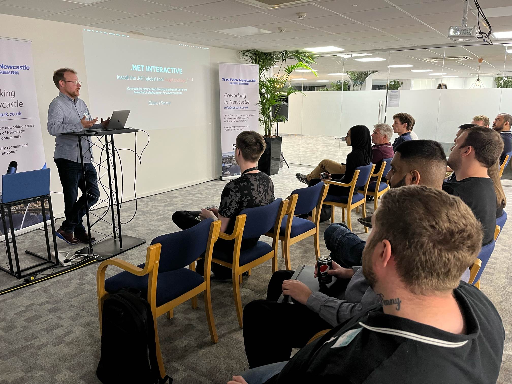
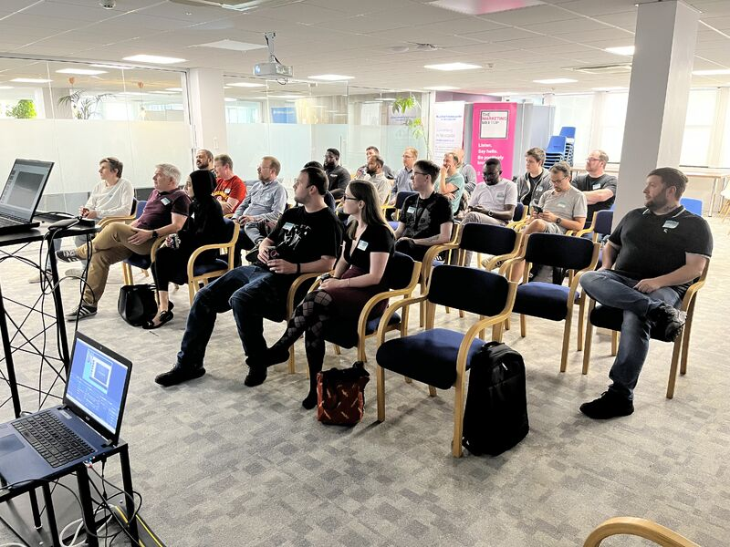
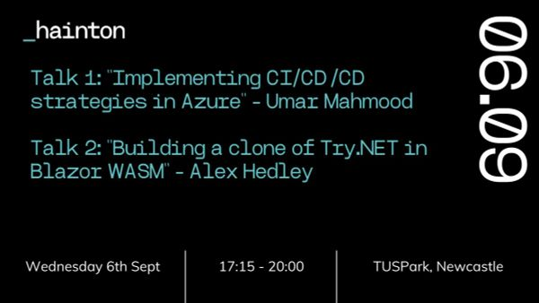
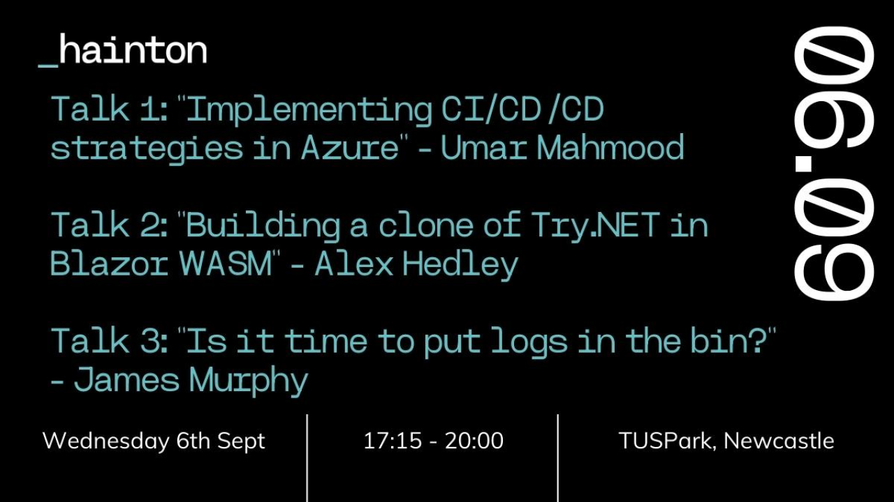

<!-- # Blazor Interactive (Talk) -->

On Wednesday the 6th of Sept 2023 I stood on "stage" at the Hainton .NET meetup in [Tuspark](https://www.tuspark.co.uk/our-science-parks/tuspark-newcastle/) Newcastle.

I presented on an application I built called Blazor Interactive, which is a website that allows you to compile and run code in the browser. See more at [.NET Blazor Interactive](/dotnet-blazor-interactive).

Thanks [Qasim](https://www.linkedin.com/in/qasim-asghar-hainton/) and [Tom](https://www.linkedin.com/in/tomhainton/) from [Hainton](https://www.hainton.com/) for giving me the opportunity, it was great to push myself and try something I've wanted to do for a long time.
I've given many talks at work, over the years, either in person or recently via Teams but this was something more public.

I think I may have been a little nervous as I rushed through the talk in about 15 minutes where it had usually been taking about 25, when practicing at home, talking to the cat :p. Lots of great questions afterwards though so hopefully it was interesting.

I'm undecided if I'll watch the recording back but I'll be sure to link it below when it's published.

Thinking about doing another one already!

Thanks also to Umar for his excellent talk on CI/CD/CD. Make sure to check that out too.

## Photos

## Details

🗓️ Sept 6, 2023  
🕰 17:15 - 20:00  
📍 Tuspark, Newcastle  
🔗 [[In Person] Newcastle .NET Event - September 6th - 2 Talks](https://www.meetup.com/haintonsdotnetmeetup/events/295218917)

<!--  -->

## Video

- 📼 [Blazor Interactive by Alex Hedley](https://www.youtube.com/watch?v=hfMHdYciadM)

See previous Hainton talks on YouTube: [.NET Events](https://www.youtube.com/watch?v=FbluYhmSW88&list=PLw02H-P5Q7FeiRF6nbLz55m-IofeSVAkM)
See previous Qudos talks on YouTube: [@QudosRecruitment](https://www.youtube.com/@QudosRecruitment)

<iframe width="560" height="315" src="https://www.youtube.com/embed/hfMHdYciadM?si=8UC76RlwZ2ZJQeZu" title="YouTube video player" frameborder="0" allow="accelerometer; autoplay; clipboard-write; encrypted-media; gyroscope; picture-in-picture; web-share" allowfullscreen></iframe>

## Links

- Original blog post [.NET Blazor Interactive](/dotnet-blazor-interactive)

- [Presentation](https://alex-hedley.github.io/talk-blazorinteractive/)
- [Presentation Code](https://github.com/alex-hedley/talk-blazorinteractive)

- [App](https://alex-hedley.github.io/BlazorInteractive/)
- [App Code](https://github.com/alex-hedley/BlazorInteractive)
