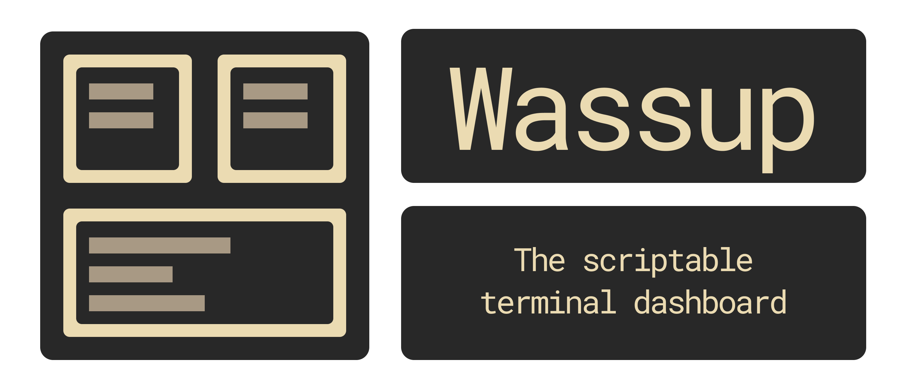
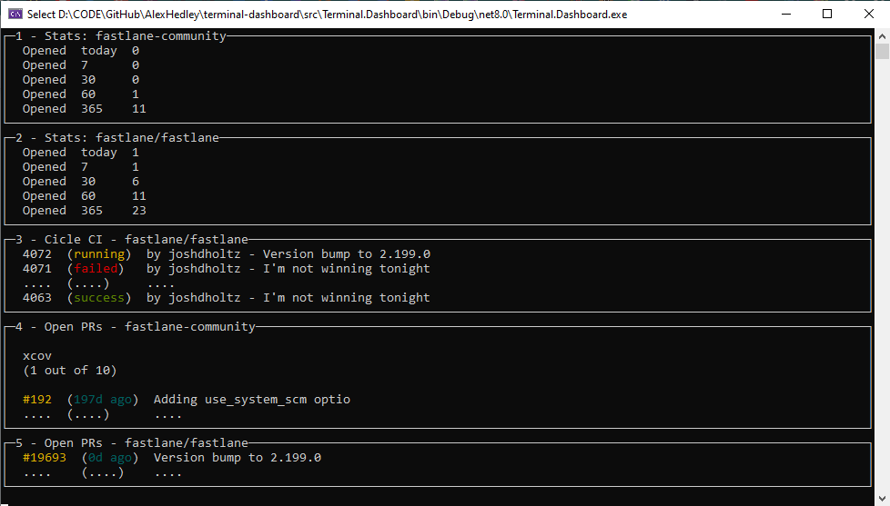
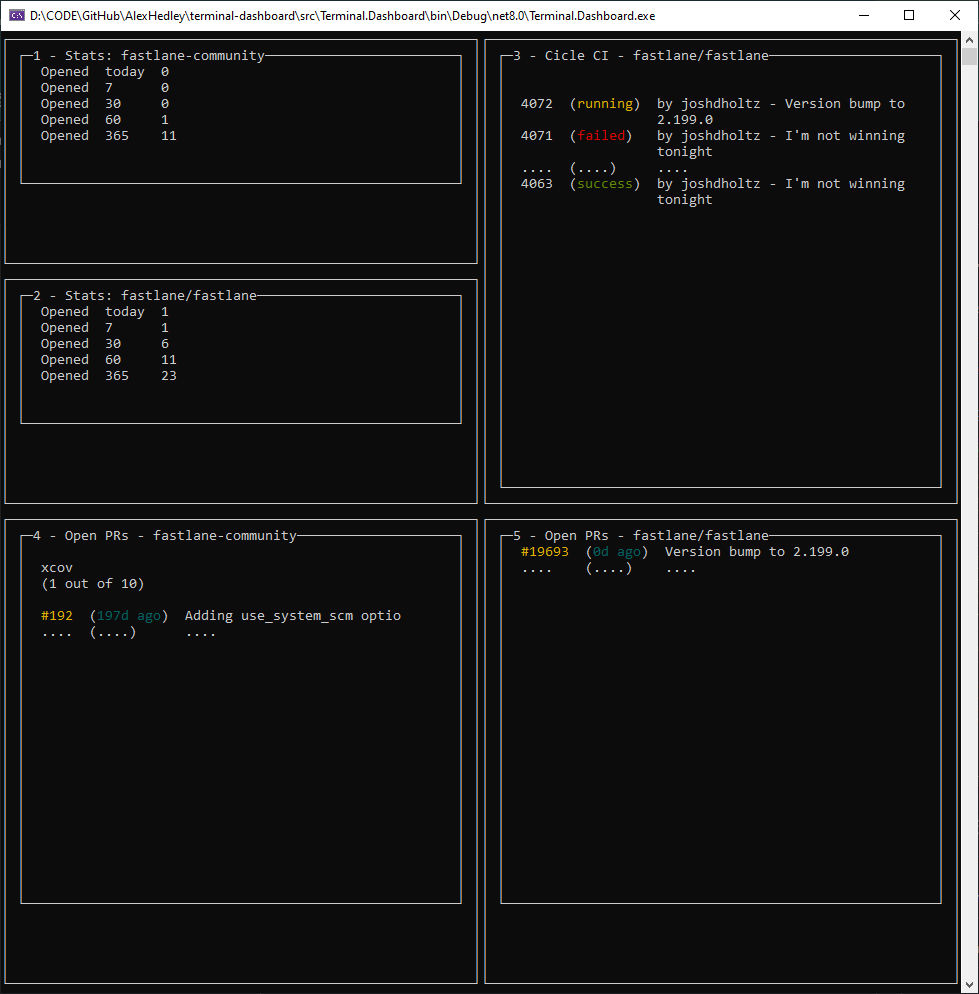

<!-- Terminal Dashboard -->

I recently came across the following app: **wassup**.

> **Wassup** is a scriptable terminal dashboard. Configure panes and content logic in a `Supfile` and then run `wassup`.

I've probably followed [@joshdholtz](https://github.com/joshdholtz) since his [fastlane](https://github.com/fastlane) days and loved the concept behind this.

Now I can read Ruby but would I say I'm confident in working with it... plus the idea here was to "borrow" the concept and see if I could rebuild it in .... .NET of course.

Now there are libraries out there that can do a majority of the work so I might as well start with using [Spectre.Console](https://spectreconsole.net/)

Added the sample data just to see what it looks like:

Then tried putting into panels.

Helps if I don't wrap panels in panels!

Next is to actually get data from some APIs... then create an equivalent `Supfile` to build up any layout you wish.

## 🔗Links

- https://github.com/AlexHedley/terminal-dashboard
- [wassup](https://github.com/joshdholtz/wassup) from [@joshdholtz](https://github.com/joshdholtz)
- Spectre.Console https://spectreconsole.net/
  - https://github.com/spectreconsole
