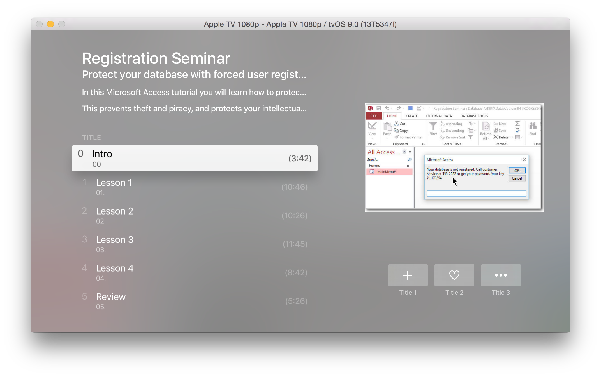

So I'd like to play a Video in an Apple TV App.

I need to look into Player from the TVJS Lib.

https://developer.apple.com/library/prerelease/tvos/documentation/TVMLJS/Reference/TVJSPlayer\_Ref/index.html#//apple\_ref/javascript/cl/Player

_Forum_

https://forums.developer.apple.com/thread/17338?sr=stream&ru=377

https://forums.developer.apple.com/message/52011#52011

https://forums.developer.apple.com/message/53126#53126 I can play a Video using AVPlayer but need to look into the controls

[gist dac53c99670daddebd72 /]

`application.js`

```javascript
function launchPlayer() {  
  var player = new Player();  
  var playlist = new Playlist();  
  var mediaItem = new MediaItem("video", "http://trailers.apple.com/movies/focus_features/9/9-clip_480p.mov");  
  player.playlist = playlist;  
  player.playlist.push(mediaItem);  
  player.present();  
}

//in application.js  
App.onLaunch = function(options) {  
   launchPlayer();  
}
```

`PlayerViewController.m`

```objectivec
NSString *filepath = [[NSBundle mainBundle] pathForResource:@"FILENAME" ofType:@"mp4"];
NSURL *fileURL = [NSURL fileURLWithPath:filepath];
self.avPlayer = [AVPlayer playerWithURL:fileURL];

AVPlayerLayer *layer = [AVPlayerLayer playerLayerWithPlayer:self.avPlayer];
self.avPlayer.actionAtItemEnd = AVPlayerActionAtItemEndNone;
layer.frame = CGRectMake(0, 0, 1024, 768);
[self.view.layer addSublayer: layer];

[self.avPlayer play];
```

I'd prefer to create the view using the TVML as the 'Compilation.xml' seems to be the perfect fit for it.

<blockquote class="twitter-tweet"><p lang="en" dir="ltr">Trying out an idea for Apple TV with <a href="https://twitter.com/599CD?ref_src=twsrc%5Etfw">@599CD</a><br>How would the Registration Seminar look?<a href="https://t.co/A8eFsx29Th">https://t.co/A8eFsx29Th</a> <a href="http://t.co/5jVGuGF22b">pic.twitter.com/5jVGuGF22b</a></p>&mdash; Alex Hedley (@AlexHedley) <a href="https://twitter.com/AlexHedley/status/642737644309487616?ref_src=twsrc%5Etfw">September 12, 2015</a></blockquote> <script async src="https://platform.twitter.com/widgets.js" charset="utf-8"></script>

https://twitter.com/AlexHedley/status/642737644309487616/photo/1



Finally found out that the videos files can't be running under python.

If you change the URL to a file on the web it works fine.

http://stackoverflow.com/questions/32518673/setting-up-apple-tv-video-javascript

> I think you're using the Python SimpleHTTPServer for your test, it did not worked for video streaming, but if you use Apache or for example this file directly from apple "[http://trailers.apple.com/movies/focus\_features/9/9-clip\_480p.mov](http://trailers.apple.com/movies/focus_features/9/9-clip_480p.mov)" it will work. [user2418630](http://stackoverflow.com/users/2418630/user2418630)
> 
> This is correct. I think video playback requires that the server supports, among other things, byte-range requests. –  [lemnar](http://stackoverflow.com/users/196079/lemnar "3326 reputation")

**Blogs**

http://martinnormark.com/playing-video-on-apple-tv-with-tvos/

 [Original Link](https://alexhedley.wordpress.com/2015/09/12/tvos-playing-a-video/)
