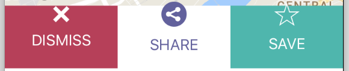

https://stackoverflow.com/a/22621613/2895831

[gist 87d1917da7745da9cd77033508e69243 /]

`UIButton+VerticalLayout.m`

```objectivec
//https://stackoverflow.com/a/22621613/2895831

@interface UIButton (VerticalLayout)  

- (void)centerVerticallyWithPadding:(float)padding;  
- (void)centerVertically;  

@end  

@implementation UIButton (VerticalLayout)  

- (void)centerVerticallyWithPadding:(float)padding {      
    CGSize imageSize = self.imageView.frame.size;  
    CGSize titleSize = self.titleLabel.frame.size;  
    CGFloat totalHeight = (imageSize.height + titleSize.height + padding);  
    self.imageEdgeInsets = UIEdgeInsetsMake(- (totalHeight - imageSize.height),
                                            0.0f,
                                            0.0f,
                                            - titleSize.width);
    self.titleEdgeInsets = UIEdgeInsetsMake(0.0f,
                                            - imageSize.width,
                                            - (totalHeight - titleSize.height),
                                            0.0f);
//     self.contentEdgeInsets = UIEdgeInsetsMake(0.0f,
//                                             0.0f,
//                                             titleSize.height,
//                                             0.0f);
    CGFloat inset = (self.frame.size.height - totalHeight)/2;
    self.contentEdgeInsets = UIEdgeInsetsMake(inset, 0.0f, inset, 0.0f);
}

- (void)centerVertically {  
    const CGFloat kDefaultPadding = 6.0f;
    [self centerVerticallyWithPadding:kDefaultPadding];  
}
@end
```

I added some buttons into a UIStackView but the image overlaps the button.

[gallery ids="1046,1047" type="rectangular"]




I modified the _contentEdgeInsets_

```objectivec
CGFloat inset = (self.frame.size.height - totalHeight)/2;
self.contentEdgeInsets = UIEdgeInsetsMake(inset, 0.0f, inset, 0.0f);
```

 [Original Link](https://alexhedley.wordpress.com/2017/08/04/uibutton-verticallayout/)
