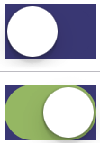

Changing the colour of a [UISwitch](https://developer.apple.com/reference/uikit/uiswitch?language=objc) control.

```objectivec
#define kSwitchOnColor [UIColor colorWithRed:0.647 green:0.757 blue:0.463 alpha:1] // /*#A5C176*/ Green
#define kSwitchOffColor [UIColor colorWithRed:0.29 green:0.29 blue:0.525 alpha:1]; // /*#4A4A86*/ Purple
```

```objectivec
UISwitch *switchview = [[UISwitch alloc] initWithFrame:CGRectZero];
[switchview setOn:TRUE animated:YES\];
switchview.onTintColor = kSwitchOnColor;
switchview.tintColor = kSwitchOffColor;
//tintColor just does outline
switchview.backgroundColor = kSwitchOffColor;
switchview.layer.cornerRadius = 16.0f;

tintColor changes the background when sliding but when off just has the outline, if you change the background then it is square so add a corner radius.
```

[gallery ids="917,918,916,915" type="rectangular"]





- http://stackoverflow.com/a/22830039/2895831
- http://stackoverflow.com/a/19123019/2895831

[gist https://gist.github.com/AlexHedley/41485d2b11f6f03a4734e350ee7dac3f /]

<?# Gist 41485d2b11f6f03a4734e350ee7dac3f /?>

 [Original Link](https://alexhedley.wordpress.com/2017/04/03/uiswitch/)
