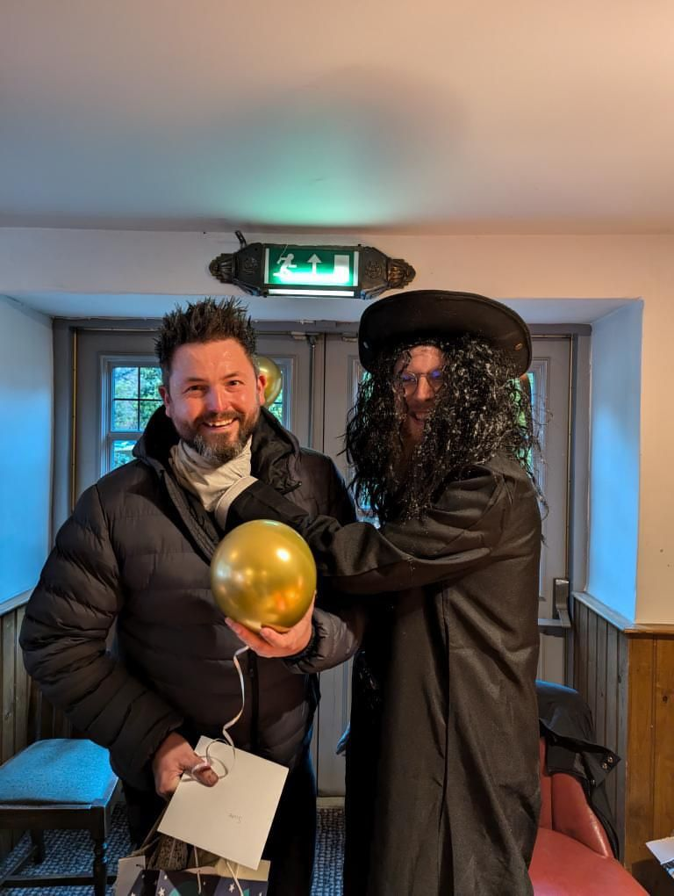
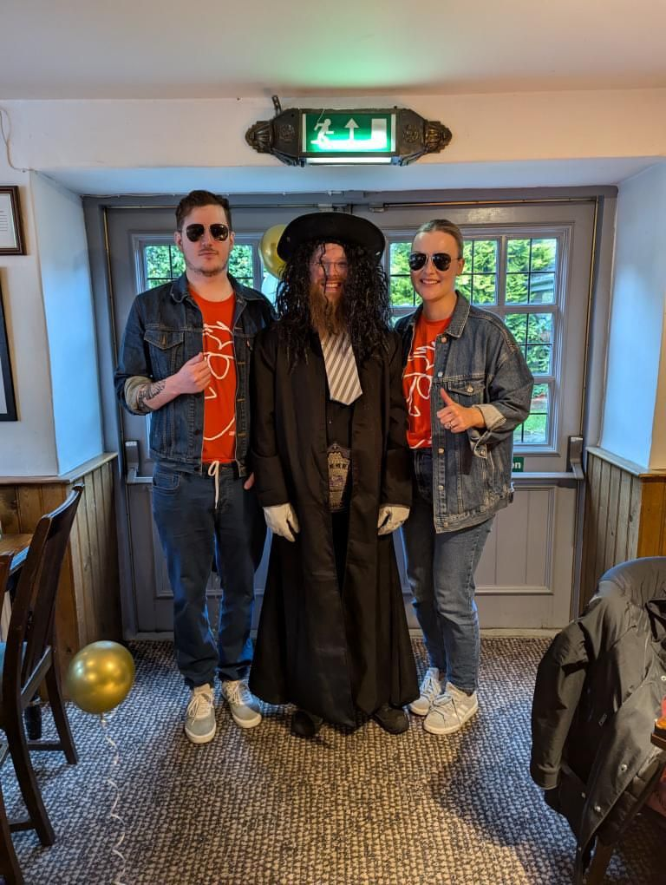
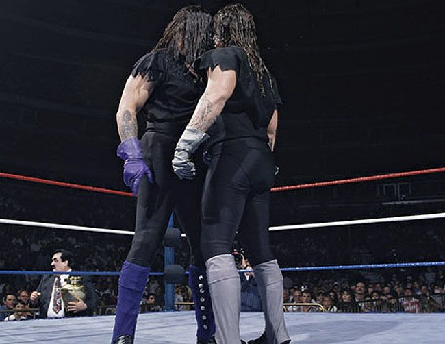
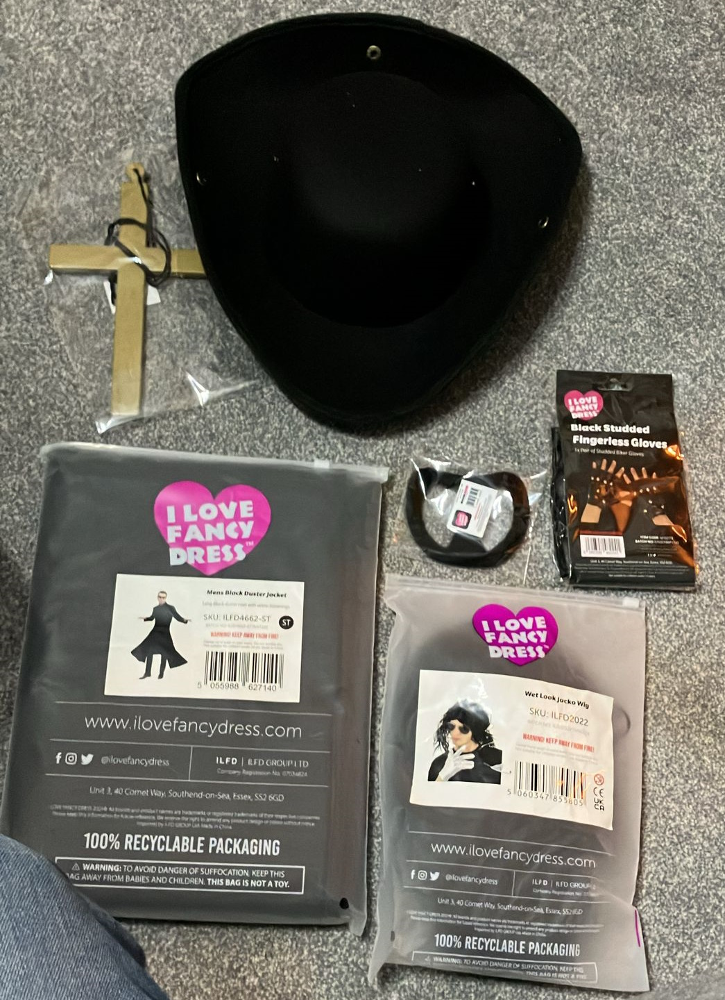
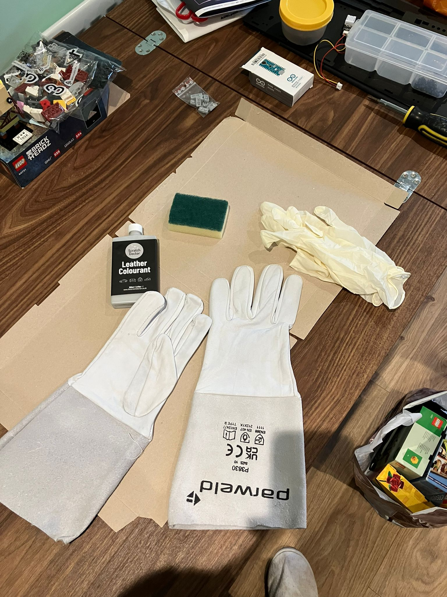
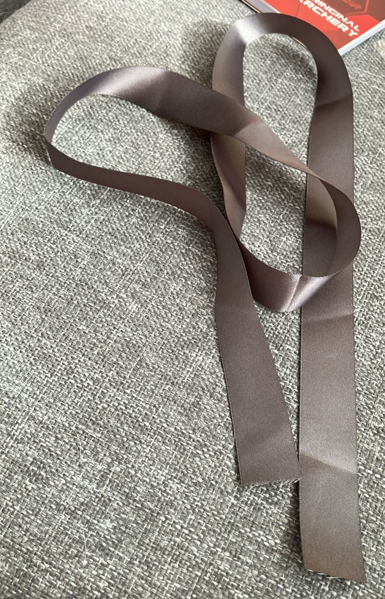
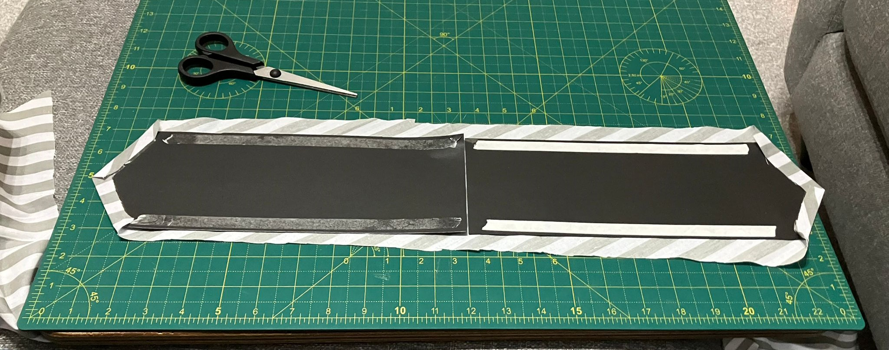
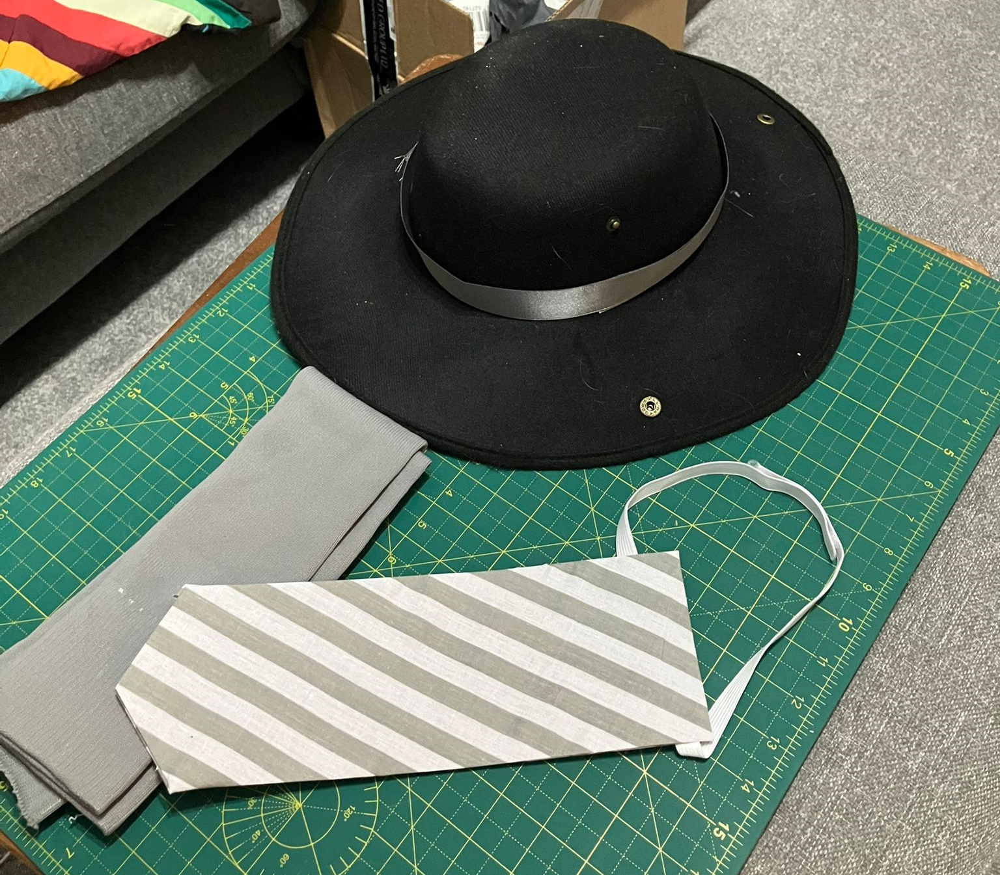
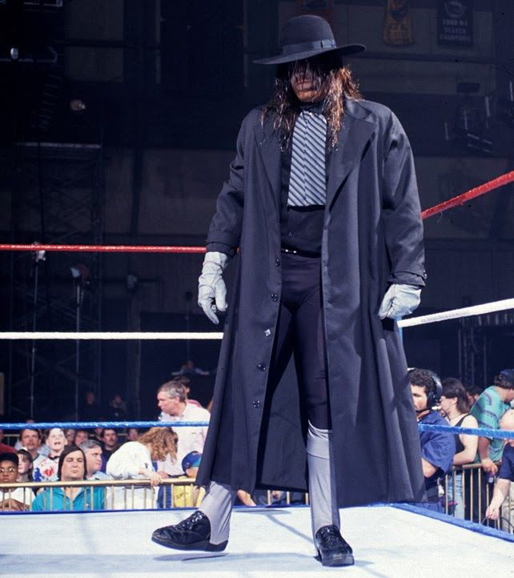
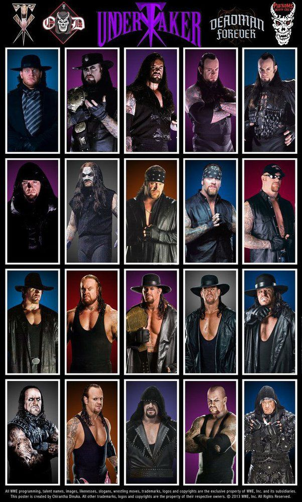

<!-- # Becoming the Undertaker -->

For Scott's 40th Birthday this year Jennie had arranged a surprise (optional) wrestling themed birthday, I only had one choice... become The Undertaker. Now Scott is also a massive Undertaker fan so I had to switch it up a little....

How about going as the Fake Taker, and making my theme grey instead of purple.

I found a pre-made costume on Amazon (or [https://ilovefancydress.com/](https://ilovefancydress.com/)) which had a strange mix, including a cross - not sure he ever carried one of those around, he put a few people on one, and even got put on his own. I guess I can also re-use this for a MJ costume or Neo from the Matrix. Don't think the goatee would stick to my current beard.

Next was some gloves, I bought a pair of white ones and stained them with leather dye. A couple of coats later they came out pretty well.

A got a small piece of ribbon to wrap around the hat.

I also added a tie and the leg covers. Just bought a pair of grey footy socks and cut the bottoms off. The tie was a grey & white striped piece of cloth, I couldn't quite find the correct colours, then with a piece of cardboard, with an angle cut into it and stuck with some double sided sticky tape, I don't have a sewing machine! Then some elastic to wrap it round my neck, with some velcro to adjust if needed.

Finally a belt

The black shirt and black jeans I already had finished it off nicely. I didn't cut zig-zags into the sleeves.

The wig and hat combo made a very hot afternoon, but was worth it, had such a laugh.

I think I got quite close :).

Maybe I'll try one of his many other personas another time.

