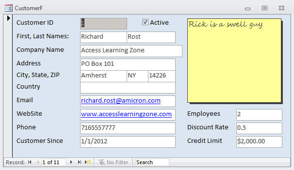
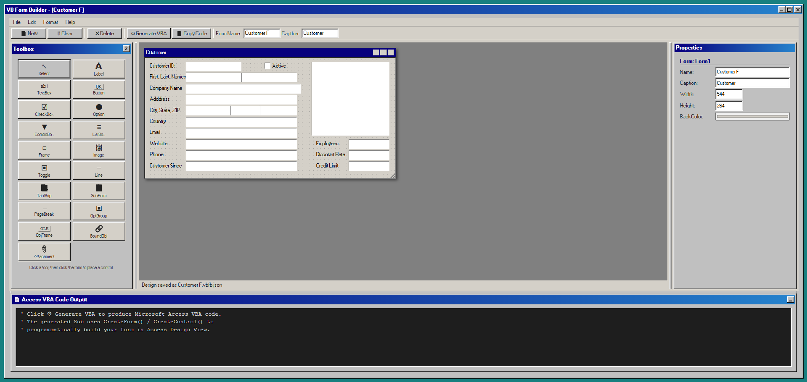
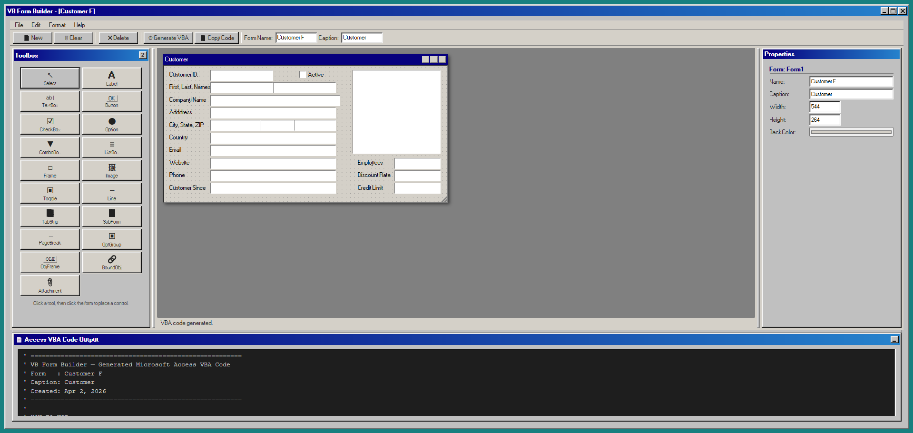

<!-- VB Form Builder -->

In a past life I was a [balsamiq](https://balsamiq.com/) user. I loved a quick way to mockup a design with a set of common controls. There are many other tools you can do this with.

Not sure how much need there would be for an [MS Access](https://www.microsoft.com/en-us/microsoft-365/access) version but thought why not give it a go.

I used [GitHub Copilot](github-copilot) to build the app with the following prompt:

> Build a Microsoft Access VBA Form Builder as a website using the 98.css theme.
>   
> https://jdan.github.io/98.css/  
> https://unpkg.com/98.css@0.1.21/dist/98.css  

With the additional prompts

> add and import and export option

To test this out I've take a `CustomerF` from the [599CD](https://599cd.com/) [Blank Template](https://599cd.com/blog/display-article.asp?ID=1413).



Then I've created the same `Form` with the new tool to see how it looks:



<!--  -->

It created a number of controls originally, then I asked it to add more:

- [Introduction to controls](https://support.microsoft.com/en-us/office/introduction-to-controls-4a8cf5f2-d739-4ae9-b1e0-510c3f4d6975)

```vb
  // Access VBA control-type constants
  const AC = {
    Label:            { vba: 'acLabel',            n: 100 },
    TextBox:          { vba: 'acTextBox',          n: 109 },
    CommandButton:    { vba: 'acCommandButton',    n: 104 },
    CheckBox:         { vba: 'acCheckBox',         n: 106 },
    OptionButton:     { vba: 'acOptionButton',     n: 105 },
    ComboBox:         { vba: 'acComboBox',         n: 111 },
    ListBox:          { vba: 'acListBox',          n: 110 },
    Frame:            { vba: 'acRectangle',        n: 101 },
    Image:            { vba: 'acImage',            n: 103 },
    ToggleButton:     { vba: 'acToggleButton',     n: 122 },
    Line:             { vba: 'acLine',             n: 102 },
    TabStrip:         { vba: 'acTabCtl',           n: 123 },
    SubForm:          { vba: 'acSubForm',          n: 112 },
    PageBreak:        { vba: 'acPageBreak',        n: 118 },
    OptionGroup:      { vba: 'acOptionGroup',      n: 107 },
    ObjectFrame:      { vba: 'acObjectFrame',      n: 114 },
    BoundObjectFrame: { vba: 'acBoundObjectFrame', n: 108 },
    Attachment:       { vba: 'acAttachment',       n: 126 },
  };
```

A few more prompts were asked:

> Allow the toolbox to be 1 or 2 columns

> You can minimise but not restore the code output panel

> The main Form isn't resizable, you can't drag the corner.
> When you change the width and height properties it doesn't resize the Form.

> Allow for the different panels to be adjustable.

It worked really for a majority of the work. There are still some tweaks I need to make but as an initial app it does more than what I needed or had in my head before I began.

The Import / Export and Save Code option were really cool additions.

### Code Output

<details>
<summary>Customer F.vbfb.json</summary>

```json
{
  "_version": 1,
  "_app": "VB Form Builder",
  "form": {
    "name": "Customer F",
    "caption": "Customer",
    "width": 544,
    "height": 264,
    "backColor": "#d4d0c8"
  },
  "controls": [
    {
      "id": "_c781thv",
      "type": "TextBox",
      "name": "CustomerID",
      "left": 88,
      "top": 8,
      "width": 120,
      "height": 21,
      "visible": true,
      "enabled": true,
      "fontSize": 8,
      "fontBold": false,
      "fontItalic": false,
      "foreColor": "#000000",
      "text": "",
      "backColor": "#ffffff"
    },
    {
      "id": "_hs98uso",
      "type": "TextBox",
      "name": "First",
      "left": 88,
      "top": 32,
      "width": 120,
      "height": 21,
      "visible": true,
      "enabled": true,
      "fontSize": 8,
      "fontBold": false,
      "fontItalic": false,
      "foreColor": "#000000",
      "text": "",
      "backColor": "#ffffff"
    },
    {
      "id": "_4q66qws",
      "type": "TextBox",
      "name": "Last",
      "left": 208,
      "top": 32,
      "width": 120,
      "height": 21,
      "visible": true,
      "enabled": true,
      "fontSize": 8,
      "fontBold": false,
      "fontItalic": false,
      "foreColor": "#000000",
      "text": "",
      "backColor": "#ffffff"
    },
    {
      "id": "_8q2kiag",
      "type": "TextBox",
      "name": "CompanyName",
      "left": 88,
      "top": 56,
      "width": 248,
      "height": 21,
      "visible": true,
      "enabled": true,
      "fontSize": 8,
      "fontBold": false,
      "fontItalic": false,
      "foreColor": "#000000",
      "text": "",
      "backColor": "#ffffff"
    },
    {
      "id": "_2k62j39",
      "type": "CheckBox",
      "name": "Check1",
      "left": 256,
      "top": 8,
      "width": 72,
      "height": 18,
      "visible": true,
      "enabled": true,
      "fontSize": 8,
      "fontBold": false,
      "fontItalic": false,
      "foreColor": "#000000",
      "caption": "Active"
    },
    {
      "id": "_3xz8l9h",
      "type": "TextBox",
      "name": "Address",
      "left": 88,
      "top": 80,
      "width": 240,
      "height": 21,
      "visible": true,
      "enabled": true,
      "fontSize": 8,
      "fontBold": false,
      "fontItalic": false,
      "foreColor": "#000000",
      "text": "",
      "backColor": "#ffffff"
    },
    {
      "id": "_5175abg",
      "type": "TextBox",
      "name": "State",
      "left": 184,
      "top": 104,
      "width": 64,
      "height": 21,
      "visible": true,
      "enabled": true,
      "fontSize": 8,
      "fontBold": false,
      "fontItalic": false,
      "foreColor": "#000000",
      "text": "",
      "backColor": "#ffffff"
    },
    {
      "id": "_ks2n5x9",
      "type": "TextBox",
      "name": "City",
      "left": 88,
      "top": 104,
      "width": 96,
      "height": 21,
      "visible": true,
      "enabled": true,
      "fontSize": 8,
      "fontBold": false,
      "fontItalic": false,
      "foreColor": "#000000",
      "text": "",
      "backColor": "#ffffff"
    },
    {
      "id": "_er8y4rr",
      "type": "TextBox",
      "name": "ZIP",
      "left": 248,
      "top": 104,
      "width": 80,
      "height": 21,
      "visible": true,
      "enabled": true,
      "fontSize": 8,
      "fontBold": false,
      "fontItalic": false,
      "foreColor": "#000000",
      "text": "",
      "backColor": "#ffffff"
    },
    {
      "id": "_8nt7gpy",
      "type": "TextBox",
      "name": "Country",
      "left": 88,
      "top": 128,
      "width": 240,
      "height": 21,
      "visible": true,
      "enabled": true,
      "fontSize": 8,
      "fontBold": false,
      "fontItalic": false,
      "foreColor": "#000000",
      "text": "",
      "backColor": "#ffffff"
    },
    {
      "id": "_g4gqyex",
      "type": "TextBox",
      "name": "Email",
      "left": 88,
      "top": 152,
      "width": 240,
      "height": 21,
      "visible": true,
      "enabled": true,
      "fontSize": 8,
      "fontBold": false,
      "fontItalic": false,
      "foreColor": "#000000",
      "text": "",
      "backColor": "#ffffff"
    },
    {
      "id": "_xq0w79g",
      "type": "TextBox",
      "name": "Website",
      "left": 88,
      "top": 176,
      "width": 240,
      "height": 21,
      "visible": true,
      "enabled": true,
      "fontSize": 8,
      "fontBold": false,
      "fontItalic": false,
      "foreColor": "#000000",
      "text": "",
      "backColor": "#ffffff"
    },
    {
      "id": "_n35gvys",
      "type": "TextBox",
      "name": "Phone",
      "left": 88,
      "top": 200,
      "width": 240,
      "height": 21,
      "visible": true,
      "enabled": true,
      "fontSize": 8,
      "fontBold": false,
      "fontItalic": false,
      "foreColor": "#000000",
      "text": "",
      "backColor": "#ffffff"
    },
    {
      "id": "_32kp3r9",
      "type": "TextBox",
      "name": "CustomerSince",
      "left": 88,
      "top": 224,
      "width": 240,
      "height": 21,
      "visible": true,
      "enabled": true,
      "fontSize": 8,
      "fontBold": false,
      "fontItalic": false,
      "foreColor": "#000000",
      "text": "",
      "backColor": "#ffffff"
    },
    {
      "id": "_i9vneir",
      "type": "Label",
      "name": "Label1",
      "left": 8,
      "top": 8,
      "width": 80,
      "height": 18,
      "visible": true,
      "enabled": true,
      "fontSize": 8,
      "fontBold": false,
      "fontItalic": false,
      "foreColor": "#000000",
      "caption": "Customer ID:"
    },
    {
      "id": "_11whonp",
      "type": "Label",
      "name": "Label2",
      "left": 8,
      "top": 32,
      "width": 80,
      "height": 18,
      "visible": true,
      "enabled": true,
      "fontSize": 8,
      "fontBold": false,
      "fontItalic": false,
      "foreColor": "#000000",
      "caption": "First, Last, Names:"
    },
    {
      "id": "_qzvc20v",
      "type": "Label",
      "name": "Label3",
      "left": 8,
      "top": 56,
      "width": 80,
      "height": 18,
      "visible": true,
      "enabled": true,
      "fontSize": 8,
      "fontBold": false,
      "fontItalic": false,
      "foreColor": "#000000",
      "caption": "Company Name"
    },
    {
      "id": "_eto8nap",
      "type": "Label",
      "name": "Label4",
      "left": 8,
      "top": 80,
      "width": 80,
      "height": 18,
      "visible": true,
      "enabled": true,
      "fontSize": 8,
      "fontBold": false,
      "fontItalic": false,
      "foreColor": "#000000",
      "caption": "Adddress"
    },
    {
      "id": "_ljj8txa",
      "type": "Label",
      "name": "Label5",
      "left": 8,
      "top": 104,
      "width": 80,
      "height": 18,
      "visible": true,
      "enabled": true,
      "fontSize": 8,
      "fontBold": false,
      "fontItalic": false,
      "foreColor": "#000000",
      "caption": "City, State, ZIP"
    },
    {
      "id": "_613df84",
      "type": "Label",
      "name": "Label6",
      "left": 8,
      "top": 128,
      "width": 80,
      "height": 18,
      "visible": true,
      "enabled": true,
      "fontSize": 8,
      "fontBold": false,
      "fontItalic": false,
      "foreColor": "#000000",
      "caption": "Country"
    },
    {
      "id": "_oo6m3uo",
      "type": "Label",
      "name": "Label7",
      "left": 8,
      "top": 152,
      "width": 80,
      "height": 18,
      "visible": true,
      "enabled": true,
      "fontSize": 8,
      "fontBold": false,
      "fontItalic": false,
      "foreColor": "#000000",
      "caption": "Email"
    },
    {
      "id": "_vxbg61c",
      "type": "Label",
      "name": "Label8",
      "left": 8,
      "top": 176,
      "width": 80,
      "height": 18,
      "visible": true,
      "enabled": true,
      "fontSize": 8,
      "fontBold": false,
      "fontItalic": false,
      "foreColor": "#000000",
      "caption": "Website"
    },
    {
      "id": "_qsl0gqg",
      "type": "Label",
      "name": "Label9",
      "left": 8,
      "top": 200,
      "width": 80,
      "height": 18,
      "visible": true,
      "enabled": true,
      "fontSize": 8,
      "fontBold": false,
      "fontItalic": false,
      "foreColor": "#000000",
      "caption": "Phone"
    },
    {
      "id": "_3bxqrg1",
      "type": "Label",
      "name": "Label10",
      "left": 8,
      "top": 224,
      "width": 80,
      "height": 18,
      "visible": true,
      "enabled": true,
      "fontSize": 8,
      "fontBold": false,
      "fontItalic": false,
      "foreColor": "#000000",
      "caption": "Customer Since"
    },
    {
      "id": "_snbv7o7",
      "type": "TextBox",
      "name": "Employees",
      "left": 440,
      "top": 176,
      "width": 88,
      "height": 21,
      "visible": true,
      "enabled": true,
      "fontSize": 8,
      "fontBold": false,
      "fontItalic": false,
      "foreColor": "#000000",
      "text": "",
      "backColor": "#ffffff"
    },
    {
      "id": "_r38w8jj",
      "type": "Label",
      "name": "Label11",
      "left": 368,
      "top": 176,
      "width": 64,
      "height": 18,
      "visible": true,
      "enabled": true,
      "fontSize": 8,
      "fontBold": false,
      "fontItalic": false,
      "foreColor": "#000000",
      "caption": "Employees"
    },
    {
      "id": "_f5xfpfp",
      "type": "TextBox",
      "name": "DiscountRate",
      "left": 440,
      "top": 200,
      "width": 88,
      "height": 21,
      "visible": true,
      "enabled": true,
      "fontSize": 8,
      "fontBold": false,
      "fontItalic": false,
      "foreColor": "#000000",
      "text": "",
      "backColor": "#ffffff"
    },
    {
      "id": "_cz9zpwg",
      "type": "Label",
      "name": "Label12",
      "left": 368,
      "top": 200,
      "width": 72,
      "height": 18,
      "visible": true,
      "enabled": true,
      "fontSize": 8,
      "fontBold": false,
      "fontItalic": false,
      "foreColor": "#000000",
      "caption": "Discount Rate"
    },
    {
      "id": "_wnij37q",
      "type": "TextBox",
      "name": "CreditLimit",
      "left": 440,
      "top": 224,
      "width": 88,
      "height": 21,
      "visible": true,
      "enabled": true,
      "fontSize": 8,
      "fontBold": false,
      "fontItalic": false,
      "foreColor": "#000000",
      "text": "",
      "backColor": "#ffffff"
    },
    {
      "id": "_b8w401v",
      "type": "Label",
      "name": "Label13",
      "left": 368,
      "top": 224,
      "width": 64,
      "height": 18,
      "visible": true,
      "enabled": true,
      "fontSize": 8,
      "fontBold": false,
      "fontItalic": false,
      "foreColor": "#000000",
      "caption": "Credit Limit"
    },
    {
      "id": "_ab9btu3",
      "type": "TextBox",
      "name": "Notes",
      "left": 360,
      "top": 8,
      "width": 168,
      "height": 160,
      "visible": true,
      "enabled": true,
      "fontSize": 8,
      "fontBold": false,
      "fontItalic": false,
      "foreColor": "#000000",
      "text": "",
      "backColor": "#ffff00"
    }
  ],
  "counters": {
    "TextBox": 17,
    "CheckBox": 1,
    "Label": 13
  }
}
```

</details>

<details>
<summary>Customer F_VBA.bas</summary>

```vb
' ========================================================
' VB Form Builder — Generated Microsoft Access VBA Code
' Form   : Customer F
' Caption: Customer
' Created: Apr 2, 2026
' ========================================================
'
' HOW TO USE:
'   1. Open your Access database.
'   2. Press Alt+F11 to open the VBA editor.
'   3. Insert > Module, paste this code, then run CreateForm_Customer F().
' ========================================================

Option Explicit

Sub CreateForm_Customer F()
    Dim frm  As Form
    Dim ctrl As Control

    ' ---- Create the form ----
    Set frm = CreateForm()
    frm.Caption = "Customer"

    ' ---- Controls ----
    ' CustomerID (TextBox)
    Set ctrl = CreateControl(frm.Name, acTextBox, acDetail, , "CustomerID", 1320, 120, 1800, 315)

    ' First (TextBox)
    Set ctrl = CreateControl(frm.Name, acTextBox, acDetail, , "First", 1320, 480, 1800, 315)

    ' Last (TextBox)
    Set ctrl = CreateControl(frm.Name, acTextBox, acDetail, , "Last", 3120, 480, 1800, 315)

    ' CompanyName (TextBox)
    Set ctrl = CreateControl(frm.Name, acTextBox, acDetail, , "CompanyName", 1320, 840, 3720, 315)

    ' Check1 (CheckBox)
    Set ctrl = CreateControl(frm.Name, acCheckBox, acDetail, , "Check1", 3840, 120, 1080, 270)
    ctrl.Caption = "Active"

    ' Address (TextBox)
    Set ctrl = CreateControl(frm.Name, acTextBox, acDetail, , "Address", 1320, 1200, 3600, 315)

    ' State (TextBox)
    Set ctrl = CreateControl(frm.Name, acTextBox, acDetail, , "State", 2760, 1560, 960, 315)

    ' City (TextBox)
    Set ctrl = CreateControl(frm.Name, acTextBox, acDetail, , "City", 1320, 1560, 1440, 315)

    ' ZIP (TextBox)
    Set ctrl = CreateControl(frm.Name, acTextBox, acDetail, , "ZIP", 3720, 1560, 1200, 315)

    ' Country (TextBox)
    Set ctrl = CreateControl(frm.Name, acTextBox, acDetail, , "Country", 1320, 1920, 3600, 315)

    ' Email (TextBox)
    Set ctrl = CreateControl(frm.Name, acTextBox, acDetail, , "Email", 1320, 2280, 3600, 315)

    ' Website (TextBox)
    Set ctrl = CreateControl(frm.Name, acTextBox, acDetail, , "Website", 1320, 2640, 3600, 315)

    ' Phone (TextBox)
    Set ctrl = CreateControl(frm.Name, acTextBox, acDetail, , "Phone", 1320, 3000, 3600, 315)

    ' CustomerSince (TextBox)
    Set ctrl = CreateControl(frm.Name, acTextBox, acDetail, , "CustomerSince", 1320, 3360, 3600, 315)

    ' Label1 (Label)
    Set ctrl = CreateControl(frm.Name, acLabel, acDetail, , "Label1", 120, 120, 1200, 270)
    ctrl.Caption = "Customer ID:"

    ' Label2 (Label)
    Set ctrl = CreateControl(frm.Name, acLabel, acDetail, , "Label2", 120, 480, 1200, 270)
    ctrl.Caption = "First, Last, Names:"

    ' Label3 (Label)
    Set ctrl = CreateControl(frm.Name, acLabel, acDetail, , "Label3", 120, 840, 1200, 270)
    ctrl.Caption = "Company Name"

    ' Label4 (Label)
    Set ctrl = CreateControl(frm.Name, acLabel, acDetail, , "Label4", 120, 1200, 1200, 270)
    ctrl.Caption = "Adddress"

    ' Label5 (Label)
    Set ctrl = CreateControl(frm.Name, acLabel, acDetail, , "Label5", 120, 1560, 1200, 270)
    ctrl.Caption = "City, State, ZIP"

    ' Label6 (Label)
    Set ctrl = CreateControl(frm.Name, acLabel, acDetail, , "Label6", 120, 1920, 1200, 270)
    ctrl.Caption = "Country"

    ' Label7 (Label)
    Set ctrl = CreateControl(frm.Name, acLabel, acDetail, , "Label7", 120, 2280, 1200, 270)
    ctrl.Caption = "Email"

    ' Label8 (Label)
    Set ctrl = CreateControl(frm.Name, acLabel, acDetail, , "Label8", 120, 2640, 1200, 270)
    ctrl.Caption = "Website"

    ' Label9 (Label)
    Set ctrl = CreateControl(frm.Name, acLabel, acDetail, , "Label9", 120, 3000, 1200, 270)
    ctrl.Caption = "Phone"

    ' Label10 (Label)
    Set ctrl = CreateControl(frm.Name, acLabel, acDetail, , "Label10", 120, 3360, 1200, 270)
    ctrl.Caption = "Customer Since"

    ' Employees (TextBox)
    Set ctrl = CreateControl(frm.Name, acTextBox, acDetail, , "Employees", 6600, 2640, 1320, 315)

    ' Label11 (Label)
    Set ctrl = CreateControl(frm.Name, acLabel, acDetail, , "Label11", 5520, 2640, 960, 270)
    ctrl.Caption = "Employees"

    ' DiscountRate (TextBox)
    Set ctrl = CreateControl(frm.Name, acTextBox, acDetail, , "DiscountRate", 6600, 3000, 1320, 315)

    ' Label12 (Label)
    Set ctrl = CreateControl(frm.Name, acLabel, acDetail, , "Label12", 5520, 3000, 1080, 270)
    ctrl.Caption = "Discount Rate"

    ' CreditLimit (TextBox)
    Set ctrl = CreateControl(frm.Name, acTextBox, acDetail, , "CreditLimit", 6600, 3360, 1320, 315)

    ' Label13 (Label)
    Set ctrl = CreateControl(frm.Name, acLabel, acDetail, , "Label13", 5520, 3360, 960, 270)
    ctrl.Caption = "Credit Limit"

    ' Notes (TextBox)
    Set ctrl = CreateControl(frm.Name, acTextBox, acDetail, , "Notes", 5400, 120, 2520, 2400)
    ctrl.BackColor = RGB(255, 255, 0)

    ' ---- Save & close ----
    DoCmd.Save acForm, frm.Name
    DoCmd.Close acForm, frm.Name, acSaveYes
    MsgBox "Form '" & frm.Name & "' created successfully!", vbInformation
End Sub

' ========================================================
' Event-handler stubs
' (Paste these into your form's code module in Access)
' ========================================================

Private Sub CustomerID_Change()
    ' TODO: handle CustomerID change
End Sub

Private Sub CustomerID_BeforeUpdate(Cancel As Integer)
    ' TODO: validate CustomerID
End Sub

Private Sub First_Change()
    ' TODO: handle First change
End Sub

Private Sub First_BeforeUpdate(Cancel As Integer)
    ' TODO: validate First
End Sub

Private Sub Last_Change()
    ' TODO: handle Last change
End Sub

Private Sub Last_BeforeUpdate(Cancel As Integer)
    ' TODO: validate Last
End Sub

Private Sub CompanyName_Change()
    ' TODO: handle CompanyName change
End Sub

Private Sub CompanyName_BeforeUpdate(Cancel As Integer)
    ' TODO: validate CompanyName
End Sub

Private Sub Check1_Click()
    ' TODO: handle Check1 toggle
    ' Me.Check1 = True or False
End Sub

Private Sub Address_Change()
    ' TODO: handle Address change
End Sub

Private Sub Address_BeforeUpdate(Cancel As Integer)
    ' TODO: validate Address
End Sub

Private Sub State_Change()
    ' TODO: handle State change
End Sub

Private Sub State_BeforeUpdate(Cancel As Integer)
    ' TODO: validate State
End Sub

Private Sub City_Change()
    ' TODO: handle City change
End Sub

Private Sub City_BeforeUpdate(Cancel As Integer)
    ' TODO: validate City
End Sub

Private Sub ZIP_Change()
    ' TODO: handle ZIP change
End Sub

Private Sub ZIP_BeforeUpdate(Cancel As Integer)
    ' TODO: validate ZIP
End Sub

Private Sub Country_Change()
    ' TODO: handle Country change
End Sub

Private Sub Country_BeforeUpdate(Cancel As Integer)
    ' TODO: validate Country
End Sub

Private Sub Email_Change()
    ' TODO: handle Email change
End Sub

Private Sub Email_BeforeUpdate(Cancel As Integer)
    ' TODO: validate Email
End Sub

Private Sub Website_Change()
    ' TODO: handle Website change
End Sub

Private Sub Website_BeforeUpdate(Cancel As Integer)
    ' TODO: validate Website
End Sub

Private Sub Phone_Change()
    ' TODO: handle Phone change
End Sub

Private Sub Phone_BeforeUpdate(Cancel As Integer)
    ' TODO: validate Phone
End Sub

Private Sub CustomerSince_Change()
    ' TODO: handle CustomerSince change
End Sub

Private Sub CustomerSince_BeforeUpdate(Cancel As Integer)
    ' TODO: validate CustomerSince
End Sub

Private Sub Employees_Change()
    ' TODO: handle Employees change
End Sub

Private Sub Employees_BeforeUpdate(Cancel As Integer)
    ' TODO: validate Employees
End Sub

Private Sub DiscountRate_Change()
    ' TODO: handle DiscountRate change
End Sub

Private Sub DiscountRate_BeforeUpdate(Cancel As Integer)
    ' TODO: validate DiscountRate
End Sub

Private Sub CreditLimit_Change()
    ' TODO: handle CreditLimit change
End Sub

Private Sub CreditLimit_BeforeUpdate(Cancel As Integer)
    ' TODO: validate CreditLimit
End Sub

Private Sub Notes_Change()
    ' TODO: handle Notes change
End Sub

Private Sub Notes_BeforeUpdate(Cancel As Integer)
    ' TODO: validate Notes
End Sub

Private Sub Form_Open(Cancel As Integer)
    ' TODO: initialize form
End Sub

Private Sub Form_Close()
    ' TODO: clean up
End Sub
```

</details>

## Site

I've deployed this via Rick's [PC Resale](http://pcresale.net/) website as it's Access related and linked to [599CD](https://599cd.com/).

- 🌍 http://pcresale.net/vb-form-builder/
- 🔗 https://github.com/599CD/vb-form-builder

## 🔗 Links

- http://pcresale.net/vb-form-builder/
