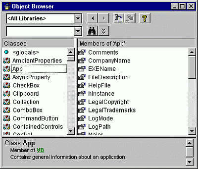
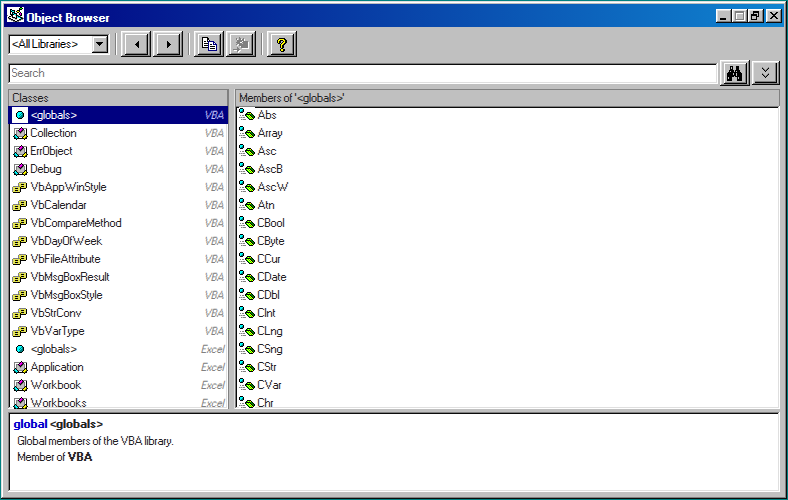
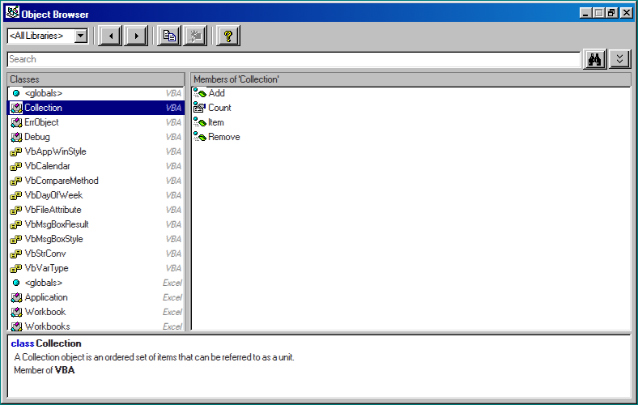
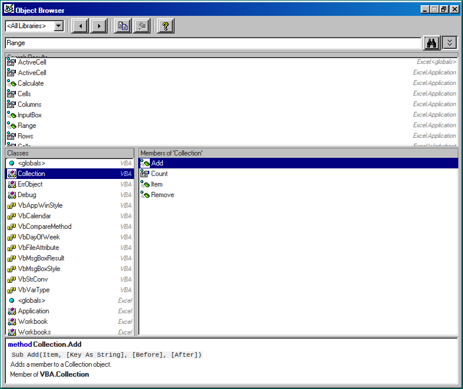

<!-- VBA Object Browser -->

A number of years ago I found a UI lib called [98.css](https://jdan.github.io/98.css/) with the tag line "A design system for building faithful recreations of old UIs." I've been wanting a reason to use this in some app and thought this might be a good use case.

What is the [Object Browser](https://learn.microsoft.com/en-us/office/vba/language/reference/user-interface-help/object-browser)?

> A dialog box in which you can examine the contents of an object library to get information about the objects provided.
> 
> Displays the [classes](https://learn.microsoft.com/en-us/office/vba/language/glossary/vbe-glossary#class), properties, methods, events, and constants available from [object libraries](https://learn.microsoft.com/en-us/office/vba/language/glossary/vbe-glossary#object-library) and the [procedures](https://learn.microsoft.com/en-us/office/vba/language/glossary/vbe-glossary#procedure) in your project. Use it to find and use objects you create, as well as objects from other applications.
> 
> You can get Help for the **Object Browser** by searching for Object Browser in Help.

An original screenshot of the Object Browser.

The list of Libraries comes from the [MS Learn](https://learn.microsoft.com/) [Office VBA Reference](https://learn.microsoft.com/en-us/office/vba/api/overview/)

- VBA
- Excel
- Office
- Word
- PowerPoint
- Access
- Outlook
- Scripting
- ADODB

I thought why not use this type of project as a way to try out [GitHub Copilot](github-copilot) so I asked the following:

> Build the VBA Object Browser as a website.

I then raised a new Issue and assigned Copilot to see what they would add:

> Use the following links as a reference:
> 
> Use the Object Browser
> 
> https://learn.microsoft.com/en-us/office/vba/language/reference/user-interface-help/use-the-object-browser
> 
> Object Browser
> 
> https://learn.microsoft.com/en-us/office/vba/language/reference/user-interface-help/object-browser
> 
> Code window and Object Browser icons
> 
> https://learn.microsoft.com/en-us/office/vba/language/reference/user-interface-help/icons-used-in-the-object-browser-and-code-windows

With the following prompts:

> are there any missing classes/methods?

**VBA** `<globals>` — 27 new methods: `AppActivate`, `Beep`, `CallByName`, `ChDir`, `ChDrive`, `CVErr`, `DeleteSetting`, `FileCopy`, `FileDateTime`, `FileLen`, `FreeFile`, `GetAllSettings`, `GetAttr`, `GetSetting`, `InputBox`, `Kill`, `MkDir`, `Partition`, `QBColor`, `Randomize`, `RmDir`, `SaveSetting`, `SendKeys`, `SetAttr`, `Shell`, `Spc`, `Tab`

**VBA enums** — 2 new: `VbFirstWeekOfYear` (was already referenced in the `DateDiff`/`DatePart` signatures but the enum itself was absent), `VbTriState`

**Excel** `<globals>` — 4 added: `ActiveChart`, `Charts`, `Names`, `Sheets`

**Excel** existing classes — missing members added to Application (+7: `ActiveChart`, `Charts`, `GetOpenFilename`, `GetSaveAsFilename`, `OnTime`, `Run`, `Wait`), `Workbook` (+6: `ActiveChart`, `Charts`, `Names`, `PrintOut`, `Protect`, `Unprotect`), `Worksheet` (+7: `Calculate`, `ChartObjects`, `ListObjects`, `PageSetup`, `PrintOut`, `Protect`, `Shapes`), `Range` (+11: `Activate`, `Borders`, `Calculate`, `FillDown`/`Left`/`Right`/`Up`, `NumberFormatLocal`, `Select`, `Text`, `WrapText`)

**New Excel classes** — `Chart`, `Name`, `PivotTable`, `ListObject`

> can you implement all classes/methods etc from all Office programs

**Word** (19 classes, 218 members): `Application`, `Document`, `Documents`, `Selection`, `Range`, `Paragraph`, `Table`, `Find`, `Bookmark`, and enums `WdParagraphAlignment`, `WdSaveFormat`, `WdSaveOptions`, `WdUnits`, `WdCollapseDirection`, `WdMovementType`, `WdSelectionType`, `WdProtectionType`, `WdFindWrap`

**PowerPoint** (11 classes, 122 members): `Application`, `Presentation`, `Presentations`, `Slide`, `Slides`, `Shape`, `TextFrame`, `TextRange`, and enums `PpSlideLayout`, `PpSaveAsFileType`

> add Access, Outlook, Scripting (FileSystemObject), and ADODB

With the following responses:

**Access** (9 classes, 106 members): `Application`, `DoCmd` (30 actions: `OpenForm`, `OpenReport`, `RunSQL`, `TransferSpreadsheet`, `SendObject`, etc.), `Form`, `Report` + enums `AcFormView`, `AcObjectType`, `AcRecord`, `AcQuitOption`

**Outlook** (11 classes, 114 members): `Application`, `NameSpace`, `MailItem` (22 members), `MAPIFolder`, `AppointmentItem`, `ContactItem` + enums `OlItemType`, `OlDefaultFolders`, `OlImportance`, `OlSaveAsType`

**Scripting** (9 classes, 98 members): `FileSystemObject` (24 members: `CopyFile`, `DeleteFolder`, `OpenTextFile`, etc.), `TextStream`, `File`, `Folder`, `Drive` + enums `IOMode`, `SpecialFolderConst`, `FileAttribute`

**ADODB** (11 classes, 117 members): `Connection`, `Recordset` (38 members: `MoveNext`, `AddNew`, `Update`, `GetRows`, etc.), `Command`, `Field`, `Parameter` + enums `CursorTypeEnum`, `LockTypeEnum`, `CommandTypeEnum`, `ParameterDirectionEnum`, `ConnectModeEnum`

My outputs after accepting the changes from [GitHub Copilot](https://github.com/features/copilot):

I thought it might be _helpful_ to have the ? link go to "https://learn.microsoft.com/en-gb/office/vba/api/overview/language-reference then it was updated to use the method etc but I think that needs some work...

## Site

I've deployed this via Rick's [PC Resale](http://pcresale.net/) website as it's Access related and linked to [599CD](https://599cd.com/).

- 🌍 http://pcresale.net/vba-object-browser/
- 🔗 https://github.com/599CD/VBA-Object-Browser

## 🔗Links

- 🔗 https://github.com/jdan/98.css
- 🌍 https://jdan.github.io/98.css/
