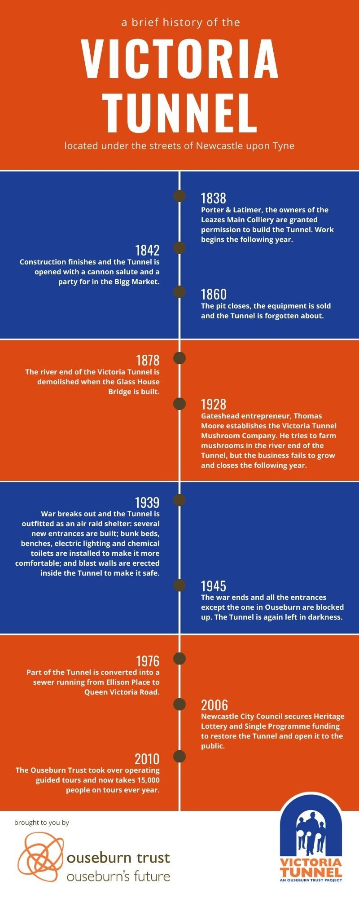

<!-- # Victoria Tunnel -->

## 📅 Date

Sunday 20th March 2022

## 💷 Price

£10

## About

The Victoria Tunnel is a preserved 19th-century waggonway under Newcastle, stretching from the Town Moor to the Tyne river. It was originally built to transport coal from Spital Tongues (Leazes Main) Colliery to the river and operated between 1842 and the 1860s. The Tunnel was converted in 1939 into an air-raid shelter to protect thousands of Newcastle citizens during World War 2.

---

## 🔗 Links

- https://www.ouseburntrust.org.uk/visit-vt
