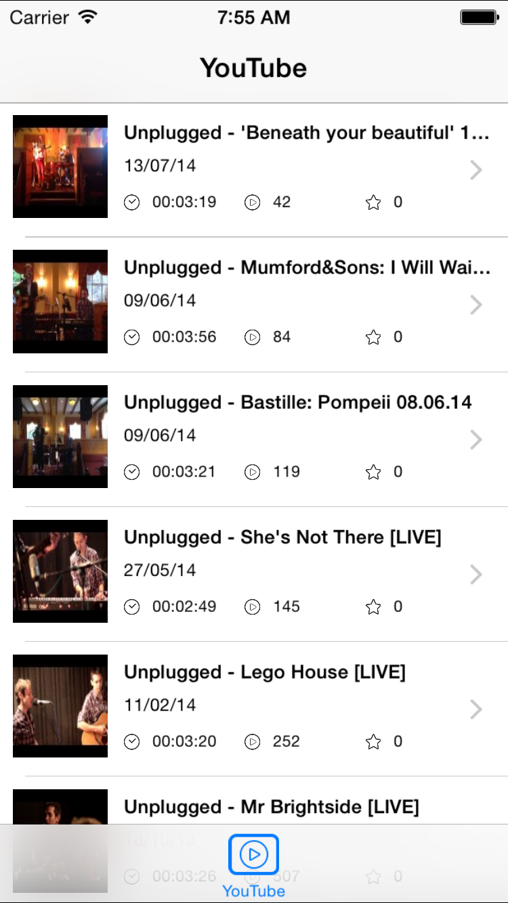

So I've started parsing the YouTube feed of uploads for a User, the User being Uplugged.

URL: http://gdata.youtube.com/feeds/api/users/unpluggedacoustic1/uploads/?alt=json

Here is the result so far.

Updated:

See previous posts for parsing tips.

 [Original Link](https://alexhedley.wordpress.com/2014/10/02/youtube-unplugged/)
